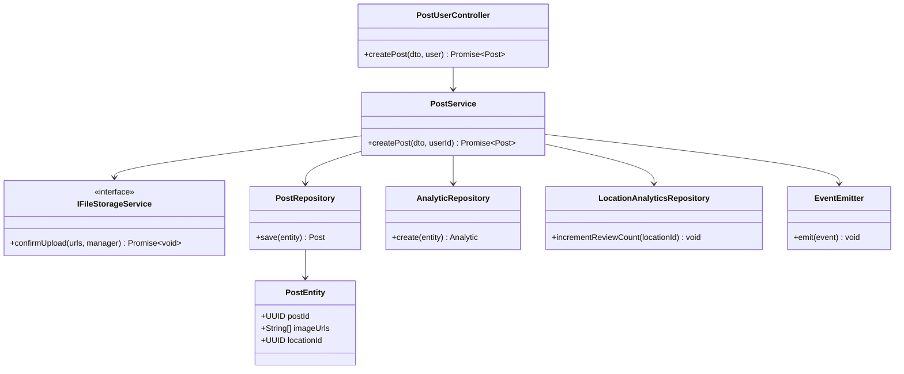
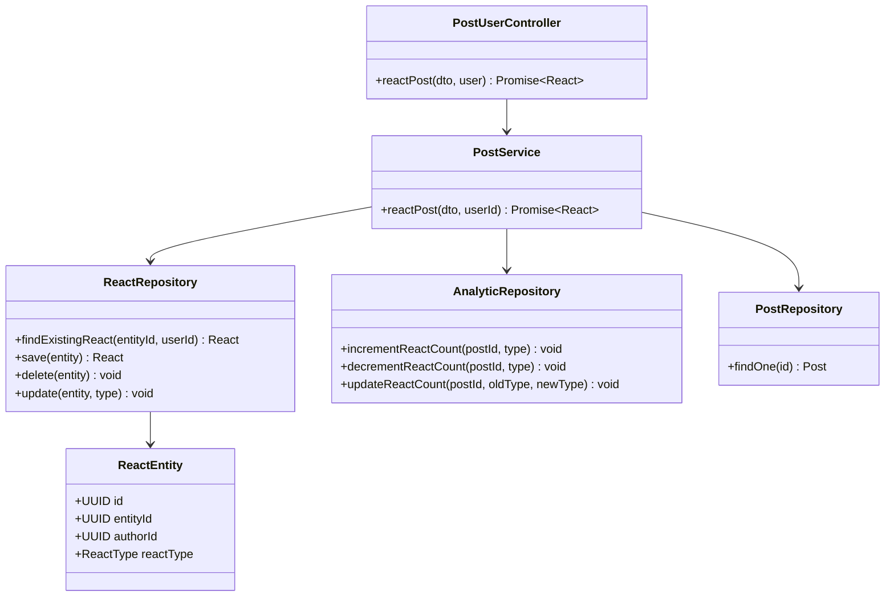
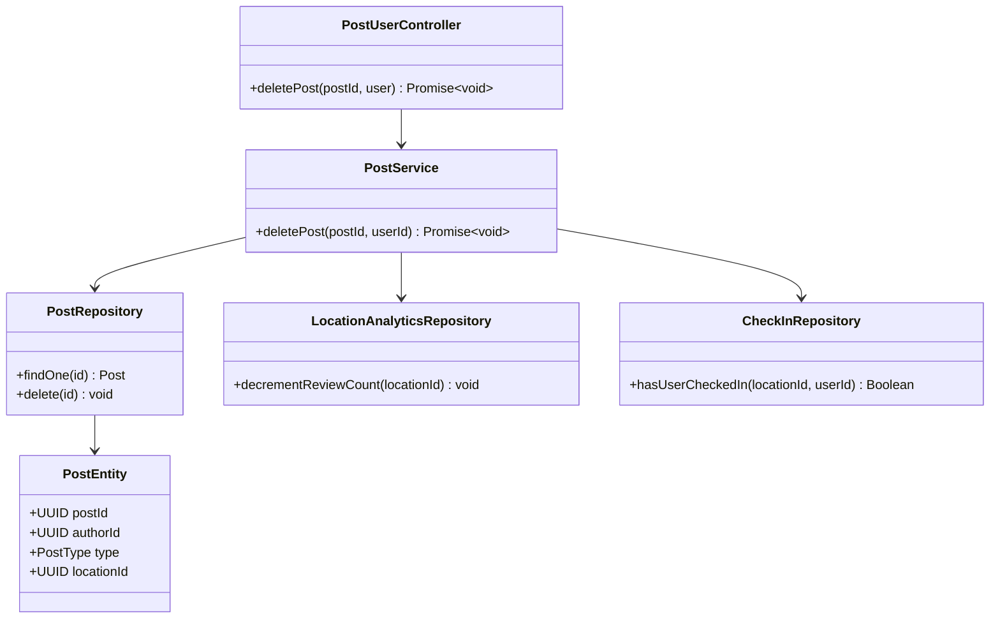

    # Post Feature - Class & Sequence Diagrams

    ## Class Diagram

    ```mermaid
    classDiagram

        class PostEntity {
            +UUID postId
            +String content
            +PostType type
            +Integer rating
            +String[] imageUrls
            +UUID authorId
            +UUID locationId
            +UUID eventId
            +Visibility visibility
            +Date createdAt
            +Date updatedAt
            +canDelete() Boolean
        }

        class AccountEntity {
            +UUID id
            +String firstName
            +String lastName
            +String email
            +String avatarUrl
            +Role role
            +Boolean hasOnboarded
        }

        class CommentEntity {
            +UUID id
            +String content
            +UUID postId
            +UUID authorId
            +Date createdAt
            +Date updatedAt
        }

        class ReactEntity {
            +UUID id
            +ReactType reactType
            +ReactEntityType entityType
            +UUID entityId
            +UUID authorId
            +Date createdAt
        }

        class AnalyticEntity {
            +UUID id
            +AnalyticEntityType entityType
            +UUID entityId
            +Integer totalUpvotes
            +Integer totalDownvotes
            +Integer totalComments
        }

        class LocationEntity {
            +UUID id
            +String name
            +String addressLine
            +Decimal latitude
            +Decimal longitude
        }

        class IPostService {
            <<interface>>
            +createPost(dto) Promise~Post~
            +getPostById(id, userId) Promise~Post~
            +reactPost(dto) Promise~React~
            +deletePost(dto) Promise~void~
            +getMyPosts(userId, query) Promise~PaginationResult~
        }

        class PostService {
            -PostRepository postRepository
            -AnalyticRepository analyticRepository
            -ReactRepository reactRepository
            -CommentRepository commentRepository
            -CheckInRepository checkInRepository
            -FollowRepository followRepository
            -IFileStorageService fileStorageService
            -EventEmitter2 eventEmitter
            +createPost(dto) Promise~Post~
            +getPostById(id, userId) Promise~Post~
            +reactPost(dto) Promise~React~
            +deletePost(dto) Promise~void~
        }

        class PostUserController {
            -IPostService postService
            +createPost(dto, user) Promise~Post~
            +reactPost(dto, user) Promise~React~
            +deletePost(postId, user) Promise~void~
            +getMyPosts(query, user) Promise~PaginationResult~
        }

        class IFileStorageService {
            <<interface>>
            +confirmUpload(urls, manager) Promise~void~
        }

        %% VALID RELATIONSHIPS
        AccountEntity "1" o-- "many" PostEntity : creates
        AccountEntity "1" o-- "many" CommentEntity : writes
        AccountEntity "1" o-- "many" ReactEntity : reacts
        PostEntity "1" o-- "many" CommentEntity : has
        PostEntity "1" o-- "many" ReactEntity : has
        PostEntity "0..1" -- "1" LocationEntity : references
        PostEntity "1" -- "1" AnalyticEntity : has

        IPostService <|.. PostService
        PostUserController --> IPostService
        PostService --> IFileStorageService
    ```

    ## Sequence Diagram: Create Post

### Class Diagram: Create Post



    ```mermaid
    sequenceDiagram
        participant Client
        participant PostController as PostUserController
        participant PostService
        participant FileStorageService as IFileStorageService
        participant PostRepository
        participant AnalyticRepository
        participant LocationAnalyticsRepository
        participant EventEmitter

        Client->>PostController: POST /user/post (CreatePostDto)
        PostController->>PostService: createPost(dto, userId)

        alt Image URLs provided
            PostService->>FileStorageService: confirmUpload(imageUrls)
            FileStorageService-->>PostService: success
        end

        PostService->>PostRepository: save(PostEntity)
        PostRepository-->>PostService: savedPost

        PostService->>AnalyticRepository: create(AnalyticEntity)
        Note over AnalyticRepository: entityType = POST<br/>entityId = postId
        AnalyticRepository-->>PostService: analytic

        alt Post type is REVIEW and has locationId
            PostService->>LocationAnalyticsRepository: incrementReviewCount(locationId)
            LocationAnalyticsRepository-->>PostService: updated
        end

        PostService->>EventEmitter: emit(POST_CREATED_EVENT)
        EventEmitter-->>PostService: emitted

        PostService-->>PostController: PostResponseDto
        PostController-->>Client: 201 Created
    ```

    ## Sequence Diagram: React Post

### Class Diagram: React Post



    ```mermaid
    sequenceDiagram
        participant Client
        participant PostController as PostUserController
        participant PostService
        participant ReactRepository
        participant AnalyticRepository

        Client->>PostController: POST /user/post/react (ReactPostDto)
        PostController->>PostService: reactPost(dto, userId)

        PostService->>ReactRepository: findExistingReact(entityId, userId)
        ReactRepository-->>PostService: existingReact

        alt React exists
            alt Same react type
                PostService->>ReactRepository: delete(existingReact)
                ReactRepository-->>PostService: deleted
                PostService->>AnalyticRepository: decrementReactCount(postId, reactType)
            else Different react type
                PostService->>ReactRepository: update(existingReact, newReactType)
                ReactRepository-->>PostService: updated
                PostService->>AnalyticRepository: updateReactCount(postId, oldType, newType)
            end
        else No existing react
            PostService->>ReactRepository: save(ReactEntity)
            ReactRepository-->>PostService: savedReact
            PostService->>AnalyticRepository: incrementReactCount(postId, reactType)
        end

        AnalyticRepository-->>PostService: updated

        PostService-->>PostController: ReactResponseDto
        PostController-->>Client: 200 OK
    ```

    ## Sequence Diagram: Delete Post

### Class Diagram: Delete Post



    ```mermaid
    sequenceDiagram
        participant Client
        participant PostController as PostUserController
        participant PostService
        participant PostRepository
        participant LocationAnalyticsRepository

        Client->>PostController: DELETE /user/post/:postId
        PostController->>PostService: deletePost(postId, userId)

        PostService->>PostRepository: findOne(postId)
        PostRepository-->>PostService: post

        alt Post not found
            PostService-->>PostController: NotFoundException
            PostController-->>Client: 404 Not Found
        else Post author != userId
            PostService-->>PostController: ForbiddenException
            PostController-->>Client: 403 Forbidden
        end

        alt Post type is REVIEW and has locationId
            PostService->>LocationAnalyticsRepository: decrementReviewCount(locationId)
            LocationAnalyticsRepository-->>PostService: updated
        end

        PostService->>PostRepository: delete(postId)
        PostRepository-->>PostService: deleted

        PostService-->>PostController: success
        PostController-->>Client: 200 OK
    ```
