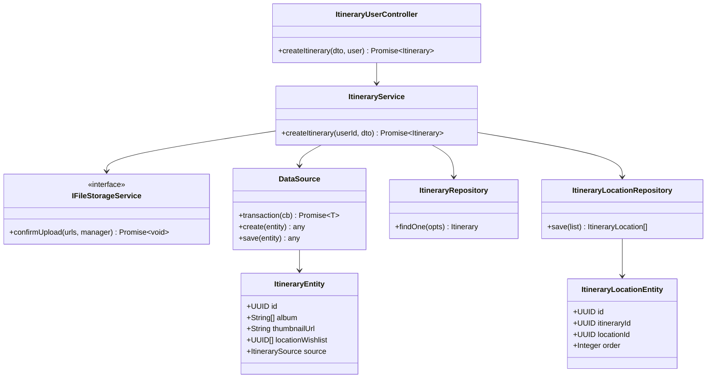
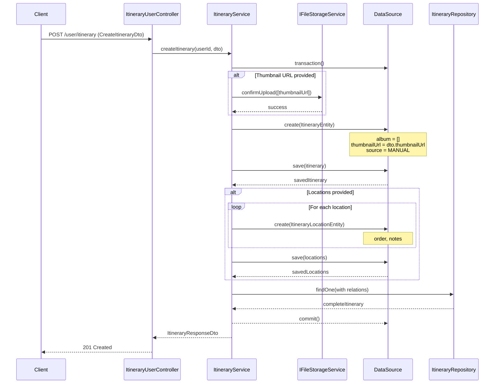
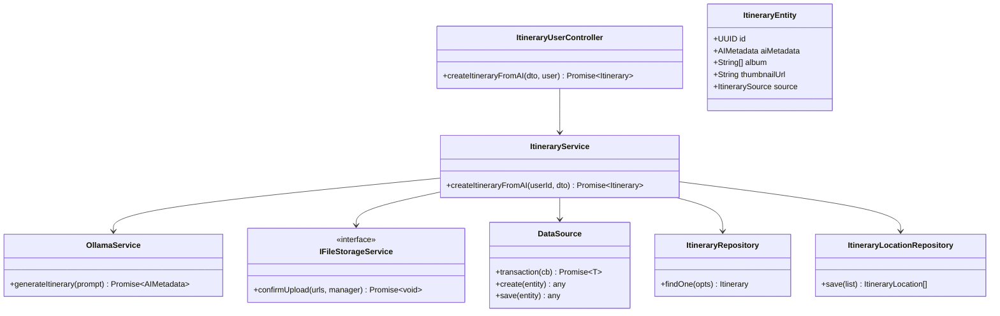
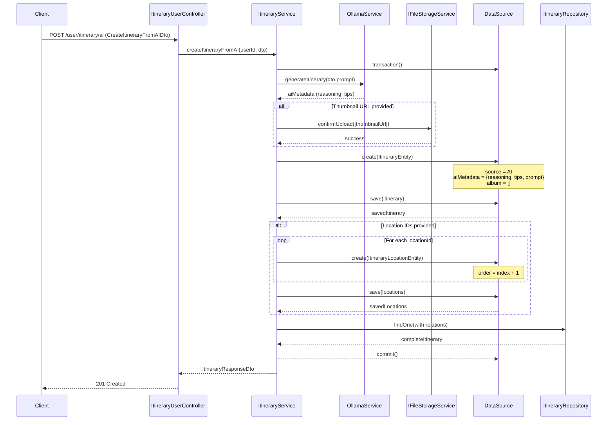
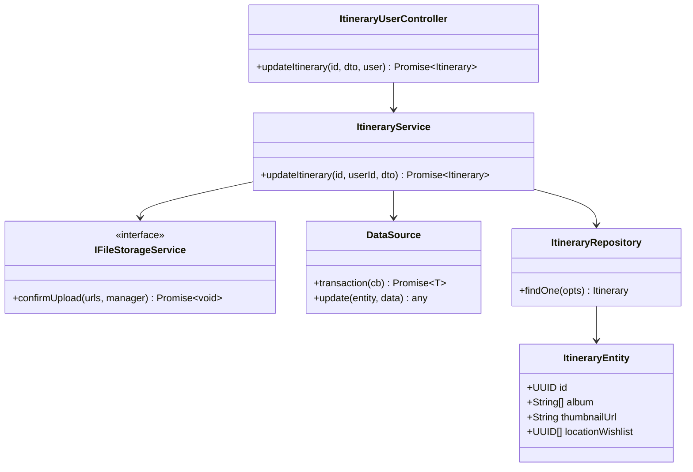
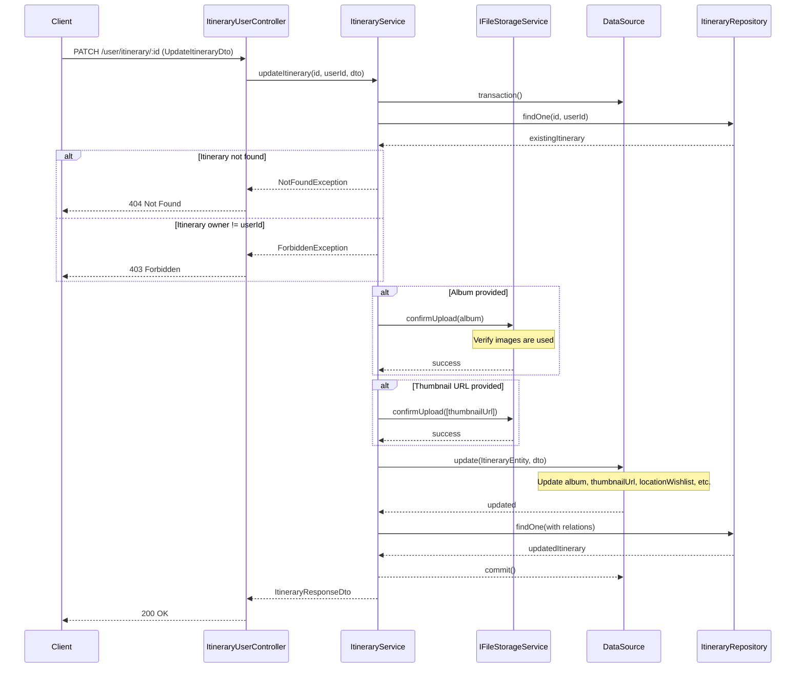

# Itinerary Feature - Class & Sequence Diagrams

## Class Diagram

```mermaid
classDiagram
    class ItineraryEntity {
        +UUID id
        +UUID userId
        +String title
        +String description
        +Date startDate
        +Date endDate
        +ItinerarySource source
        +AIMetadata aiMetadata
        +String[] album
        +String thumbnailUrl
        +UUID[] locationWishlist
        +Date createdAt
        +Date updatedAt
    }

    class AccountEntity {
        +UUID id
        +String firstName
        +String lastName
        +String email
        +String avatarUrl
        +Boolean hasOnboarded
    }

    class ItineraryLocationEntity {
        +UUID id
        +UUID itineraryId
        +UUID locationId
        +Integer order
        +String notes
    }

    class LocationEntity {
        +UUID id
        +String name
        +String description
        +Decimal latitude
        +Decimal longitude
        +String addressLine
        +String[] imageUrl
    }

    class IItineraryService {
        <<interface>>
        +createItinerary(userId, dto) Promise~Itinerary~
        +createItineraryFromAI(userId, dto) Promise~Itinerary~
        +updateItinerary(id, userId, dto) Promise~Itinerary~
        +getItineraryById(id, userId) Promise~Itinerary~
        +getMyItineraries(userId, query) Promise~Paginated~
        +deleteItinerary(id, userId) Promise~void~
    }

    class ItineraryService {
        -ItineraryRepository itineraryRepository
        -ItineraryLocationRepository itineraryLocationRepository
        -DataSource dataSource
        -IFileStorageService fileStorageService
        +createItinerary(userId, dto) Promise~Itinerary~
        +createItineraryFromAI(userId, dto) Promise~Itinerary~
        +updateItinerary(id, userId, dto) Promise~Itinerary~
        +getItineraryById(id, userId) Promise~Itinerary~
        +getMyItineraries(userId, query) Promise~Paginated~
        +deleteItinerary(id, userId) Promise~void~
    }

    class ItineraryUserController {
        -IItineraryService itineraryService
        +createItinerary(dto, user) Promise~Itinerary~
        +createItineraryFromAI(dto, user) Promise~Itinerary~
        +updateItinerary(id, dto, user) Promise~Itinerary~
        +getItineraryById(id, user) Promise~Itinerary~
        +getMyItineraries(query, user) Promise~Paginated~
        +deleteItinerary(id, user) Promise~void~
    }

    class IFileStorageService {
        <<interface>>
        +confirmUpload(urls, manager) Promise~void~
    }

    class OllamaService {
        +generateItinerary(prompt) Promise~AIMetadata~
    }

    %% Relationships
    AccountEntity ||--o{ ItineraryEntity : "creates"
    ItineraryEntity ||--o{ ItineraryLocationEntity : "contains"
    ItineraryLocationEntity }o--|| LocationEntity : "references"

    IItineraryService <|.. ItineraryService
    ItineraryUserController --> IItineraryService
    ItineraryService --> IFileStorageService
    ItineraryService --> OllamaService
```

## Sequence Diagram: Create Itinerary (Manual)

### Class Diagram: Create Itinerary (Manual)





## Sequence Diagram: Create Itinerary from AI

### Class Diagram: Create Itinerary from AI





## Sequence Diagram: Update Itinerary Album

### Class Diagram: Update Itinerary Album




