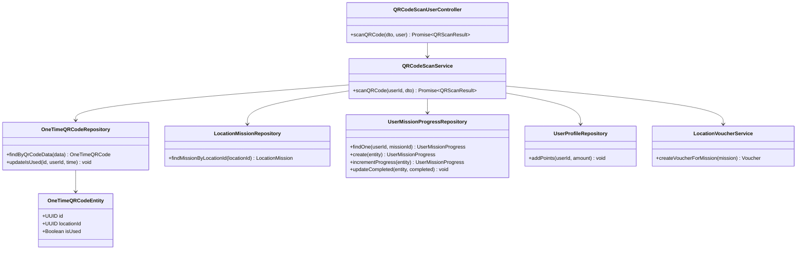
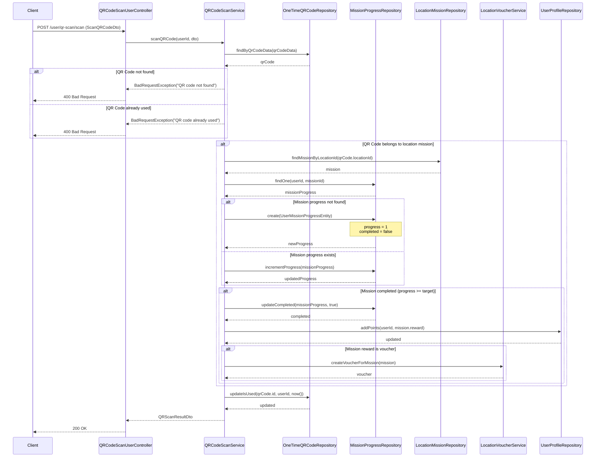
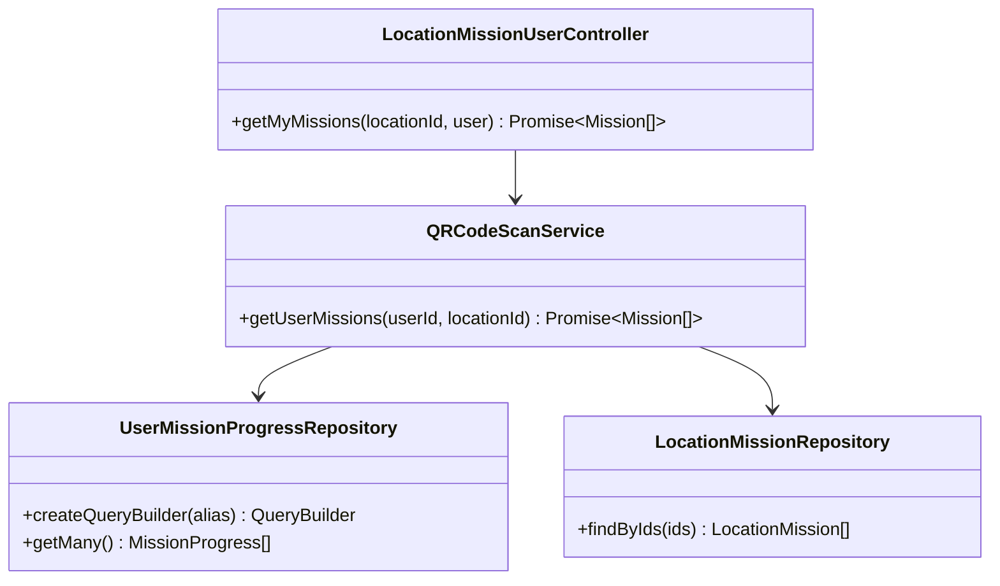
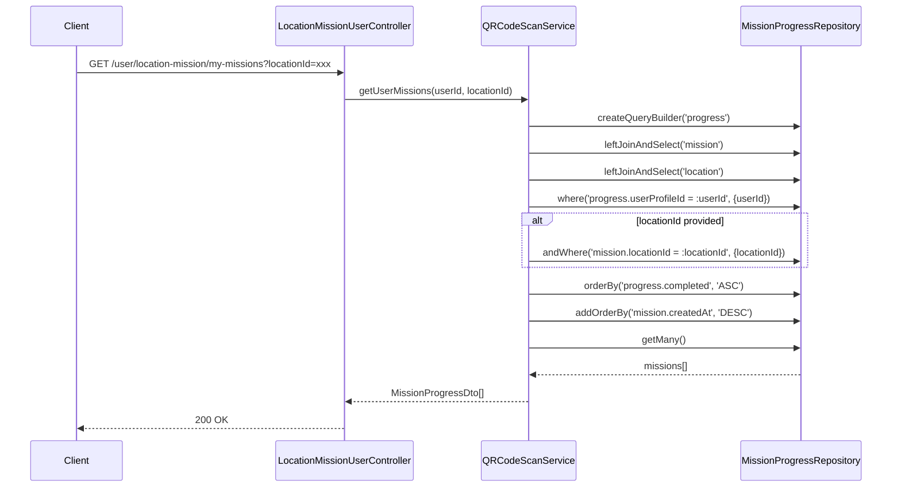
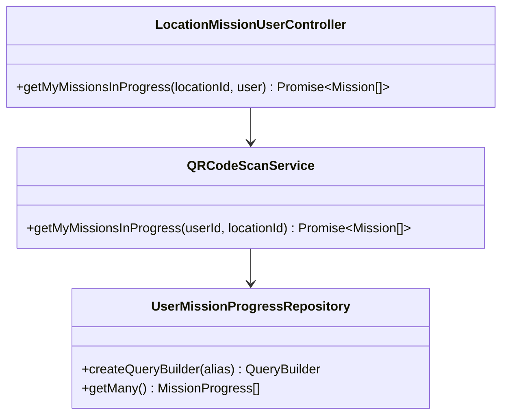
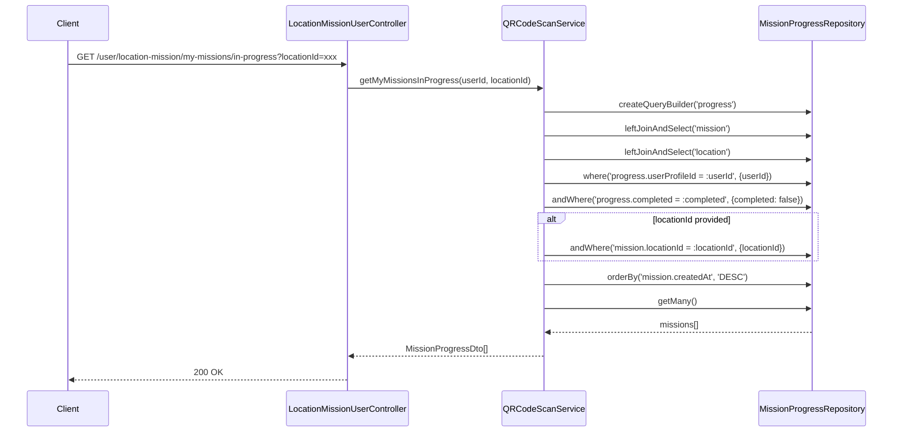
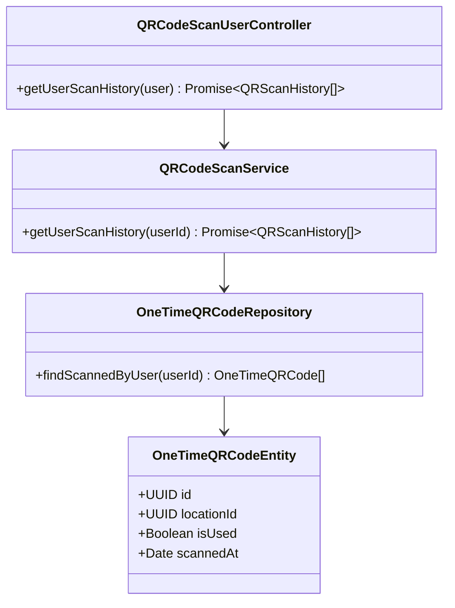
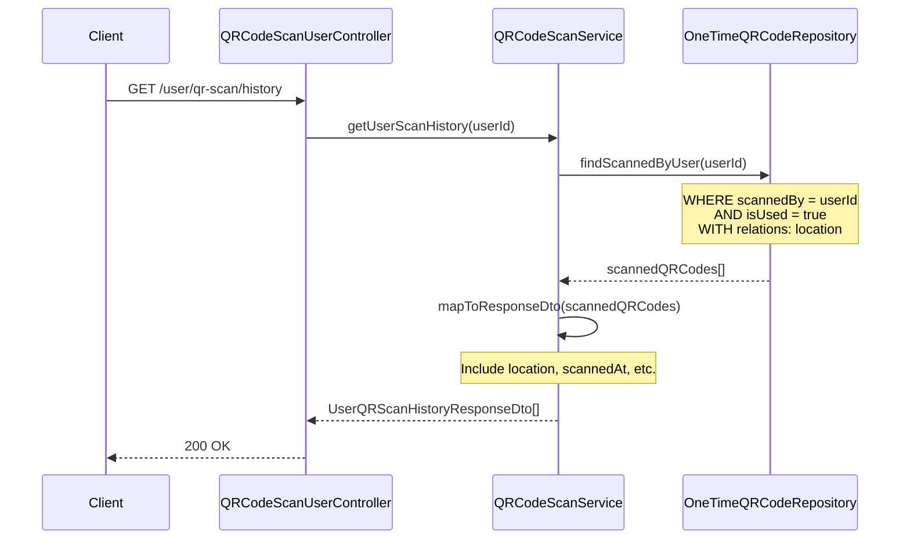

# Mission Feature - Class & Sequence Diagrams

## Class Diagram

```mermaid
classDiagram
    class LocationMissionEntity {
        +UUID id
        +UUID locationId
        +String title
        +String description
        +Integer target
        +Date startDate
        +Date endDate
        +Integer reward
        +String[] imageUrls
        +Date createdAt
        +Date updatedAt
        +isActive() Boolean
    }

    class UserMissionProgressEntity {
        +UUID id
        +UUID userProfileId
        +UUID missionId
        +Integer progress
        +Boolean completed
        +isComplete() Boolean
        +getProgressPercentage() Number
    }

    class UserProfileEntity {
        +UUID accountId
        +Integer points
        +UUID rankId
        +addPoints(amount) void
        +deductPoints(amount) void
    }

    class LocationEntity {
        +UUID id
        +String name
        +String addressLine
        +Decimal latitude
        +Decimal longitude
        +UUID businessId
    }

    class OneTimeQRCodeEntity {
        +UUID id
        +UUID locationId
        +String qrCodeData
        +UUID businessOwnerId
        +String referenceId
        +Boolean isUsed
        +UUID scannedBy
        +Date scannedAt
        +Date createdAt
        +isValid() Boolean
    }

    class ILocationMissionService {
        <<interface>>
        +createMission(locationId, dto) Promise~Mission~
        +getMissionsByLocation(locationId, query) Promise~Paginated~
        +getMissionById(missionId) Promise~Mission~
        +updateMission(missionId, dto) Promise~Mission~
        +deleteMission(missionId) Promise~void~
        +getActiveMissionsByLocation(locationId, query) Promise~Paginated~
        +getAvailableMissionsForUser(locationId, userId, query) Promise~Paginated~
        +getCompletedMissionsByUser(locationId, userId, query) Promise~Paginated~
    }

    class IQRCodeScanService {
        <<interface>>
        +scanQRCode(userId, dto) Promise~QRScanResult~
        +getUserScanHistory(userId) Promise~QRScanHistory[]~
        +getBusinessScanHistory(businessOwnerId) Promise~QRScanHistory[]~
        +getUserMissions(userId, locationId) Promise~Mission[]~
        +getMyMissionsInProgress(userId, locationId) Promise~Mission[]~
        +getUserMissionProgress(userId, missionId) Promise~MissionProgress~
    }

    class QRCodeScanService {
        -OneTimeQRCodeRepository qrCodeRepository
        -UserMissionProgressRepository missionProgressRepository
        -LocationMissionRepository missionRepository
        -UserProfileRepository userProfileRepository
        -LocationVoucherService voucherService
        +scanQRCode(userId, dto) Promise~QRScanResult~
        +getUserScanHistory(userId) Promise~QRScanHistory[]~
        +getUserMissions(userId, locationId) Promise~Mission[]~
        +getMyMissionsInProgress(userId, locationId) Promise~Mission[]~
        +getUserMissionProgress(userId, missionId) Promise~MissionProgress~
    }

    class LocationMissionUserController {
        -ILocationMissionService locationMissionService
        -IQRCodeScanService qrCodeScanService
        +getMyMissions(locationId, user) Promise~Mission[]~
        +getMyMissionsInProgress(locationId, user) Promise~Mission[]~
        +getMyMissionProgress(missionId, user) Promise~MissionProgress~
        +getMissionsByLocation(locationId, query, user) Promise~Paginated~
    }

    class QRCodeScanUserController {
        -IQRCodeScanService qrCodeScanService
        +scanQRCode(dto, user) Promise~QRScanResult~
        +getUserScanHistory(user) Promise~QRScanHistory[]~
    }

    %% Relationships
    LocationEntity ||--o{ LocationMissionEntity : "has"
    UserProfileEntity ||--o{ UserMissionProgressEntity : "tracks"
    LocationMissionEntity ||--o{ UserMissionProgressEntity : "tracked by"
    LocationEntity ||--o{ OneTimeQRCodeEntity : "has"
    UserProfileEntity ||--o{ OneTimeQRCodeEntity : "scans"

    IQRCodeScanService <|.. QRCodeScanService
    LocationMissionUserController --> ILocationMissionService
    LocationMissionUserController --> IQRCodeScanService
    QRCodeScanUserController --> IQRCodeScanService
```

## Sequence Diagram: Scan QR Code and Complete Mission

### Class Diagram: Scan QR Code and Complete Mission





## Sequence Diagram: Get User Missions

### Class Diagram: Get User Missions





## Sequence Diagram: Get Missions In Progress

### Class Diagram: Get Missions In Progress





## Sequence Diagram: Get QR Scan History

### Class Diagram: Get QR Scan History




