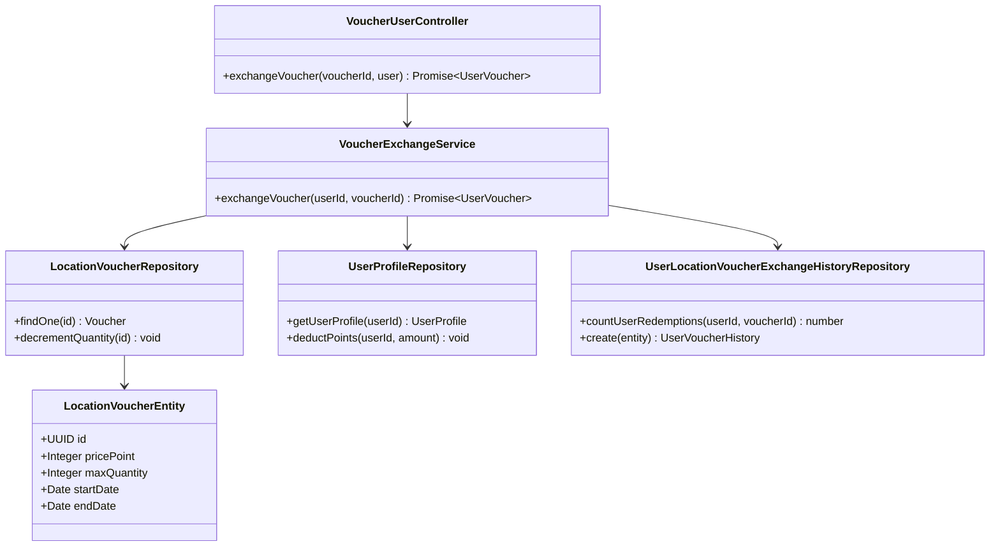
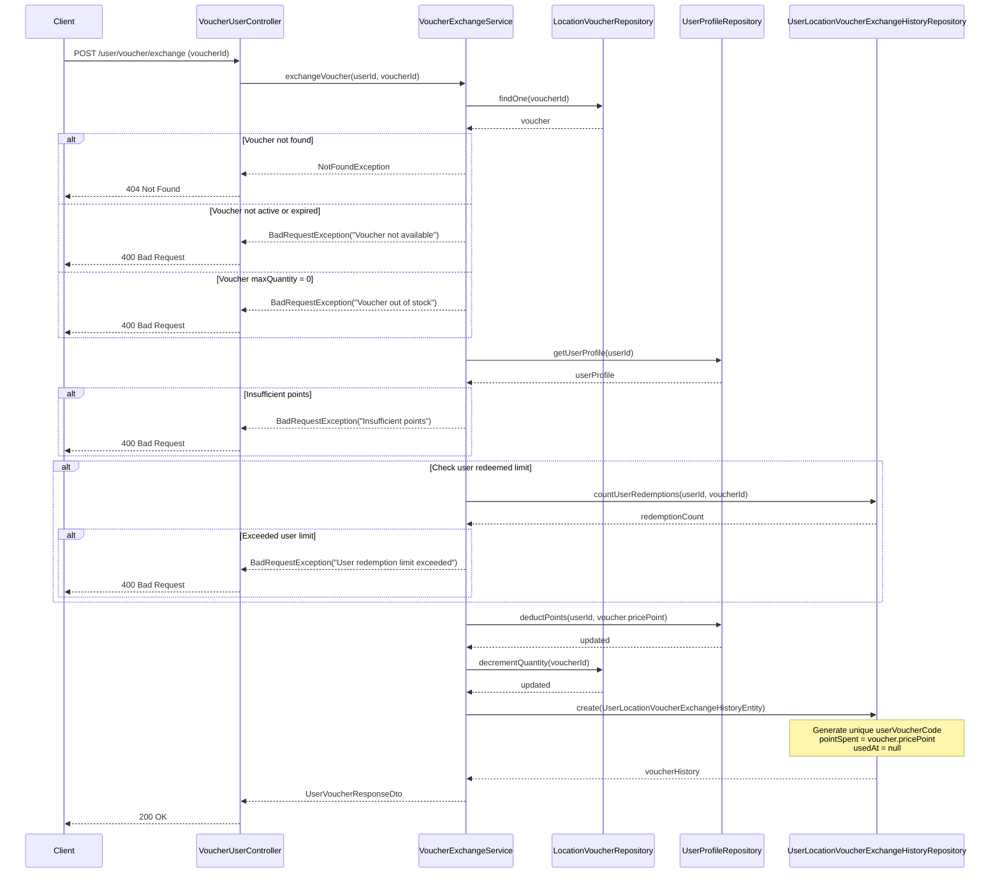
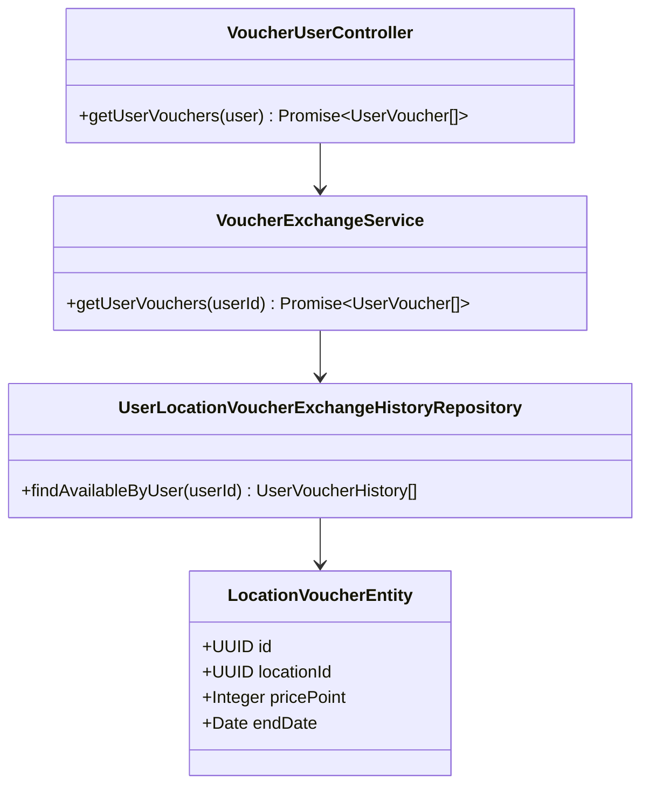
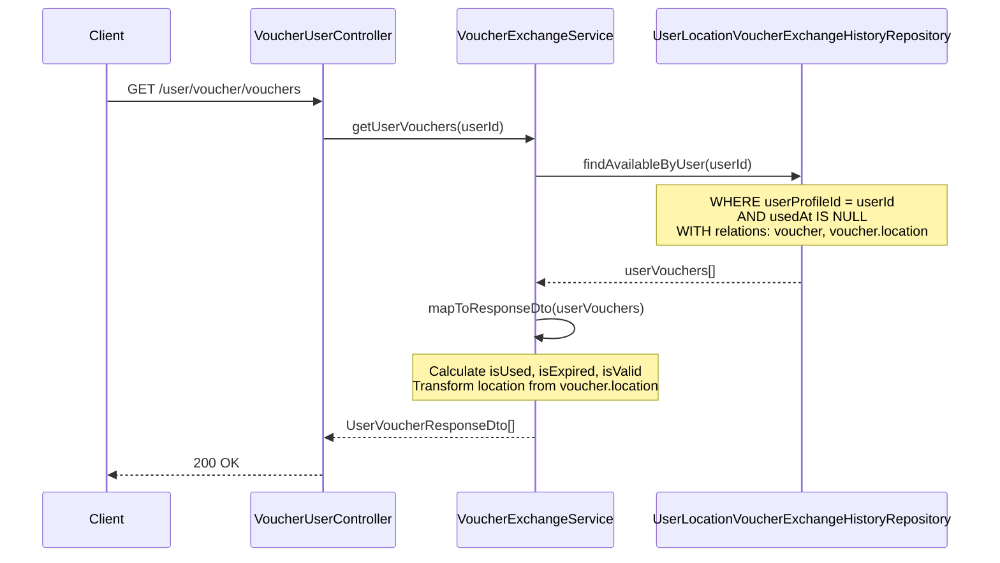
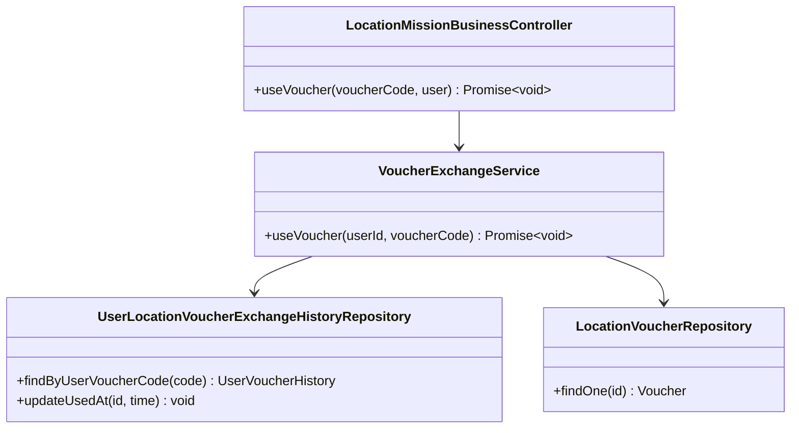
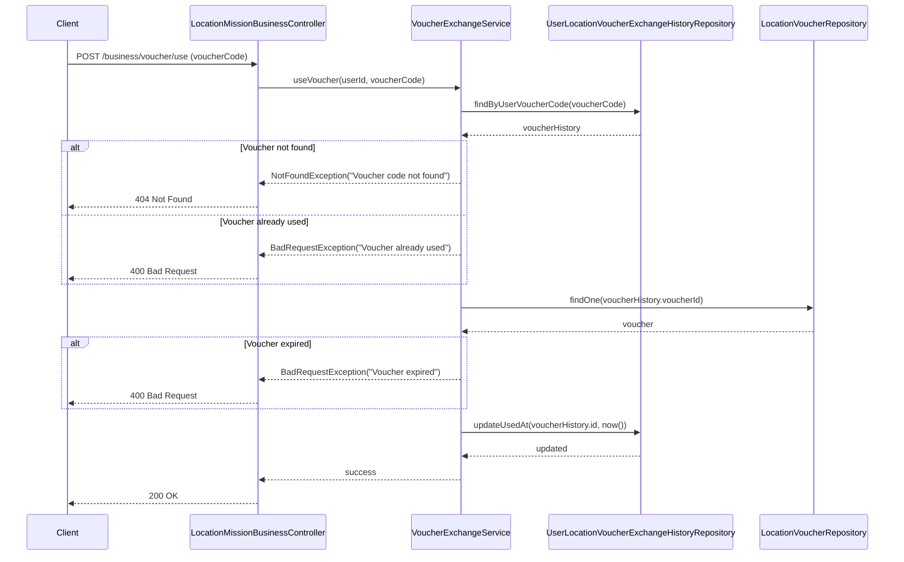
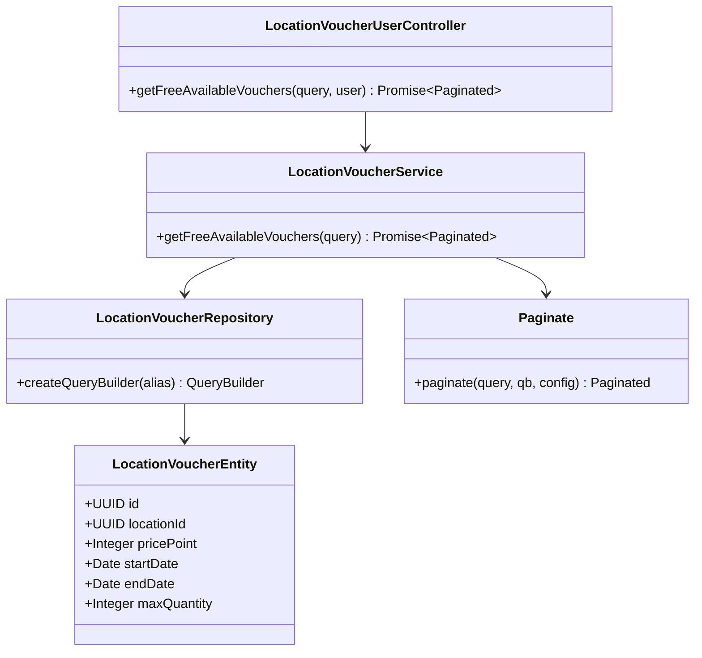
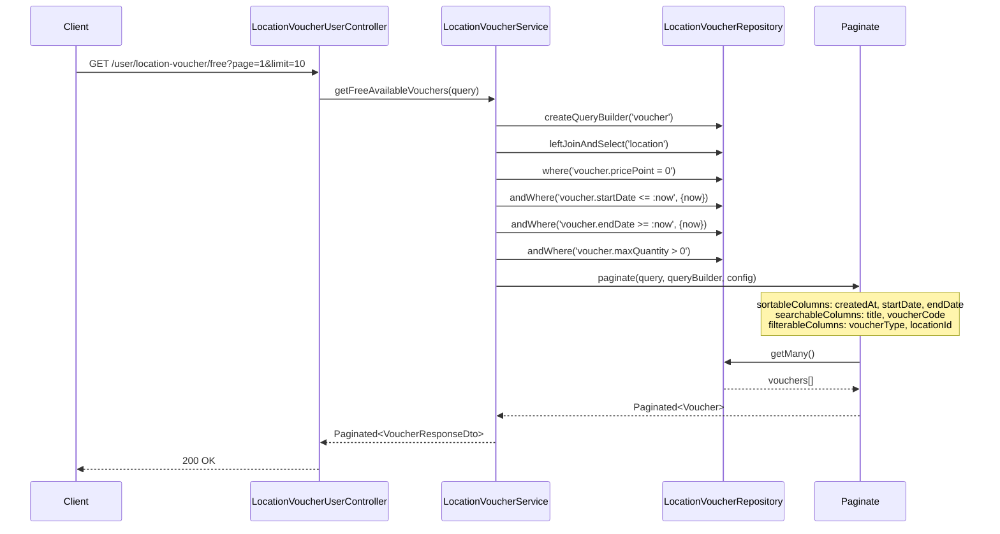

# Voucher Feature - Class & Sequence Diagrams

## Class Diagram

```mermaid
classDiagram
    class LocationVoucherEntity {
        +UUID id
        +UUID locationId
        +String title
        +String description
        +String voucherCode
        +String imageUrl
        +Integer pricePoint
        +Integer maxQuantity
        +Integer userRedeemedLimit
        +LocationVoucherType voucherType
        +Date startDate
        +Date endDate
        +Date createdAt
        +Date updatedAt
        +isAvailable() Boolean
        +isExpired() Boolean
        +isActive() Boolean
    }

    class UserLocationVoucherExchangeHistoryEntity {
        +UUID id
        +UUID voucherId
        +UUID userProfileId
        +Integer pointSpent
        +String userVoucherCode
        +Date usedAt
        +Date createdAt
        +isUsed() Boolean
        +isExpired() Boolean
        +isValid() Boolean
    }

    class UserProfileEntity {
        +UUID accountId
        +Integer points
        +UUID rankId
        +addPoints(amount) void
        +deductPoints(amount) void
        +hasEnoughPoints(amount) Boolean
    }

    class LocationEntity {
        +UUID id
        +String name
        +String addressLine
        +Decimal latitude
        +Decimal longitude
        +UUID businessId
    }

    class ILocationVoucherService {
        <<interface>>
        +createVoucher(locationId, dto) Promise~Voucher~
        +getVouchersByLocation(locationId, query) Promise~Paginated~
        +getVoucherById(voucherId) Promise~Voucher~
        +updateVoucher(voucherId, dto) Promise~Voucher~
        +deleteVoucher(voucherId) Promise~void~
        +getFreeAvailableVouchers(query) Promise~Paginated~
    }

    class IVoucherExchangeService {
        <<interface>>
        +exchangeVoucher(userId, voucherId) Promise~UserVoucher~
        +getUserVouchers(userId) Promise~UserVoucher[]~
        +useVoucher(userId, voucherCode) Promise~void~
    }

    class VoucherExchangeService {
        -UserLocationVoucherExchangeHistoryRepository voucherHistoryRepository
        -UserProfileRepository userProfileRepository
        -LocationVoucherRepository voucherRepository
        +exchangeVoucher(userId, voucherId) Promise~UserVoucher~
        +getUserVouchers(userId) Promise~UserVoucher[]~
        +useVoucher(userId, voucherCode) Promise~void~
    }

    class LocationVoucherUserController {
        -ILocationVoucherService locationVoucherService
        +getFreeAvailableVouchers(query, user) Promise~Paginated~
        +getVouchersByLocation(locationId, query, user) Promise~Paginated~
        +getVoucherById(voucherId, user) Promise~Voucher~
    }

    class VoucherUserController {
        -IVoucherExchangeService voucherExchangeService
        +exchangeVoucher(voucherId, user) Promise~UserVoucher~
        +getUserVouchers(user) Promise~UserVoucher[]~
    }

    class LocationMissionBusinessController {
        -IVoucherExchangeService voucherExchangeService
        +useVoucher(voucherCode, user) Promise~void~
    }

    %% Relationships
    LocationEntity ||--o{ LocationVoucherEntity : "has"
    LocationVoucherEntity ||--o{ UserLocationVoucherExchangeHistoryEntity : "exchanged as"
    UserProfileEntity ||--o{ UserLocationVoucherExchangeHistoryEntity : "exchanges"

    ILocationVoucherService <|.. LocationVoucherService
    IVoucherExchangeService <|.. VoucherExchangeService
    LocationVoucherUserController --> ILocationVoucherService
    VoucherUserController --> IVoucherExchangeService
    LocationMissionBusinessController --> IVoucherExchangeService
```

## Sequence Diagram: Exchange Voucher

### Class Diagram: Exchange Voucher





## Sequence Diagram: Get User Available Vouchers

### Class Diagram: Get User Available Vouchers





## Sequence Diagram: Use Voucher (Business Owner)

### Class Diagram: Use Voucher (Business Owner)





## Sequence Diagram: Get Free Available Vouchers

### Class Diagram: Get Free Available Vouchers




