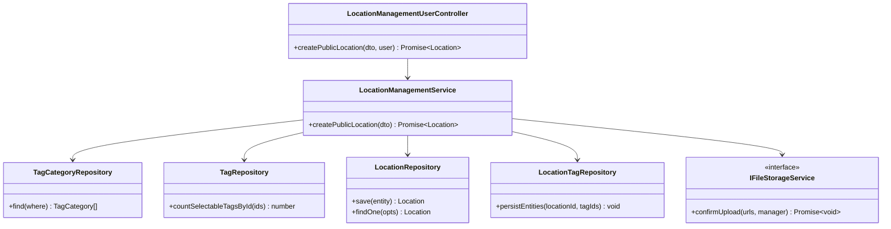
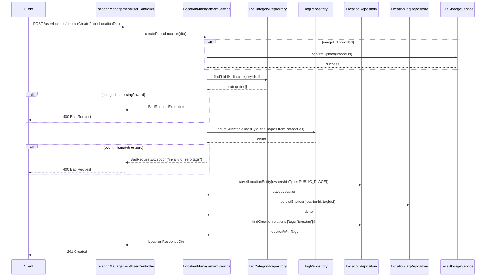
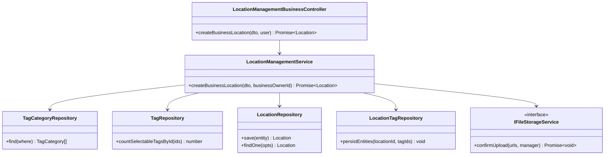
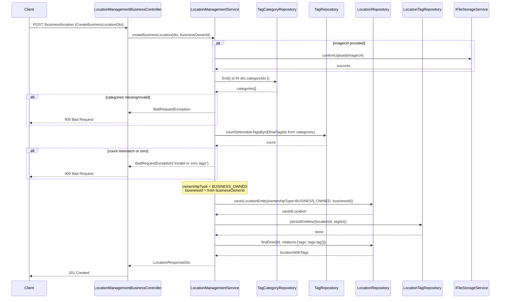
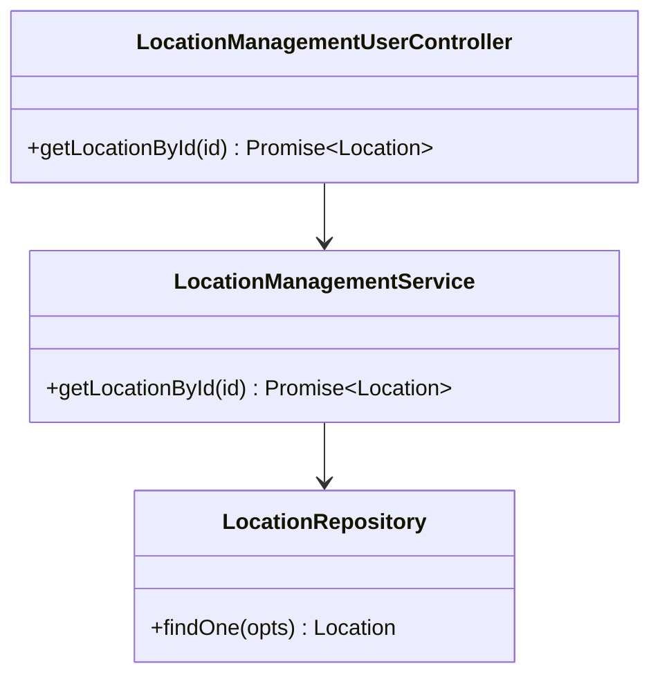
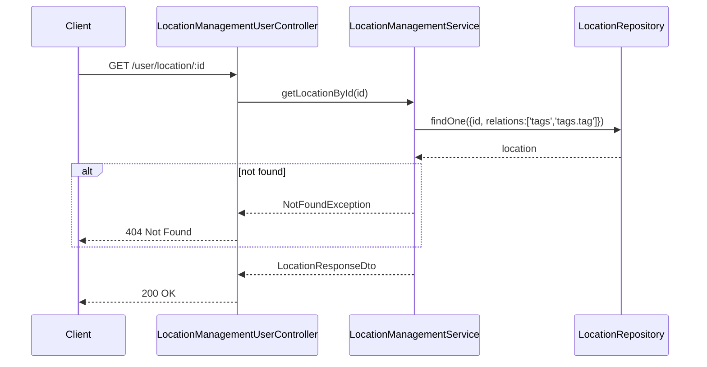

# Location Feature - Class & Sequence Diagrams

## Description

Mô tả domain Location: tạo địa điểm (public do user tạo, business do business owner tạo), xác thực category → tags, xem chi tiết địa điểm kèm tags và analytics cơ bản. Áp dụng chuẩn xác nhận ảnh đã upload nếu có.

## Class Diagram

```mermaid
classDiagram

    class LocationEntity {
        +UUID id
        +String name
        +String description
        +Decimal latitude
        +Decimal longitude
        +String addressLine
        +String addressLevel1
        +String addressLevel2
        +LocationOwnershipType ownershipType
        +UUID businessId
        +String[] imageUrl
        +Boolean isVisibleOnMap
        +Date createdAt
        +Date updatedAt
    }

    class BusinessEntity {
        +UUID id
        +UUID accountId
        +String name
        +String email
        +String phone
        +Boolean isActive
    }

    class TagEntity {
        +Integer id
        +String name
        +Boolean selectable
    }

    class TagCategoryEntity {
        +Integer id
        +String name
        +CategoryType[] applicableTypes
        +Map<tagId, weight> tagScoreWeights
    }

    class LocationTagEntity {
        +UUID id
        +UUID locationId
        +Integer tagId
    }

    class LocationAnalyticsEntity {
        +UUID id
        +UUID locationId
        +Integer totalReviews
        +Integer totalCheckins
        +Integer totalReacts
    }

    class CreatePublicLocationDto {
        +String name
        +String description
        +Decimal latitude
        +Decimal longitude
        +String addressLine
        +Integer[] categoryIds
        +String[] imageUrl
    }

    class ILocationManagementService {
        <<interface>>
        +createPublicLocation(dto) Promise~Location~
        +getLocationById(id) Promise~Location~
    }

    class LocationManagementService {
        -DataSource dataSource
        -IFileStorageService fileStorageService
        -mergeTagsWithCategories(categories) Integer[]
        +createPublicLocation(dto) Promise~Location~
        +getLocationById(id) Promise~Location~
    }

    class LocationManagementUserController {
        -ILocationManagementService locationService
        +createPublicLocation(dto, user) Promise~Location~
        +getLocationById(id) Promise~Location~
    }

    class IFileStorageService {
        <<interface>>
        +confirmUpload(urls, manager) Promise~void~
    }

    %% Relationships
    LocationEntity ||--o{ LocationTagEntity : "has"
    TagEntity ||--o{ LocationTagEntity : "applied as"
    TagCategoryEntity "many" o-- "many" TagEntity : "weights via tag_score_weights"
    LocationEntity "1" -- "1" LocationAnalyticsEntity : has
    BusinessEntity "1" -- "many" LocationEntity : owns (BUSINESS_OWNED)

    ILocationManagementService <|.. LocationManagementService
    LocationManagementUserController --> ILocationManagementService
    LocationManagementService --> IFileStorageService
```

## Sequence Diagram: Create Public Location

### Class Diagram: Create Public Location





## Sequence Diagram: Create Business Location

### Class Diagram: Create Business Location





## Sequence Diagram: Get Location by Id

### Class Diagram: Get Location by Id




