# Event Feature - Class & Sequence Diagrams

## Description

Mô tả domain Event: tạo sự kiện gắn với địa điểm hoặc business, quản lý tham gia (RSVP/Join), và liệt kê sự kiện sắp diễn ra. Kết nối với Account (organizer/participant) và Location.

## Class Diagram

```mermaid
classDiagram

    class EventEntity {
        +UUID id
        +String title
        +String description
        +Date startTime
        +Date endTime
        +UUID locationId
        +UUID organizerAccountId
        +String[] imageUrls
        +Boolean isPublic
        +Date createdAt
        +Date updatedAt
    }

    class EventParticipantEntity {
        +UUID id
        +UUID eventId
        +UUID accountId
        +Date joinedAt
        +Boolean checkedIn
    }

    class AccountEntity {
        +UUID id
        +String firstName
        +String lastName
        +String email
        +Role role
    }

    class LocationEntity {
        +UUID id
        +String name
        +Decimal latitude
        +Decimal longitude
        +String addressLine
    }

    class IEventService {
        <<interface>>
        +createEvent(dto, organizerId) Promise~Event~
        +joinEvent(eventId, accountId) Promise~void~
        +listUpcomingEvents(query) Promise~Paginated~
        +getEventById(id) Promise~Event~
    }

    class EventService {
        -EventRepository eventRepository
        -EventParticipantRepository eventParticipantRepository
        -LocationRepository locationRepository
        -IFileStorageService fileStorageService
        +createEvent(dto, organizerId) Promise~Event~
        +joinEvent(eventId, accountId) Promise~void~
        +listUpcomingEvents(query) Promise~Paginated~
        +getEventById(id) Promise~Event~
    }

    class EventUserController {
        -IEventService eventService
        +createEvent(dto, user) Promise~Event~
        +joinEvent(eventId, user) Promise~void~
        +listUpcomingEvents(query) Promise~Paginated~
        +getEventById(id) Promise~Event~
    }

    class IFileStorageService {
        <<interface>>
        +confirmUpload(urls, manager) Promise~void~
    }

    %% Relationships
    EventEntity ||--o{ EventParticipantEntity : "has participants"
    AccountEntity ||--o{ EventParticipantEntity : "joins"
    AccountEntity "1" -- "many" EventEntity : organizes
    LocationEntity "1" -- "many" EventEntity : hosts

    IEventService <|.. EventService
    EventUserController --> IEventService
    EventService --> IFileStorageService
```

## Sequence Diagram: Create Event

### Class Diagram: Create Event


## Sequence Diagram: Join Event

### Class Diagram: Join Event


## Sequence Diagram: List Upcoming Events

### Class Diagram: List Upcoming Events

```mermaid
sequenceDiagram
    participant Client
    participant EventController as EventUserController
    participant EventService
    participant EventRepository
    participant Paginate

    Client->>EventController: GET /user/event/upcoming?page=1&limit=10
    EventController->>EventService: listUpcomingEvents(query)

    EventService->>EventRepository: createQueryBuilder('event')
    EventService->>EventRepository: where('event.startTime >= :now', {now})
    EventService->>EventRepository: andWhere('event.isPublic = true')

    EventService->>Paginate: paginate(query, queryBuilder, config)
    Paginate->>EventRepository: getMany()
    EventRepository-->>Paginate: events[]
    Paginate-->>EventService: Paginated<Event>

    EventService-->>EventController: Paginated<EventResponseDto>
    EventController-->>Client: 200 OK
```



