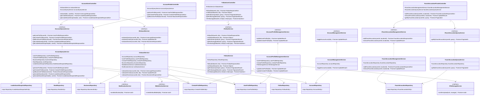

# Class Diagram - Account Module (Services)

```mermaid
classDiagram
    %% Controllers
    class AccountUserController {
        -IOnboardService onboardService
        -IAccountQueryService accountQueryService
        +onboard(dto, userDto) Promise~UserLoginResponseDto~
        +getLeaderboard(user) Promise~LeaderboardResponseDto~
        +getLeaderboardSnapshot(dto, user) Promise~LeaderboardSnapshotResponseDto~
    }

    class AccountPublicController {
        -IAccountQueryService accountQueryService
        +getUserProfile(userId) Promise~UserProfileResponseDto~
        +getCreatorProfile(userId) Promise~CreatorProfileResponseDto~
        +getBusinessProfile(businessId) Promise~BusinessResponseDto~
    }

    class FollowUserController {
        -IFollowService followService
        +follow(followerId, dto) Promise~FollowResponseDto~
        +unfollow(followerId, dto) Promise~Object~
        +getFollowers(entityId, query) Promise~PaginationResult~
        +getFollowing(followerId, query) Promise~PaginationResult~
        +isFollowing(followerId, entityId, entityType) Promise~boolean~
    }

    class FavoriteLocationPrivateController {
        -IFavoriteLocationManagementService favoriteLocationManagementService
        -IFavoriteLocationQueryService favoriteLocationQueryService
        +addFavoriteLocation(userDto, locationId) Promise~FavoriteLocationResponseDto~
        +removeFavoriteLocation(userDto, locationId) Promise~UpdateResult~
        +getMyFavoriteLocations(userDto, query) Promise~Paginated~
    }

    %% Service Interfaces
    class IAccountQueryService {
        <<interface>>
        +getUserProfile(userId) Promise~UserProfileResponseDto~
        +getCreatorProfile(userId) Promise~CreatorProfileResponseDto~
        +getBusinessProfile(businessId) Promise~BusinessResponseDto~
        +getLeaderboard(userId) Promise~LeaderboardResponseDto~
        +getLeaderboardSnapshot(dto, userId) Promise~LeaderboardSnapshotResponseDto~
    }

    class IOnboardService {
        <<interface>>
        +onboardUser(accountId, dto) Promise~UserLoginResponseDto~
        +onboardCreator(accountId, dto) Promise~UpdateResult~
        +onboardOwner(accountId, dto) Promise~BusinessResponseDto~
    }

    class IFollowService {
        <<interface>>
        +follow(followerId, dto) Promise~FollowResponseDto~
        +unfollow(followerId, dto) Promise~Object~
        +getFollowers(entityId, query) Promise~PaginationResult~
        +getFollowing(followerId, query) Promise~PaginationResult~
        +isFollowing(followerId, entityId, entityType) Promise~boolean~
    }

    class IFavoriteLocationManagementService {
        <<interface>>
        +addFavoriteLocation(userId, locationId) Promise~FavoriteLocationResponseDto~
        +removeFavoriteLocation(userId, locationId) Promise~UpdateResult~
    }

    class IFavoriteLocationQueryService {
        <<interface>>
        +getMyFavoriteLocations(userId, query) Promise~Paginated~
    }

    class IAccountManagementService {
        <<interface>>
        +toggleAccountLock(dto) Promise~UpdateResult~
    }

    class IAccountProfileManagementService {
        <<interface>>
        +updateUserProfile(dto) Promise~UpdateResult~
        +updateCreatorProfile(dto) Promise~UpdateResult~
    }

    %% Service Implementations
    class AccountQueryService {
        -UserProfileRepository userProfileRepository
        -CreatorProfileRepository creatorProfileRepository
        -BusinessRepository businessRepository
        -RankRepository rankRepository
        -LeaderboardSnapshotRepository leaderboardSnapshotRepository
        +getUserProfile(userId) Promise~UserProfileResponseDto~
        +getCreatorProfile(userId) Promise~CreatorProfileResponseDto~
        +getBusinessProfile(businessId) Promise~BusinessResponseDto~
        +getLeaderboard(userId) Promise~LeaderboardResponseDto~
        +getLeaderboardSnapshot(dto, userId) Promise~LeaderboardSnapshotResponseDto~
    }

    class OnboardService {
        -AccountRepository accountRepository
        -UserProfileRepository userProfileRepository
        -CreatorProfileRepository creatorProfileRepository
        -BusinessRepository businessRepository
        -IWalletActionService walletActionService
        -INotificationService notificationService
        +onboardUser(accountId, dto) Promise~UserLoginResponseDto~
        +onboardCreator(accountId, dto) Promise~UpdateResult~
        +onboardOwner(accountId, dto) Promise~BusinessResponseDto~
    }

    class FollowService {
        -FollowRepository followRepository
        +follow(followerId, dto) Promise~FollowResponseDto~
        +unfollow(followerId, dto) Promise~Object~
        +getFollowers(entityId, query) Promise~PaginationResult~
        +getFollowing(followerId, query) Promise~PaginationResult~
        +isFollowing(followerId, entityId, entityType) Promise~boolean~
    }

    class FavoriteLocationManagementService {
        -FavoriteLocationRepository favoriteLocationRepository
        +addFavoriteLocation(userId, locationId) Promise~FavoriteLocationResponseDto~
        +removeFavoriteLocation(userId, locationId) Promise~UpdateResult~
    }

    class FavoriteLocationQueryService {
        -FavoriteLocationRepository favoriteLocationRepository
        +getMyFavoriteLocations(userId, query) Promise~Paginated~
    }

    class AccountManagementService {
        -AccountRepository accountRepository
        +toggleAccountLock(dto) Promise~UpdateResult~
    }

    class AccountProfileManagementService {
        -UserProfileRepository userProfileRepository
        -CreatorProfileRepository creatorProfileRepository
        -IFileStorageService fileStorageService
        +updateUserProfile(dto) Promise~UpdateResult~
        +updateCreatorProfile(dto) Promise~UpdateResult~
    }

    %% Repositories
    class AccountRepository {
        +repo Repository~AccountEntity~
    }

    class UserProfileRepository {
        +repo Repository~UserProfileEntity~
    }

    class CreatorProfileRepository {
        +repo Repository~CreatorProfileEntity~
    }

    class BusinessRepository {
        +repo Repository~BusinessEntity~
    }

    class FollowRepository {
        +repo Repository~FollowEntity~
    }

    class FavoriteLocationRepository {
        +repo Repository~FavoriteLocationEntity~
    }

    class RankRepository {
        +repo Repository~RankEntity~
    }

    class LeaderboardSnapshotRepository {
        +repo Repository~LeaderboardSnapshotEntity~
    }

    %% External Services
    class IWalletActionService {
        <<interface>>
        +createDefaultWallet(dto) Promise~void~
    }

    class INotificationService {
        <<interface>>
        +sendNotification(dto) Promise~void~
    }

    class IFileStorageService {
        <<interface>>
        +confirmUpload(urls, manager) Promise~void~
    }

    %% Relationships
    AccountUserController "1" --> "1" IOnboardService
    AccountUserController "1" --> "1" IAccountQueryService
    AccountPublicController "1" --> "1" IAccountQueryService
    FollowUserController "1" --> "1" IFollowService
    FavoriteLocationPrivateController "1" --> "1" IFavoriteLocationManagementService
    FavoriteLocationPrivateController "1" --> "1" IFavoriteLocationQueryService

    IAccountQueryService <|.. AccountQueryService
    IOnboardService <|.. OnboardService
    IFollowService <|.. FollowService
    IFavoriteLocationManagementService <|.. FavoriteLocationManagementService
    IFavoriteLocationQueryService <|.. FavoriteLocationQueryService
    IAccountManagementService <|.. AccountManagementService
    IAccountProfileManagementService <|.. AccountProfileManagementService

    AccountQueryService "1" --> "1" UserProfileRepository
    AccountQueryService "1" --> "1" CreatorProfileRepository
    AccountQueryService "1" --> "1" BusinessRepository
    AccountQueryService "1" --> "1" RankRepository
    AccountQueryService "1" --> "1" LeaderboardSnapshotRepository

    OnboardService "1" --> "1" AccountRepository
    OnboardService "1" --> "1" UserProfileRepository
    OnboardService "1" --> "1" CreatorProfileRepository
    OnboardService "1" --> "1" BusinessRepository
    OnboardService "1" --> "1" IWalletActionService
    OnboardService "1" --> "1" INotificationService

    FollowService "1" --> "1" FollowRepository
    FavoriteLocationManagementService "1" --> "1" FavoriteLocationRepository
    FavoriteLocationQueryService "1" --> "1" FavoriteLocationRepository
    AccountManagementService "1" --> "1" AccountRepository
    AccountProfileManagementService "1" --> "1" UserProfileRepository
    AccountProfileManagementService "1" --> "1" CreatorProfileRepository
    AccountProfileManagementService "1" --> "1" IFileStorageService
```
