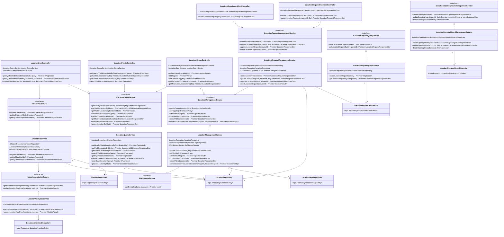

# Class Diagram - Business Module (Services)

```mermaid
classDiagram
    %% Controllers
    class LocationUserController {
        -ILocationQueryService locationQueryService
        -ICheckInV2Service checkInV2Service
        +getMyCheckedInLocations(userDto, query) Promise~Paginated~
        +getMyCheckedInLocationById(userDto, locationId) Promise~CheckInResponseDto~
        +registerCheckIn(userDto, locationId, dto) Promise~CheckInResponseDto~
    }

    class LocationPublicController {
        -ILocationQueryService locationQueryService
        +getNearbyVisibleLocationsByCoordinates(dto, query) Promise~Paginated~
        +getVisibleLocationById(dto) Promise~LocationWithDistanceResponseDto~
        +getVisibleLocationsByBusinessId(dto) Promise~Array~
        +searchVisibleLocations(query) Promise~Paginated~
    }

    class LocationOwnerController {
        -ILocationManagementService locationManagementService
        -ILocationQueryService locationQueryService
        +updateOwnedLocation(dto) Promise~UpdateResult~
        +addTag(dto) Promise~Array~
        +softRemoveTag(dto) Promise~UpdateResult~
        +getMyCreatedLocations(dto, query) Promise~Paginated~
        +getMyCreatedLocationById(dto) Promise~LocationResponseDto~
    }

    class LocationRequestBusinessController {
        -ILocationRequestManagementService locationRequestManagementService
        +createLocationRequest(dto) Promise~LocationRequestResponseDto~
        +updateLocationRequest(requestId, dto) Promise~LocationRequestResponseDto~
    }

    class LocationSubmissionUserController {
        -ILocationRequestManagementService locationRequestManagementService
        +submitLocationRequest(dto) Promise~LocationRequestResponseDto~
    }

    %% Service Interfaces
    class ILocationQueryService {
        <<interface>>
        +getNearbyVisibleLocationsByCoordinates(dto) Promise~Paginated~
        +getVisibleLocationById(dto) Promise~LocationWithDistanceResponseDto~
        +getVisibleLocationsByBusinessId(dto) Promise~Array~
        +searchVisibleLocations(query) Promise~Paginated~
        +getMyCreatedLocations(dto) Promise~Paginated~
        +getMyCreatedLocationById(dto) Promise~LocationResponseDto~
        +searchAnyLocation(query) Promise~Paginated~
        +getAnyLocationById(dto) Promise~LocationResponseDto~
    }

    class ILocationManagementService {
        <<interface>>
        +updateOwnedLocation(dto) Promise~UpdateResult~
        +addTag(dto) Promise~Array~
        +softRemoveTag(dto) Promise~UpdateResult~
        +forceUpdateLocation(dto) Promise~UpdateResult~
        +createPublicLocation(dto) Promise~LocationResponseDto~
        +convertLocationRequestToLocationEntity(em, locationRequest) Promise~LocationEntity~
    }

    class ICheckInV2Service {
        <<interface>>
        +registerCheckIn(dto) Promise~CheckInResponseDto~
        +getMyCheckIns(dto) Promise~Paginated~
        +getMyCheckInByLocationId(dto) Promise~CheckInResponseDto~
    }

    class ILocationRequestManagementService {
        <<interface>>
        +createLocationRequest(dto) Promise~LocationRequestResponseDto~
        +updateLocationRequest(requestId, dto) Promise~LocationRequestResponseDto~
        +approveLocationRequest(requestId) Promise~LocationResponseDto~
        +rejectLocationRequest(requestId) Promise~UpdateResult~
    }

    class ILocationRequestQueryService {
        <<interface>>
        +searchLocationRequests(query) Promise~Paginated~
        +getLocationRequestById(requestId) Promise~LocationRequestResponseDto~
    }

    class ILocationAnalyticsService {
        <<interface>>
        +getLocationAnalytics(locationId) Promise~LocationAnalyticsResponseDto~
        +updateLocationAnalytics(locationId, metrics) Promise~UpdateResult~
    }

    class ILocationOpeningHoursManagementService {
        <<interface>>
        +createOpeningHours(dto) Promise~LocationOpeningHoursResponseDto~
        +updateOpeningHours(hoursId, dto) Promise~LocationOpeningHoursResponseDto~
        +deleteOpeningHours(hoursId) Promise~void~
    }

    %% Service Implementations
    class LocationQueryService {
        -LocationRepository locationRepository
        +getNearbyVisibleLocationsByCoordinates(dto) Promise~Paginated~
        +getVisibleLocationById(dto) Promise~LocationWithDistanceResponseDto~
        +getVisibleLocationsByBusinessId(dto) Promise~Array~
        +searchVisibleLocations(query) Promise~Paginated~
        +getMyCreatedLocations(dto) Promise~Paginated~
        +getMyCreatedLocationById(dto) Promise~LocationResponseDto~
        +searchAnyLocation(query) Promise~Paginated~
        +getAnyLocationById(dto) Promise~LocationResponseDto~
    }

    class LocationManagementService {
        -LocationRepository locationRepository
        -LocationTagsRepository locationTagsRepository
        -IFileStorageService fileStorageService
        +updateOwnedLocation(dto) Promise~UpdateResult~
        +addTag(dto) Promise~Array~
        +softRemoveTag(dto) Promise~UpdateResult~
        +forceUpdateLocation(dto) Promise~UpdateResult~
        +createPublicLocation(dto) Promise~LocationResponseDto~
        +convertLocationRequestToLocationEntity(em, locationRequest) Promise~LocationEntity~
    }

    class CheckInV2Service {
        -CheckInRepository checkInRepository
        -LocationRepository locationRepository
        -ILocationAnalyticsService locationAnalyticsService
        +registerCheckIn(dto) Promise~CheckInResponseDto~
        +getMyCheckIns(dto) Promise~Paginated~
        +getMyCheckInByLocationId(dto) Promise~CheckInResponseDto~
    }

    class LocationRequestManagementService {
        -LocationRequestRepository locationRequestRepository
        -LocationRepository locationRepository
        -ILocationManagementService locationManagementService
        +createLocationRequest(dto) Promise~LocationRequestResponseDto~
        +updateLocationRequest(requestId, dto) Promise~LocationRequestResponseDto~
        +approveLocationRequest(requestId) Promise~LocationResponseDto~
        +rejectLocationRequest(requestId) Promise~UpdateResult~
    }

    class LocationRequestQueryService {
        -LocationRequestRepository locationRequestRepository
        +searchLocationRequests(query) Promise~Paginated~
        +getLocationRequestById(requestId) Promise~LocationRequestResponseDto~
    }

    class LocationAnalyticsService {
        -LocationAnalyticsRepository locationAnalyticsRepository
        +getLocationAnalytics(locationId) Promise~LocationAnalyticsResponseDto~
        +updateLocationAnalytics(locationId, metrics) Promise~UpdateResult~
    }

    class LocationOpeningHoursManagementService {
        -LocationOpeningHoursRepository locationOpeningHoursRepository
        +createOpeningHours(dto) Promise~LocationOpeningHoursResponseDto~
        +updateOpeningHours(hoursId, dto) Promise~LocationOpeningHoursResponseDto~
        +deleteOpeningHours(hoursId) Promise~void~
    }

    %% Repositories
    class LocationRepository {
        +repo Repository~LocationEntity~
    }

    class CheckInRepository {
        +repo Repository~CheckInEntity~
    }

    class LocationTagsRepository {
        +repo Repository~LocationTagsEntity~
    }

    class LocationRequestRepository {
        +repo Repository~LocationRequestEntity~
    }

    class LocationAnalyticsRepository {
        +repo Repository~LocationAnalyticsEntity~
    }

    class LocationOpeningHoursRepository {
        +repo Repository~LocationOpeningHoursEntity~
    }

    %% External Services
    class IFileStorageService {
        <<interface>>
        +confirmUpload(urls, manager) Promise~void~
    }

    %% Relationships
    LocationUserController "1" --> "1" ILocationQueryService
    LocationUserController "1" --> "1" ICheckInV2Service
    LocationPublicController "1" --> "1" ILocationQueryService
    LocationOwnerController "1" --> "1" ILocationManagementService
    LocationOwnerController "1" --> "1" ILocationQueryService
    LocationRequestBusinessController "1" --> "1" ILocationRequestManagementService
    LocationSubmissionUserController "1" --> "1" ILocationRequestManagementService

    ILocationQueryService <|.. LocationQueryService
    ILocationManagementService <|.. LocationManagementService
    ICheckInV2Service <|.. CheckInV2Service
    ILocationRequestManagementService <|.. LocationRequestManagementService
    ILocationRequestQueryService <|.. LocationRequestQueryService
    ILocationAnalyticsService <|.. LocationAnalyticsService
    ILocationOpeningHoursManagementService <|.. LocationOpeningHoursManagementService

    LocationQueryService "1" --> "1" LocationRepository
    LocationManagementService "1" --> "1" LocationRepository
    LocationManagementService "1" --> "1" LocationTagsRepository
    LocationManagementService "1" --> "1" IFileStorageService
    CheckInV2Service "1" --> "1" CheckInRepository
    CheckInV2Service "1" --> "1" LocationRepository
    CheckInV2Service "1" --> "1" ILocationAnalyticsService
    LocationRequestManagementService "1" --> "1" LocationRequestRepository
    LocationRequestManagementService "1" --> "1" LocationRepository
    LocationRequestManagementService "1" --> "1" ILocationManagementService
    LocationRequestQueryService "1" --> "1" LocationRequestRepository
    LocationAnalyticsService "1" --> "1" LocationAnalyticsRepository
    LocationOpeningHoursManagementService "1" --> "1" LocationOpeningHoursRepository
```
