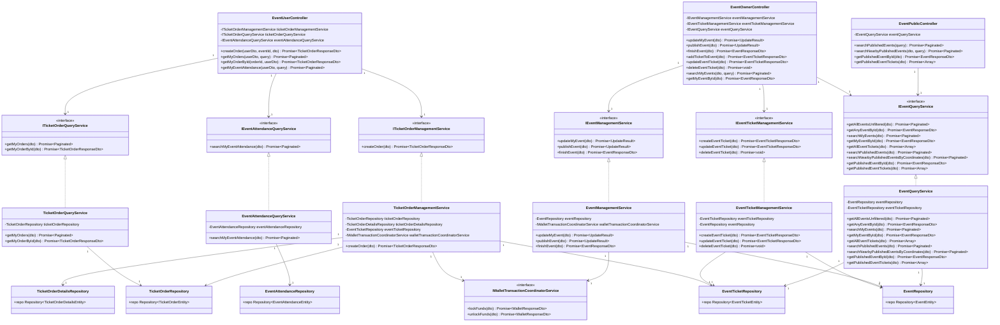

# Class Diagram - Event Module (Services)

```mermaid
classDiagram
    %% Controllers
    class EventUserController {
        -ITicketOrderManagementService ticketOrderManagementService
        -ITicketOrderQueryService ticketOrderQueryService
        -IEventAttendanceQueryService eventAttendanceQueryService
        +createOrder(userDto, eventId, dto) Promise~TicketOrderResponseDto~
        +getMyOrders(userDto, query) Promise~Paginated~
        +getMyOrderById(orderId, userDto) Promise~TicketOrderResponseDto~
        +getMyEventAttendance(userDto, query) Promise~Paginated~
    }

    class EventPublicController {
        -IEventQueryService eventQueryService
        +searchPublishedEvents(query) Promise~Paginated~
        +searchNearbyPublishedEvents(dto, query) Promise~Paginated~
        +getPublishedEventById(dto) Promise~EventResponseDto~
        +getPublishedEventTickets(dto) Promise~Array~
    }

    class EventOwnerController {
        -IEventManagementService eventManagementService
        -IEventTicketManagementService eventTicketManagementService
        -IEventQueryService eventQueryService
        +updateMyEvent(dto) Promise~UpdateResult~
        +publishEvent(dto) Promise~UpdateResult~
        +finishEvent(dto) Promise~EventResponseDto~
        +addTicketToEvent(dto) Promise~EventTicketResponseDto~
        +updateEventTicket(dto) Promise~EventTicketResponseDto~
        +deleteEventTicket(dto) Promise~void~
        +searchMyEvents(dto, query) Promise~Paginated~
        +getMyEventById(dto) Promise~EventResponseDto~
    }

    %% Service Interfaces
    class IEventQueryService {
        <<interface>>
        +getAllEventsUnfiltered(dto) Promise~Paginated~
        +getAnyEventById(dto) Promise~EventResponseDto~
        +searchMyEvents(dto) Promise~Paginated~
        +getMyEventById(dto) Promise~EventResponseDto~
        +getAllEventTickets(dto) Promise~Array~
        +searchPublishedEvents(dto) Promise~Paginated~
        +searchNearbyPublishedEventsByCoordinates(dto) Promise~Paginated~
        +getPublishedEventById(dto) Promise~EventResponseDto~
        +getPublishedEventTickets(dto) Promise~Array~
    }

    class IEventManagementService {
        <<interface>>
        +updateMyEvent(dto) Promise~UpdateResult~
        +publishEvent(dto) Promise~UpdateResult~
        +finishEvent(dto) Promise~EventResponseDto~
    }

    class IEventTicketManagementService {
        <<interface>>
        +createEventTicket(dto) Promise~EventTicketResponseDto~
        +updateEventTicket(dto) Promise~EventTicketResponseDto~
        +deleteEventTicket(dto) Promise~void~
    }

    class ITicketOrderManagementService {
        <<interface>>
        +createOrder(dto) Promise~TicketOrderResponseDto~
    }

    class ITicketOrderQueryService {
        <<interface>>
        +getMyOrders(dto) Promise~Paginated~
        +getMyOrderById(dto) Promise~TicketOrderResponseDto~
    }

    class IEventAttendanceQueryService {
        <<interface>>
        +searchMyEventAttendance(dto) Promise~Paginated~
    }

    %% Service Implementations
    class EventQueryService {
        -EventRepository eventRepository
        -EventTicketRepository eventTicketRepository
        +getAllEventsUnfiltered(dto) Promise~Paginated~
        +getAnyEventById(dto) Promise~EventResponseDto~
        +searchMyEvents(dto) Promise~Paginated~
        +getMyEventById(dto) Promise~EventResponseDto~
        +getAllEventTickets(dto) Promise~Array~
        +searchPublishedEvents(dto) Promise~Paginated~
        +searchNearbyPublishedEventsByCoordinates(dto) Promise~Paginated~
        +getPublishedEventById(dto) Promise~EventResponseDto~
        +getPublishedEventTickets(dto) Promise~Array~
    }

    class EventManagementService {
        -EventRepository eventRepository
        -IWalletTransactionCoordinatorService walletTransactionCoordinatorService
        +updateMyEvent(dto) Promise~UpdateResult~
        +publishEvent(dto) Promise~UpdateResult~
        +finishEvent(dto) Promise~EventResponseDto~
    }

    class EventTicketManagementService {
        -EventTicketRepository eventTicketRepository
        -EventRepository eventRepository
        +createEventTicket(dto) Promise~EventTicketResponseDto~
        +updateEventTicket(dto) Promise~EventTicketResponseDto~
        +deleteEventTicket(dto) Promise~void~
    }

    class TicketOrderManagementService {
        -TicketOrderRepository ticketOrderRepository
        -TicketOrderDetailsRepository ticketOrderDetailsRepository
        -EventTicketRepository eventTicketRepository
        -IWalletTransactionCoordinatorService walletTransactionCoordinatorService
        +createOrder(dto) Promise~TicketOrderResponseDto~
    }

    class TicketOrderQueryService {
        -TicketOrderRepository ticketOrderRepository
        +getMyOrders(dto) Promise~Paginated~
        +getMyOrderById(dto) Promise~TicketOrderResponseDto~
    }

    class EventAttendanceQueryService {
        -EventAttendanceRepository eventAttendanceRepository
        +searchMyEventAttendance(dto) Promise~Paginated~
    }

    %% Repositories
    class EventRepository {
        +repo Repository~EventEntity~
    }

    class EventTicketRepository {
        +repo Repository~EventTicketEntity~
    }

    class TicketOrderRepository {
        +repo Repository~TicketOrderEntity~
    }

    class TicketOrderDetailsRepository {
        +repo Repository~TicketOrderDetailsEntity~
    }

    class EventAttendanceRepository {
        +repo Repository~EventAttendanceEntity~
    }

    %% External Services
    class IWalletTransactionCoordinatorService {
        <<interface>>
        +lockFunds(dto) Promise~WalletResponseDto~
        +unlockFunds(dto) Promise~WalletResponseDto~
    }

    %% Relationships
    EventUserController "1" --> "1" ITicketOrderManagementService
    EventUserController "1" --> "1" ITicketOrderQueryService
    EventUserController "1" --> "1" IEventAttendanceQueryService
    EventPublicController "1" --> "1" IEventQueryService
    EventOwnerController "1" --> "1" IEventManagementService
    EventOwnerController "1" --> "1" IEventTicketManagementService
    EventOwnerController "1" --> "1" IEventQueryService

    IEventQueryService <|.. EventQueryService
    IEventManagementService <|.. EventManagementService
    IEventTicketManagementService <|.. EventTicketManagementService
    ITicketOrderManagementService <|.. TicketOrderManagementService
    ITicketOrderQueryService <|.. TicketOrderQueryService
    IEventAttendanceQueryService <|.. EventAttendanceQueryService

    EventQueryService "1" --> "1" EventRepository
    EventQueryService "1" --> "1" EventTicketRepository
    EventManagementService "1" --> "1" EventRepository
    EventManagementService "1" --> "1" IWalletTransactionCoordinatorService
    EventTicketManagementService "1" --> "1" EventTicketRepository
    EventTicketManagementService "1" --> "1" EventRepository
    TicketOrderManagementService "1" --> "1" TicketOrderRepository
    TicketOrderManagementService "1" --> "1" TicketOrderDetailsRepository
    TicketOrderManagementService "1" --> "1" EventTicketRepository
    TicketOrderManagementService "1" --> "1" IWalletTransactionCoordinatorService
    TicketOrderQueryService "1" --> "1" TicketOrderRepository
    EventAttendanceQueryService "1" --> "1" EventAttendanceRepository
```
