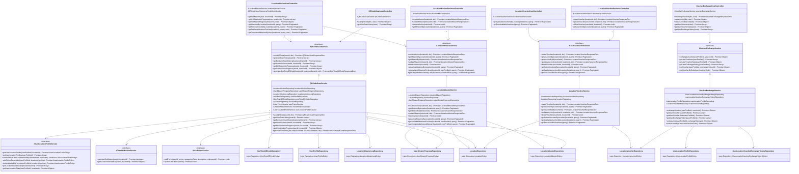

# Class Diagram - Gamification Module (Services)

```mermaid
classDiagram
    %% Controllers
    class LocationMissionUserController {
        -ILocationMissionService locationMissionService
        -IQRCodeScanService qrCodeScanService
        +getMyMissions(user, locationId) Promise~Array~
        +getMyMissionsInProgress(user, locationId) Promise~Array~
        +getMyMissionProgress(missionId, user) Promise~Object~
        +getMissionsByLocation(locationId, query) Promise~Paginated~
        +getActiveMissionsByLocation(locationId, query) Promise~Paginated~
        +getAvailableMissionsForUser(locationId, query, user) Promise~Paginated~
        +getCompletedMissionsByUser(locationId, query, user) Promise~Paginated~
    }

    class LocationMissionBusinessController {
        -ILocationMissionService locationMissionService
        +createMission(locationId, dto) Promise~LocationMissionResponseDto~
        +updateMission(missionId, dto) Promise~LocationMissionResponseDto~
        +deleteMission(missionId) Promise~void~
        +getMissionsByLocation(locationId, query) Promise~Paginated~
    }

    class QRCodeScanUserController {
        -IQRCodeScanService qrCodeScanService
        +scanQRCode(dto, user) Promise~Object~
        +getUserScanHistory(user) Promise~Array~
    }

    class VoucherExchangeUserController {
        -IVoucherExchangeService voucherExchangeService
        +exchangeVoucher(dto, user) Promise~VoucherExchangeResponseDto~
        +useVoucher(dto, user) Promise~Object~
        +useVoucherByCode(dto) Promise~Object~
        +getUserVouchers(user) Promise~Array~
        +getUserVoucherStats(user) Promise~Object~
        +getUserExchangeHistory(user) Promise~Array~
    }

    class LocationVoucherUserController {
        -ILocationVoucherService locationVoucherService
        +getAvailableVouchersByLocation(locationId, query) Promise~Paginated~
        +getFreeAvailableVouchers(query) Promise~Paginated~
    }

    class LocationVoucherBusinessController {
        -ILocationVoucherService locationVoucherService
        +createVoucher(locationId, dto) Promise~LocationVoucherResponseDto~
        +updateVoucher(voucherId, locationId, dto) Promise~LocationVoucherResponseDto~
        +deleteVoucher(voucherId, locationId) Promise~void~
        +getVouchersByLocation(locationId, query) Promise~Paginated~
    }

    %% Service Interfaces
    class ILocationMissionService {
        <<interface>>
        +createMission(locationId, dto) Promise~LocationMissionResponseDto~
        +getMissionsByLocation(locationId, query) Promise~Paginated~
        +getMissionById(missionId) Promise~LocationMissionResponseDto~
        +updateMission(missionId, dto) Promise~LocationMissionResponseDto~
        +deleteMission(missionId) Promise~void~
        +getActiveMissionsByLocation(locationId, query) Promise~Paginated~
        +getAvailableMissionsForUser(locationId, userProfileId, query) Promise~Paginated~
        +getCompletedMissionsByUser(locationId, userProfileId, query) Promise~Paginated~
    }

    class IQRCodeScanService {
        <<interface>>
        +scanQRCode(userId, dto) Promise~QRCodeScanResponseDto~
        +getUserScanHistory(userId) Promise~Array~
        +getBusinessScanHistory(businessOwnerId) Promise~Array~
        +getUserMissions(userId, locationId) Promise~Array~
        +getMyMissionsInProgress(userId, locationId) Promise~Array~
        +getUserMissionProgress(userId, missionId) Promise~Object~
        +generateOneTimeQRCode(locationId, businessOwnerId, dto) Promise~OneTimeQRCodeResponseDto~
    }

    class ILocationVoucherService {
        <<interface>>
        +createVoucher(locationId, dto) Promise~LocationVoucherResponseDto~
        +getVouchersByLocation(locationId, query) Promise~Paginated~
        +getVoucherById(voucherId) Promise~LocationVoucherResponseDto~
        +updateVoucher(voucherId, locationId, dto) Promise~LocationVoucherResponseDto~
        +deleteVoucher(voucherId, locationId) Promise~void~
        +getActiveVouchersByLocation(locationId, query) Promise~Paginated~
        +getAvailableVouchersByLocation(locationId, query) Promise~Paginated~
        +getFreeAvailableVouchers(query) Promise~Paginated~
    }

    class IVoucherExchangeService {
        <<interface>>
        +exchangeVoucher(userProfileId, voucherId) Promise~Object~
        +getUserVouchers(userProfileId) Promise~Array~
        +getUserVoucherStats(userProfileId) Promise~Object~
        +getUserExchangeHistory(userProfileId) Promise~Array~
        +useVoucher(userProfileId, exchangeHistoryId) Promise~Object~
        +useVoucherByCode(userVoucherCode) Promise~Object~
    }

    class IUserPointsService {
        <<interface>>
        +addPoints(userId, points, transactionType, description, referenceId) Promise~void~
        +updateUserRank(userId) Promise~void~
    }

    class IUserLocationProfileService {
        <<interface>>
        +getUserLocationProfile(userProfileId, locationId) Promise~UserLocationProfileEntity~
        +getUserLocationProfiles(userProfileId) Promise~Array~
        +createOrGetUserLocationProfile(userProfileId, locationId) Promise~UserLocationProfileEntity~
        +addPointsToLocation(userProfileId, locationId, points) Promise~UserLocationProfileEntity~
        +deductAvailablePoints(userProfileId, locationId, points) Promise~UserLocationProfileEntity~
        +getLocationLeaderboard(locationId, limit) Promise~Array~
        +getUserLocationStats(userProfileId, locationId) Promise~Object~
    }

    class ICheckInMissionService {
        <<interface>>
        +canUserDoMission(userId, locationId) Promise~boolean~
        +getUserCheckInStatus(userId, locationId) Promise~Object~
    }

    %% Service Implementations
    class LocationMissionService {
        -LocationMissionRepository locationMissionRepository
        -LocationRepository locationRepository
        -UserMissionProgressRepository userMissionProgressRepository
        +createMission(locationId, dto) Promise~LocationMissionResponseDto~
        +getMissionsByLocation(locationId, query) Promise~Paginated~
        +getMissionById(missionId) Promise~LocationMissionResponseDto~
        +updateMission(missionId, dto) Promise~LocationMissionResponseDto~
        +deleteMission(missionId) Promise~void~
        +getActiveMissionsByLocation(locationId, query) Promise~Paginated~
        +getAvailableMissionsForUser(locationId, userProfileId, query) Promise~Paginated~
        +getCompletedMissionsByUser(locationId, userProfileId, query) Promise~Paginated~
    }

    class QRCodeScanService {
        -LocationMissionRepository locationMissionRepository
        -UserMissionProgressRepository userMissionProgressRepository
        -LocationMissionLogRepository locationMissionLogRepository
        -UserProfileRepository userProfileRepository
        -OneTimeQRCodeRepository oneTimeQRCodeRepository
        -LocationRepository locationRepository
        -IUserPointsService userPointsService
        -ICheckInMissionService checkInMissionService
        -IUserLocationProfileService userLocationProfileService
        +scanQRCode(userId, dto) Promise~QRCodeScanResponseDto~
        +getUserScanHistory(userId) Promise~Array~
        +getBusinessScanHistory(businessOwnerId) Promise~Array~
        +getUserMissions(userId, locationId) Promise~Array~
        +getMyMissionsInProgress(userId, locationId) Promise~Array~
        +getUserMissionProgress(userId, missionId) Promise~Object~
        +generateOneTimeQRCode(locationId, businessOwnerId, dto) Promise~OneTimeQRCodeResponseDto~
    }

    class LocationVoucherService {
        -LocationVoucherRepository locationVoucherRepository
        -LocationRepository locationRepository
        +createVoucher(locationId, dto) Promise~LocationVoucherResponseDto~
        +getVouchersByLocation(locationId, query) Promise~Paginated~
        +getVoucherById(voucherId) Promise~LocationVoucherResponseDto~
        +updateVoucher(voucherId, locationId, dto) Promise~LocationVoucherResponseDto~
        +deleteVoucher(voucherId, locationId) Promise~void~
        +getActiveVouchersByLocation(locationId, query) Promise~Paginated~
        +getAvailableVouchersByLocation(locationId, query) Promise~Paginated~
        +getFreeAvailableVouchers(query) Promise~Paginated~
    }

    class VoucherExchangeService {
        -UserLocationVoucherExchangeHistoryRepository userLocationVoucherExchangeHistoryRepository
        -UserLocationProfileRepository userLocationProfileRepository
        -LocationVoucherRepository locationVoucherRepository
        +exchangeVoucher(userProfileId, voucherId) Promise~Object~
        +getUserVouchers(userProfileId) Promise~Array~
        +getUserVoucherStats(userProfileId) Promise~Object~
        +getUserExchangeHistory(userProfileId) Promise~Array~
        +useVoucher(userProfileId, exchangeHistoryId) Promise~Object~
        +useVoucherByCode(userVoucherCode) Promise~Object~
    }

    %% Repositories
    class LocationMissionRepository {
        +repo Repository~LocationMissionEntity~
    }

    class UserMissionProgressRepository {
        +repo Repository~UserMissionProgressEntity~
    }

    class LocationMissionLogRepository {
        +repo Repository~LocationMissionLogEntity~
    }

    class LocationVoucherRepository {
        +repo Repository~LocationVoucherEntity~
    }

    class UserLocationVoucherExchangeHistoryRepository {
        +repo Repository~UserLocationVoucherExchangeHistoryEntity~
    }

    class UserLocationProfileRepository {
        +repo Repository~UserLocationProfileEntity~
    }

    class OneTimeQRCodeRepository {
        +repo Repository~OneTimeQRCodeEntity~
    }

    class LocationRepository {
        +repo Repository~LocationEntity~
    }

    class UserProfileRepository {
        +repo Repository~UserProfileEntity~
    }

    %% Relationships
    LocationMissionUserController "1" --> "1" ILocationMissionService
    LocationMissionUserController "1" --> "1" IQRCodeScanService
    LocationMissionBusinessController "1" --> "1" ILocationMissionService
    QRCodeScanUserController "1" --> "1" IQRCodeScanService
    VoucherExchangeUserController "1" --> "1" IVoucherExchangeService
    LocationVoucherUserController "1" --> "1" ILocationVoucherService
    LocationVoucherBusinessController "1" --> "1" ILocationVoucherService

    ILocationMissionService <|.. LocationMissionService
    IQRCodeScanService <|.. QRCodeScanService
    ILocationVoucherService <|.. LocationVoucherService
    IVoucherExchangeService <|.. VoucherExchangeService

    LocationMissionService "1" --> "1" LocationMissionRepository
    LocationMissionService "1" --> "1" LocationRepository
    LocationMissionService "1" --> "1" UserMissionProgressRepository

    QRCodeScanService "1" --> "1" LocationMissionRepository
    QRCodeScanService "1" --> "1" UserMissionProgressRepository
    QRCodeScanService "1" --> "1" LocationMissionLogRepository
    QRCodeScanService "1" --> "1" UserProfileRepository
    QRCodeScanService "1" --> "1" OneTimeQRCodeRepository
    QRCodeScanService "1" --> "1" LocationRepository
    QRCodeScanService "1" --> "1" IUserPointsService
    QRCodeScanService "1" --> "1" ICheckInMissionService
    QRCodeScanService "1" --> "1" IUserLocationProfileService

    LocationVoucherService "1" --> "1" LocationVoucherRepository
    LocationVoucherService "1" --> "1" LocationRepository

    VoucherExchangeService "1" --> "1" UserLocationVoucherExchangeHistoryRepository
    VoucherExchangeService "1" --> "1" UserLocationProfileRepository
    VoucherExchangeService "1" --> "1" LocationVoucherRepository
```
