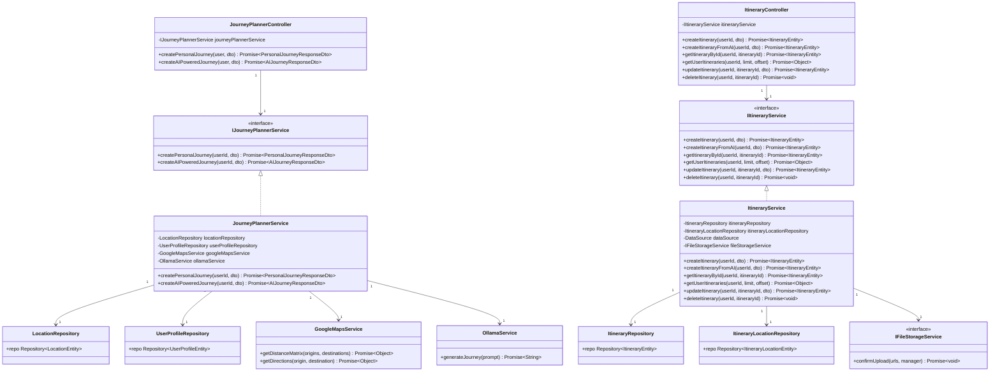

# Class Diagram - Journey Module (Services)

```mermaid
classDiagram
    %% Controllers
    class JourneyPlannerController {
        -IJourneyPlannerService journeyPlannerService
        +createPersonalJourney(user, dto) Promise~PersonalJourneyResponseDto~
        +createAIPoweredJourney(user, dto) Promise~AIJourneyResponseDto~
    }

    class ItineraryController {
        -IItineraryService itineraryService
        +createItinerary(userId, dto) Promise~ItineraryEntity~
        +createItineraryFromAI(userId, dto) Promise~ItineraryEntity~
        +getItineraryById(userId, itineraryId) Promise~ItineraryEntity~
        +getUserItineraries(userId, limit, offset) Promise~Object~
        +updateItinerary(userId, itineraryId, dto) Promise~ItineraryEntity~
        +deleteItinerary(userId, itineraryId) Promise~void~
    }

    %% Service Interfaces
    class IJourneyPlannerService {
        <<interface>>
        +createPersonalJourney(userId, dto) Promise~PersonalJourneyResponseDto~
        +createAIPoweredJourney(userId, dto) Promise~AIJourneyResponseDto~
    }

    class IItineraryService {
        <<interface>>
        +createItinerary(userId, dto) Promise~ItineraryEntity~
        +createItineraryFromAI(userId, dto) Promise~ItineraryEntity~
        +getItineraryById(userId, itineraryId) Promise~ItineraryEntity~
        +getUserItineraries(userId, limit, offset) Promise~Object~
        +updateItinerary(userId, itineraryId, dto) Promise~ItineraryEntity~
        +deleteItinerary(userId, itineraryId) Promise~void~
    }

    %% Service Implementations
    class JourneyPlannerService {
        -LocationRepository locationRepository
        -UserProfileRepository userProfileRepository
        -GoogleMapsService googleMapsService
        -OllamaService ollamaService
        +createPersonalJourney(userId, dto) Promise~PersonalJourneyResponseDto~
        +createAIPoweredJourney(userId, dto) Promise~AIJourneyResponseDto~
    }

    class ItineraryService {
        -ItineraryRepository itineraryRepository
        -ItineraryLocationRepository itineraryLocationRepository
        -DataSource dataSource
        -IFileStorageService fileStorageService
        +createItinerary(userId, dto) Promise~ItineraryEntity~
        +createItineraryFromAI(userId, dto) Promise~ItineraryEntity~
        +getItineraryById(userId, itineraryId) Promise~ItineraryEntity~
        +getUserItineraries(userId, limit, offset) Promise~Object~
        +updateItinerary(userId, itineraryId, dto) Promise~ItineraryEntity~
        +deleteItinerary(userId, itineraryId) Promise~void~
    }

    %% Repositories
    class ItineraryRepository {
        +repo Repository~ItineraryEntity~
    }

    class ItineraryLocationRepository {
        +repo Repository~ItineraryLocationEntity~
    }

    class LocationRepository {
        +repo Repository~LocationEntity~
    }

    class UserProfileRepository {
        +repo Repository~UserProfileEntity~
    }

    %% External Services
    class IFileStorageService {
        <<interface>>
        +confirmUpload(urls, manager) Promise~void~
    }

    class GoogleMapsService {
        +getDistanceMatrix(origins, destinations) Promise~Object~
        +getDirections(origin, destination) Promise~Object~
    }

    class OllamaService {
        +generateJourney(prompt) Promise~String~
    }

    %% Relationships
    JourneyPlannerController "1" --> "1" IJourneyPlannerService
    ItineraryController "1" --> "1" IItineraryService

    IJourneyPlannerService <|.. JourneyPlannerService
    IItineraryService <|.. ItineraryService

    JourneyPlannerService "1" --> "1" LocationRepository
    JourneyPlannerService "1" --> "1" UserProfileRepository
    JourneyPlannerService "1" --> "1" GoogleMapsService
    JourneyPlannerService "1" --> "1" OllamaService

    ItineraryService "1" --> "1" ItineraryRepository
    ItineraryService "1" --> "1" ItineraryLocationRepository
    ItineraryService "1" --> "1" IFileStorageService
```
