# Class Diagram - Location Booking Module (Services)

```mermaid
classDiagram
    %% Controllers
    class LocationBookingOwnerController {
        -ILocationBookingQueryService locationBookingQueryService
        -ILocationBookingManagementService locationBookingManagementService
        +searchBookingsByLocation(userDto, query) Promise~Paginated~
        +getMyLocationsBookingById(userDto, locationBookingId) Promise~LocationBookingResponseDto~
        +processLocationBooking(userDto, locationBookingId, dto) Promise~UpdateResult~
        +getBookedDatesByDateRange(dto) Promise~BookedDatesResponseDto~
    }

    class LocationBookingCreatorController {
        -ILocationBookingManagementService locationBookingManagementService
        +createBooking_ForBusinessLocation(dto) Promise~LocationBookingResponseDto~
    }

    class LocationAvailabilityOwnerController {
        -ILocationAvailabilityManagementService locationAvailabilityManagementService
        +createAvailability(dto) Promise~LocationAvailabilityResponseDto~
        +updateAvailability(availabilityId, dto) Promise~LocationAvailabilityResponseDto~
        +deleteAvailability(availabilityId) Promise~void~
    }

    class LocationBookingConfigOwnerController {
        -ILocationBookingConfigManagementService locationBookingConfigManagementService
        +createConfig(dto) Promise~LocationBookingConfigResponseDto~
        +updateConfig(configId, dto) Promise~LocationBookingConfigResponseDto~
        +deleteConfig(configId) Promise~void~
    }

    %% Service Interfaces
    class ILocationBookingManagementService {
        <<interface>>
        +createBooking_ForBusinessLocation(dto) Promise~LocationBookingResponseDto~
        +processBooking(dto) Promise~UpdateResult~
        +payForBooking(dto) Promise~LocationBookingResponseDto~
    }

    class ILocationBookingQueryService {
        <<interface>>
        +searchBookingsByLocation(dto) Promise~Paginated~
        +getBookingForMyLocationById(dto) Promise~LocationBookingResponseDto~
        +getBookedDatesByDateRange(dto) Promise~BookedDatesResponseDto~
    }

    class ILocationAvailabilityManagementService {
        <<interface>>
        +createAvailability(dto) Promise~LocationAvailabilityResponseDto~
        +updateAvailability(availabilityId, dto) Promise~LocationAvailabilityResponseDto~
        +deleteAvailability(availabilityId) Promise~void~
    }

    class ILocationBookingConfigManagementService {
        <<interface>>
        +createConfig(dto) Promise~LocationBookingConfigResponseDto~
        +updateConfig(configId, dto) Promise~LocationBookingConfigResponseDto~
        +deleteConfig(configId) Promise~void~
    }

    class IBookableLocationSearchService {
        <<interface>>
        +searchBookableLocations(query) Promise~Paginated~
    }

    %% Service Implementations
    class LocationBookingManagementService {
        -LocationBookingRepository locationBookingRepository
        -LocationBookingDateRepository locationBookingDateRepository
        -LocationAvailabilityRepository locationAvailabilityRepository
        -IWalletTransactionCoordinatorService walletTransactionCoordinatorService
        +createBooking_ForBusinessLocation(dto) Promise~LocationBookingResponseDto~
        +processBooking(dto) Promise~UpdateResult~
        +payForBooking(dto) Promise~LocationBookingResponseDto~
    }

    class LocationBookingQueryService {
        -LocationBookingRepository locationBookingRepository
        -LocationBookingDateRepository locationBookingDateRepository
        +searchBookingsByLocation(dto) Promise~Paginated~
        +getBookingForMyLocationById(dto) Promise~LocationBookingResponseDto~
        +getBookedDatesByDateRange(dto) Promise~BookedDatesResponseDto~
    }

    class LocationAvailabilityManagementService {
        -LocationAvailabilityRepository locationAvailabilityRepository
        +createAvailability(dto) Promise~LocationAvailabilityResponseDto~
        +updateAvailability(availabilityId, dto) Promise~LocationAvailabilityResponseDto~
        +deleteAvailability(availabilityId) Promise~void~
    }

    class LocationBookingConfigManagementService {
        -LocationBookingConfigRepository locationBookingConfigRepository
        +createConfig(dto) Promise~LocationBookingConfigResponseDto~
        +updateConfig(configId, dto) Promise~LocationBookingConfigResponseDto~
        +deleteConfig(configId) Promise~void~
    }

    class BookableLocationSearchService {
        -LocationRepository locationRepository
        -LocationBookingConfigRepository locationBookingConfigRepository
        +searchBookableLocations(query) Promise~Paginated~
    }

    %% Repositories
    class LocationBookingRepository {
        +repo Repository~LocationBookingEntity~
    }

    class LocationBookingDateRepository {
        +repo Repository~LocationBookingDateEntity~
    }

    class LocationAvailabilityRepository {
        +repo Repository~LocationAvailabilityEntity~
    }

    class LocationBookingConfigRepository {
        +repo Repository~LocationBookingConfigEntity~
    }

    class LocationRepository {
        +repo Repository~LocationEntity~
    }

    %% External Services
    class IWalletTransactionCoordinatorService {
        <<interface>>
        +lockFunds(dto) Promise~WalletResponseDto~
        +unlockFunds(dto) Promise~WalletResponseDto~
        +withdrawFunds(dto) Promise~WalletResponseDto~
    }

    %% Relationships
    LocationBookingOwnerController "1" --> "1" ILocationBookingQueryService
    LocationBookingOwnerController "1" --> "1" ILocationBookingManagementService
    LocationBookingCreatorController "1" --> "1" ILocationBookingManagementService
    LocationAvailabilityOwnerController "1" --> "1" ILocationAvailabilityManagementService
    LocationBookingConfigOwnerController "1" --> "1" ILocationBookingConfigManagementService

    ILocationBookingManagementService <|.. LocationBookingManagementService
    ILocationBookingQueryService <|.. LocationBookingQueryService
    ILocationAvailabilityManagementService <|.. LocationAvailabilityManagementService
    ILocationBookingConfigManagementService <|.. LocationBookingConfigManagementService
    IBookableLocationSearchService <|.. BookableLocationSearchService

    LocationBookingManagementService "1" --> "1" LocationBookingRepository
    LocationBookingManagementService "1" --> "1" LocationBookingDateRepository
    LocationBookingManagementService "1" --> "1" LocationAvailabilityRepository
    LocationBookingManagementService "1" --> "1" IWalletTransactionCoordinatorService

    LocationBookingQueryService "1" --> "1" LocationBookingRepository
    LocationBookingQueryService "1" --> "1" LocationBookingDateRepository

    LocationAvailabilityManagementService "1" --> "1" LocationAvailabilityRepository

    LocationBookingConfigManagementService "1" --> "1" LocationBookingConfigRepository

    BookableLocationSearchService "1" --> "1" LocationRepository
    BookableLocationSearchService "1" --> "1" LocationBookingConfigRepository
```

**Figure 1:** Class diagram showing the services architecture for the Location Booking module, including booking management, availability, and configuration services.
