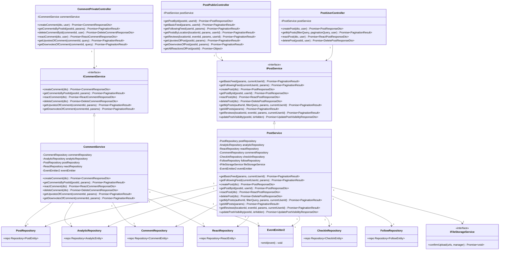

# Class Diagram - Post Module (Services)

```mermaid
classDiagram
    %% Controllers
    class PostUserController {
        -IPostService postService
        +createPost(dto, user) Promise~PostResponseDto~
        +getMyPosts(filterQuery, paginationQuery, user) Promise~PaginationResult~
        +reactPost(dto, user) Promise~ReactPostResponseDto~
        +deletePost(postId, user) Promise~DeletePostResponseDto~
    }

    class PostPublicController {
        -IPostService postService
        +getPostById(postId, userId) Promise~PostResponseDto~
        +getBasicFeed(params, userId) Promise~PaginationResult~
        +getFollowingFeed(userId, params) Promise~PaginationResult~
        +getPostsByLocation(locationId, params, userId) Promise~PaginationResult~
        +getReviews(locationId, eventId, params, userId) Promise~PaginationResult~
        +getUpvotesOfPost(postId, params) Promise~PaginationResult~
        +getDownvotesOfPost(postId, params) Promise~PaginationResult~
        +getAllReactionsOfPost(postId) Promise~Object~
    }

    class CommentPrivateController {
        -ICommentService commentService
        +createComment(dto, user) Promise~CommentResponseDto~
        +getCommentsByPostId(postId, params) Promise~PaginationResult~
        +deleteCommentById(commentId, user) Promise~DeleteCommentResponseDto~
        +reactComment(dto, user) Promise~ReactCommentResponseDto~
        +getUpvotesOfComment(commentId, query) Promise~PaginationResult~
        +getDownvotesOfComment(commentId, query) Promise~PaginationResult~
    }

    %% Service Interfaces
    class IPostService {
        <<interface>>
        +getBasicFeed(params, currentUserId) Promise~PaginationResult~
        +getFollowingFeed(currentUserId, params) Promise~PaginationResult~
        +createPost(dto) Promise~PostResponseDto~
        +getPostById(postId, userId) Promise~PostResponseDto~
        +reactPost(dto) Promise~ReactPostResponseDto~
        +deletePost(dto) Promise~DeletePostResponseDto~
        +getMyPosts(authorId, filterQuery, params, currentUserId) Promise~PaginationResult~
        +getAllPosts(params) Promise~PaginationResult~
        +getReviews(locationId, eventId, params, currentUserId) Promise~PaginationResult~
        +updatePostVisibility(postId, isHidden) Promise~UpdatePostVisibilityResponseDto~
    }

    class ICommentService {
        <<interface>>
        +createComment(dto) Promise~CommentResponseDto~
        +getCommentsByPostId(postId, params) Promise~PaginationResult~
        +reactComment(dto) Promise~ReactCommentResponseDto~
        +deleteComment(dto) Promise~DeleteCommentResponseDto~
        +getUpvotesOfComment(commentId, params) Promise~PaginationResult~
        +getDownvotesOfComment(commentId, params) Promise~PaginationResult~
    }

    %% Service Implementations
    class PostService {
        -PostRepository postRepository
        -AnalyticRepository analyticRepository
        -ReactRepository reactRepository
        -CommentRepository commentRepository
        -CheckInRepository checkInRepository
        -FollowRepository followRepository
        -IFileStorageService fileStorageService
        -EventEmitter2 eventEmitter
        +getBasicFeed(params, currentUserId) Promise~PaginationResult~
        +getFollowingFeed(currentUserId, params) Promise~PaginationResult~
        +createPost(dto) Promise~PostResponseDto~
        +getPostById(postId, userId) Promise~PostResponseDto~
        +reactPost(dto) Promise~ReactPostResponseDto~
        +deletePost(dto) Promise~DeletePostResponseDto~
        +getMyPosts(authorId, filterQuery, params, currentUserId) Promise~PaginationResult~
        +getAllPosts(params) Promise~PaginationResult~
        +getReviews(locationId, eventId, params, currentUserId) Promise~PaginationResult~
        +updatePostVisibility(postId, isHidden) Promise~UpdatePostVisibilityResponseDto~
    }

    class CommentService {
        -CommentRepository commentRepository
        -AnalyticRepository analyticRepository
        -PostRepository postRepository
        -ReactRepository reactRepository
        -EventEmitter2 eventEmitter
        +createComment(dto) Promise~CommentResponseDto~
        +getCommentsByPostId(postId, params) Promise~PaginationResult~
        +reactComment(dto) Promise~ReactCommentResponseDto~
        +deleteComment(dto) Promise~DeleteCommentResponseDto~
        +getUpvotesOfComment(commentId, params) Promise~PaginationResult~
        +getDownvotesOfComment(commentId, params) Promise~PaginationResult~
    }

    %% Repositories
    class PostRepository {
        +repo Repository~PostEntity~
    }

    class CommentRepository {
        +repo Repository~CommentEntity~
    }

    class ReactRepository {
        +repo Repository~ReactEntity~
    }

    class AnalyticRepository {
        +repo Repository~AnalyticEntity~
    }

    class CheckInRepository {
        +repo Repository~CheckInEntity~
    }

    class FollowRepository {
        +repo Repository~FollowEntity~
    }

    %% External Services
    class IFileStorageService {
        <<interface>>
        +confirmUpload(urls, manager) Promise~void~
    }

    class EventEmitter2 {
        +emit(event) void
    }

    %% Relationships
    PostUserController "1" --> "1" IPostService
    PostPublicController "1" --> "1" IPostService
    CommentPrivateController "1" --> "1" ICommentService

    IPostService <|.. PostService
    ICommentService <|.. CommentService

    PostService "1" --> "1" PostRepository
    PostService "1" --> "1" AnalyticRepository
    PostService "1" --> "1" ReactRepository
    PostService "1" --> "1" CommentRepository
    PostService "1" --> "1" CheckInRepository
    PostService "1" --> "1" FollowRepository
    PostService "1" --> "1" IFileStorageService
    PostService "1" --> "1" EventEmitter2

    CommentService "1" --> "1" CommentRepository
    CommentService "1" --> "1" AnalyticRepository
    CommentService "1" --> "1" PostRepository
    CommentService "1" --> "1" ReactRepository
    CommentService "1" --> "1" EventEmitter2
```
