# Class Diagram - Wallet Module (Services)

```mermaid
classDiagram
    %% Controllers
    class WalletPrivateController {
        -IWalletQueryService walletManagementService
        -IWalletExternalTransactionQueryService externalTransactionQueryService
        -IWalletExternalTransactionManagementService externalTransactionManagementService
        -IWalletTransactionQueryService walletTransactionQueryService
        +getMyWallet(user) Promise~WalletResponseDto~
        +getMyExternalTransactions(user, query) Promise~Paginated~
        +getMyExternalTransactionById(user, id) Promise~ExternalTransactionResponseDto~
        +depositFromExternalAccount(user, ipAddress, dto) Promise~ExternalTransactionResponseDto~
        +startPaymentSessionForDepositTransaction(user, transactionId, ipAddress, dto) Promise~PaymentResponseDto~
        +withdrawToExternalAccount(user, dto) Promise~ExternalTransactionResponseDto~
        +cancelExternalTransaction(user, transactionId) Promise~UpdateResult~
        +getMyTransactions(query, userDto) Promise~Paginated~
        +getTransactionById(id, user) Promise~WalletTransactionResponseDto~
    }

    class WalletAdminController {
        -IWalletActionService walletActionService
        +depositFunds(dto) Promise~WalletResponseDto~
        +withdrawFunds(dto) Promise~WalletResponseDto~
        +lockFunds(dto) Promise~WalletResponseDto~
        +unlockFunds(dto) Promise~WalletResponseDto~
    }

    class WalletExternalTransactionWebhook {
        -IWalletExternalTransactionManagementService externalTransactionManagementService
        +handleWebhook(payload) Promise~void~
    }

    %% Service Interfaces
    class IWalletQueryService {
        <<interface>>
        +getWalletByAccountId(dto) Promise~WalletResponseDto~
    }

    class IWalletActionService {
        <<interface>>
        +depositFunds(dto) Promise~WalletResponseDto~
        +withdrawFunds(dto) Promise~WalletResponseDto~
        +lockFunds(dto) Promise~WalletResponseDto~
        +unlockFunds(dto) Promise~WalletResponseDto~
        +permanentlyWithdrawLockedFunds(dto) Promise~WalletResponseDto~
        +createDefaultWallet(dto) Promise~void~
    }

    class IWalletExternalTransactionManagementService {
        <<interface>>
        +createDepositTransaction(dto) Promise~ExternalTransactionResponseDto~
        +createWithdrawTransaction(dto) Promise~ExternalTransactionResponseDto~
        +startPaymentSessionForDepositTransaction(dto) Promise~PaymentResponseDto~
        +cancelExternalTransaction(dto) Promise~UpdateResult~
        +handleWebhook(payload) Promise~void~
    }

    class IWalletExternalTransactionQueryService {
        <<interface>>
        +getMyExternalTransactions(dto) Promise~Paginated~
        +getMyExternalTransactionById(dto) Promise~ExternalTransactionResponseDto~
    }

    class IWalletTransactionManagementService {
        <<interface>>
        +createTransaction(dto) Promise~WalletTransactionResponseDto~
    }

    class IWalletTransactionCoordinatorService {
        <<interface>>
        +lockFunds(dto) Promise~WalletResponseDto~
        +unlockFunds(dto) Promise~WalletResponseDto~
        +withdrawFunds(dto) Promise~WalletResponseDto~
        +depositFunds(dto) Promise~WalletResponseDto~
    }

    class IWalletTransactionQueryService {
        <<interface>>
        +searchTransactions(dto) Promise~Paginated~
        +getTransactionById(dto) Promise~WalletTransactionResponseDto~
    }

    %% Service Implementations
    class WalletQueryService {
        -WalletRepository walletRepository
        +getWalletByAccountId(dto) Promise~WalletResponseDto~
    }

    class WalletActionService {
        -WalletRepository walletRepository
        +depositFunds(dto) Promise~WalletResponseDto~
        +withdrawFunds(dto) Promise~WalletResponseDto~
        +lockFunds(dto) Promise~WalletResponseDto~
        +unlockFunds(dto) Promise~WalletResponseDto~
        +permanentlyWithdrawLockedFunds(dto) Promise~WalletResponseDto~
        +createDefaultWallet(dto) Promise~void~
    }

    class WalletExternalTransactionManagementService {
        -WalletExternalTransactionRepository walletExternalTransactionRepository
        -IPaymentGatewayPort paymentGatewayPort
        +createDepositTransaction(dto) Promise~ExternalTransactionResponseDto~
        +createWithdrawTransaction(dto) Promise~ExternalTransactionResponseDto~
        +startPaymentSessionForDepositTransaction(dto) Promise~PaymentResponseDto~
        +cancelExternalTransaction(dto) Promise~UpdateResult~
        +handleWebhook(payload) Promise~void~
    }

    class WalletExternalTransactionQueryService {
        -WalletExternalTransactionRepository walletExternalTransactionRepository
        +getMyExternalTransactions(dto) Promise~Paginated~
        +getMyExternalTransactionById(dto) Promise~ExternalTransactionResponseDto~
    }

    class WalletTransactionManagementService {
        -WalletTransactionRepository walletTransactionRepository
        +createTransaction(dto) Promise~WalletTransactionResponseDto~
    }

    class WalletTransactionCoordinatorService {
        -WalletRepository walletRepository
        -WalletTransactionRepository walletTransactionRepository
        +lockFunds(dto) Promise~WalletResponseDto~
        +unlockFunds(dto) Promise~WalletResponseDto~
        +withdrawFunds(dto) Promise~WalletResponseDto~
        +depositFunds(dto) Promise~WalletResponseDto~
    }

    class WalletTransactionQueryService {
        -WalletTransactionRepository walletTransactionRepository
        +searchTransactions(dto) Promise~Paginated~
        +getTransactionById(dto) Promise~WalletTransactionResponseDto~
    }

    %% Repositories
    class WalletRepository {
        +repo Repository~WalletEntity~
    }

    class WalletExternalTransactionRepository {
        +repo Repository~WalletExternalTransactionEntity~
    }

    class WalletTransactionRepository {
        +repo Repository~WalletTransactionEntity~
    }

    %% External Services
    class IPaymentGatewayPort {
        <<interface>>
        +createPayment(dto) Promise~PaymentResponseDto~
        +verifyWebhook(payload, signature) Promise~boolean~
    }

    class SEPayPaymentGatewayAdapter {
        +createPayment(dto) Promise~PaymentResponseDto~
        +verifyWebhook(payload, signature) Promise~boolean~
    }

    %% Relationships
    WalletPrivateController "1" --> "1" IWalletQueryService
    WalletPrivateController "1" --> "1" IWalletExternalTransactionQueryService
    WalletPrivateController "1" --> "1" IWalletExternalTransactionManagementService
    WalletPrivateController "1" --> "1" IWalletTransactionQueryService
    WalletAdminController "1" --> "1" IWalletActionService
    WalletExternalTransactionWebhook "1" --> "1" IWalletExternalTransactionManagementService

    IWalletQueryService <|.. WalletQueryService
    IWalletActionService <|.. WalletActionService
    IWalletExternalTransactionManagementService <|.. WalletExternalTransactionManagementService
    IWalletExternalTransactionQueryService <|.. WalletExternalTransactionQueryService
    IWalletTransactionManagementService <|.. WalletTransactionManagementService
    IWalletTransactionCoordinatorService <|.. WalletTransactionCoordinatorService
    IWalletTransactionQueryService <|.. WalletTransactionQueryService

    WalletQueryService "1" --> "1" WalletRepository
    WalletActionService "1" --> "1" WalletRepository
    WalletExternalTransactionManagementService "1" --> "1" WalletExternalTransactionRepository
    WalletExternalTransactionManagementService "1" --> "1" IPaymentGatewayPort
    WalletExternalTransactionQueryService "1" --> "1" WalletExternalTransactionRepository
    WalletTransactionManagementService "1" --> "1" WalletTransactionRepository
    WalletTransactionCoordinatorService "1" --> "1" WalletRepository
    WalletTransactionCoordinatorService "1" --> "1" WalletTransactionRepository
    WalletTransactionQueryService "1" --> "1" WalletTransactionRepository

    IPaymentGatewayPort <|.. SEPayPaymentGatewayAdapter
```

**Figure 1:** Class diagram showing the services architecture for the Wallet module, including wallet operations, external transactions, and payment gateway integration.
