# Class Diagram - User, Post, Itinerary, Mission, Voucher Features

## Entities

```mermaid
classDiagram
    %% User Domain
    class AccountEntity {
        +UUID id
        +String firstName
        +String lastName
        +String email
        +String phoneNumber
        +String password
        +String avatarUrl
        +String coverUrl
        +Boolean hasOnboarded
        +Role role
        +Date createdAt
        +Date updatedAt
        +canCreateEvent() Boolean
        +canPerformActions() Boolean
    }

    class UserProfileEntity {
        +UUID accountId
        +Date dob
        +UUID rankId
        +AccountEntity account
        +RankEntity rankEntity
    }

    class BusinessEntity {
        +UUID accountId
        +String name
        +String email
        +String phone
        +String website
        +String addressLine
        +String addressLevel1
        +String addressLevel2
        +String description
        +BusinessCategory category
        +BusinessRequestStatus status
        +Boolean isActive
        +Date createdAt
        +Date updatedAt
        +AccountEntity account
    }

    %% Post Domain
    class PostEntity {
        +UUID postId
        +String content
        +PostType type
        +Integer rating
        +String[] imageUrls
        +UUID authorId
        +UUID locationId
        +UUID eventId
        +Visibility visibility
        +Date createdAt
        +Date updatedAt
        +AccountEntity author
        +CommentEntity[] comments
        +ReactEntity[] reacts
    }

    class CommentEntity {
        +UUID id
        +String content
        +UUID postId
        +UUID authorId
        +Date createdAt
        +Date updatedAt
        +PostEntity post
        +AccountEntity author
        +ReactEntity[] reacts
    }

    class ReactEntity {
        +UUID id
        +ReactType reactType
        +ReactEntityType entityType
        +UUID entityId
        +UUID authorId
        +Date createdAt
        +Date updatedAt
        +AccountEntity author
    }

    %% Itinerary Domain
    class ItineraryEntity {
        +UUID id
        +UUID userId
        +String title
        +String description
        +Date startDate
        +Date endDate
        +ItinerarySource source
        +AIMetadata aiMetadata
        +String[] album
        +String thumbnailUrl
        +UUID[] locationWishlist
        +Date createdAt
        +Date updatedAt
        +AccountEntity user
        +ItineraryLocationEntity[] locations
    }

    class ItineraryLocationEntity {
        +UUID id
        +UUID itineraryId
        +UUID locationId
        +Integer order
        +String activity
        +String notes
        +Date visitDate
        +ItineraryEntity itinerary
        +LocationEntity location
    }

    %% Mission Domain
    class LocationMissionEntity {
        +UUID id
        +UUID locationId
        +String title
        +String description
        +Integer target
        +Date startDate
        +Date endDate
        +Integer reward
        +String[] imageUrls
        +Date createdAt
        +Date updatedAt
        +LocationEntity location
    }

    class UserMissionProgressEntity {
        +UUID id
        +UUID userProfileId
        +UUID missionId
        +Integer progress
        +Boolean completed
        +UserProfileEntity userProfile
        +LocationMissionEntity mission
    }

    class OneTimeQRCodeEntity {
        +UUID id
        +UUID locationId
        +String qrCodeData
        +UUID businessOwnerId
        +String referenceId
        +Boolean isUsed
        +UUID scannedBy
        +Date scannedAt
        +Date createdAt
        +LocationEntity location
        +UserProfileEntity scannedByUser
    }

    %% Voucher Domain
    class LocationVoucherEntity {
        +UUID id
        +UUID locationId
        +String title
        +String description
        +String voucherCode
        +String imageUrl
        +Integer pricePoint
        +Integer maxQuantity
        +Integer userRedeemedLimit
        +LocationVoucherType voucherType
        +Date startDate
        +Date endDate
        +Date createdAt
        +Date updatedAt
        +LocationEntity location
    }

    class UserLocationVoucherExchangeHistoryEntity {
        +UUID id
        +UUID voucherId
        +UUID userProfileId
        +Integer pointSpent
        +String userVoucherCode
        +Date usedAt
        +Date createdAt
        +LocationVoucherEntity voucher
        +UserProfileEntity userProfile
    }

    %% Location Domain
    class LocationEntity {
        +UUID id
        +UUID businessId
        +String name
        +String description
        +Decimal latitude
        +Decimal longitude
        +Integer radiusMeters
        +String addressLine
        +String addressLevel1
        +String addressLevel2
        +String[] imageUrl
        +Boolean isVisibleOnMap
        +LocationOwnershipType ownershipType
        +Date createdAt
        +Date updatedAt
        +BusinessEntity business
        +LocationMissionEntity[] missions
        +LocationVoucherEntity[] vouchers
        +CheckInEntity[] checkIns
    }

    class CheckInEntity {
        +UUID id
        +UUID userProfileId
        +UUID locationId
        +Date createdAt
        +Date updatedAt
        +UserProfileEntity userProfile
        +LocationEntity location
    }

    %% Relationships
    AccountEntity ||--o| UserProfileEntity : "has"
    AccountEntity ||--o| BusinessEntity : "has"
    AccountEntity ||--o{ PostEntity : "creates"
    AccountEntity ||--o{ CommentEntity : "writes"
    AccountEntity ||--o{ ReactEntity : "reacts"

    PostEntity ||--o{ CommentEntity : "has"
    PostEntity ||--o{ ReactEntity : "has"
    CommentEntity ||--o{ ReactEntity : "has"

    AccountEntity ||--o{ ItineraryEntity : "creates"
    ItineraryEntity ||--o{ ItineraryLocationEntity : "contains"
    ItineraryLocationEntity }o--|| LocationEntity : "references"

    LocationEntity ||--o{ LocationMissionEntity : "has"
    LocationEntity ||--o{ LocationVoucherEntity : "has"
    LocationEntity ||--o{ CheckInEntity : "has"
    LocationEntity ||--o{ OneTimeQRCodeEntity : "has"

    UserProfileEntity ||--o{ UserMissionProgressEntity : "tracks"
    LocationMissionEntity ||--o{ UserMissionProgressEntity : "tracked by"

    LocationVoucherEntity ||--o{ UserLocationVoucherExchangeHistoryEntity : "exchanged as"
    UserProfileEntity ||--o{ UserLocationVoucherExchangeHistoryEntity : "exchanges"
```

## Services

```mermaid
classDiagram
    %% Post Services
    class IPostService {
        <<interface>>
        +createPost(dto) Promise~Post~
        +getPostById(id, userId) Promise~Post~
        +reactPost(dto) Promise~React~
        +deletePost(dto) Promise~void~
        +getMyPosts(userId, query) Promise~PaginationResult~
        +getBasicFeed(params, userId) Promise~PaginationResult~
        +getFollowingFeed(userId, params) Promise~PaginationResult~
    }

    class PostService {
        -PostRepository postRepository
        -AnalyticRepository analyticRepository
        -ReactRepository reactRepository
        -CommentRepository commentRepository
        -CheckInRepository checkInRepository
        -FollowRepository followRepository
        -IFileStorageService fileStorageService
        -EventEmitter2 eventEmitter
        +createPost(dto) Promise~Post~
        +getPostById(id, userId) Promise~Post~
        +reactPost(dto) Promise~React~
        +deletePost(dto) Promise~void~
        +getMyPosts(userId, query) Promise~PaginationResult~
        +getBasicFeed(params, userId) Promise~PaginationResult~
        +getFollowingFeed(userId, params) Promise~PaginationResult~
    }

    %% Itinerary Services
    class IItineraryService {
        <<interface>>
        +createItinerary(userId, dto) Promise~Itinerary~
        +createItineraryFromAI(userId, dto) Promise~Itinerary~
        +updateItinerary(id, userId, dto) Promise~Itinerary~
        +getItineraryById(id, userId) Promise~Itinerary~
        +getMyItineraries(userId, query) Promise~Paginated~
        +deleteItinerary(id, userId) Promise~void~
    }

    class ItineraryService {
        -ItineraryRepository itineraryRepository
        -ItineraryLocationRepository itineraryLocationRepository
        -DataSource dataSource
        -IFileStorageService fileStorageService
        +createItinerary(userId, dto) Promise~Itinerary~
        +createItineraryFromAI(userId, dto) Promise~Itinerary~
        +updateItinerary(id, userId, dto) Promise~Itinerary~
        +getItineraryById(id, userId) Promise~Itinerary~
        +getMyItineraries(userId, query) Promise~Paginated~
        +deleteItinerary(id, userId) Promise~void~
    }

    %% Mission Services
    class ILocationMissionService {
        <<interface>>
        +createMission(locationId, dto) Promise~Mission~
        +getMissionsByLocation(locationId, query) Promise~Paginated~
        +getMissionById(missionId) Promise~Mission~
        +updateMission(missionId, dto) Promise~Mission~
        +deleteMission(missionId) Promise~void~
        +getActiveMissionsByLocation(locationId, query) Promise~Paginated~
        +getAvailableMissionsForUser(locationId, userId, query) Promise~Paginated~
        +getCompletedMissionsByUser(locationId, userId, query) Promise~Paginated~
    }

    class IQRCodeScanService {
        <<interface>>
        +scanQRCode(userId, dto) Promise~QRScanResult~
        +getUserScanHistory(userId) Promise~QRScanHistory[]~
        +getBusinessScanHistory(businessOwnerId) Promise~QRScanHistory[]~
        +getUserMissions(userId, locationId) Promise~Mission[]~
        +getMyMissionsInProgress(userId, locationId) Promise~Mission[]~
        +getUserMissionProgress(userId, missionId) Promise~MissionProgress~
    }

    class QRCodeScanService {
        -OneTimeQRCodeRepository qrCodeRepository
        -UserMissionProgressRepository missionProgressRepository
        -LocationMissionRepository missionRepository
        -UserProfileRepository userProfileRepository
        -LocationVoucherService voucherService
        +scanQRCode(userId, dto) Promise~QRScanResult~
        +getUserScanHistory(userId) Promise~QRScanHistory[]~
        +getBusinessScanHistory(businessOwnerId) Promise~QRScanHistory[]~
        +getUserMissions(userId, locationId) Promise~Mission[]~
        +getMyMissionsInProgress(userId, locationId) Promise~Mission[]~
        +getUserMissionProgress(userId, missionId) Promise~MissionProgress~
    }

    %% Voucher Services
    class ILocationVoucherService {
        <<interface>>
        +createVoucher(locationId, dto) Promise~Voucher~
        +getVouchersByLocation(locationId, query) Promise~Paginated~
        +getVoucherById(voucherId) Promise~Voucher~
        +updateVoucher(voucherId, dto) Promise~Voucher~
        +deleteVoucher(voucherId) Promise~void~
        +getFreeAvailableVouchers(query) Promise~Paginated~
    }

    class IVoucherExchangeService {
        <<interface>>
        +exchangeVoucher(userId, voucherId) Promise~UserVoucher~
        +getUserVouchers(userId) Promise~UserVoucher[]~
        +useVoucher(userId, voucherCode) Promise~void~
    }

    class VoucherExchangeService {
        -UserLocationVoucherExchangeHistoryRepository voucherHistoryRepository
        -UserProfileRepository userProfileRepository
        -LocationVoucherRepository voucherRepository
        +exchangeVoucher(userId, voucherId) Promise~UserVoucher~
        +getUserVouchers(userId) Promise~UserVoucher[]~
        +useVoucher(userId, voucherCode) Promise~void~
    }

    %% Controllers
    class PostUserController {
        -IPostService postService
        +createPost(dto, user) Promise~Post~
        +getMyPosts(query, user) Promise~PaginationResult~
        +reactPost(dto, user) Promise~React~
        +deletePost(postId, user) Promise~void~
    }

    class ItineraryUserController {
        -IItineraryService itineraryService
        +createItinerary(dto, user) Promise~Itinerary~
        +createItineraryFromAI(dto, user) Promise~Itinerary~
        +updateItinerary(id, dto, user) Promise~Itinerary~
        +getItineraryById(id, user) Promise~Itinerary~
        +getMyItineraries(query, user) Promise~Paginated~
        +deleteItinerary(id, user) Promise~void~
    }

    class LocationMissionUserController {
        -ILocationMissionService locationMissionService
        -IQRCodeScanService qrCodeScanService
        +getMyMissions(locationId, user) Promise~Mission[]~
        +getMyMissionsInProgress(locationId, user) Promise~Mission[]~
        +getMyMissionProgress(missionId, user) Promise~MissionProgress~
        +getMissionsByLocation(locationId, query, user) Promise~Paginated~
    }

    class QRCodeScanUserController {
        -IQRCodeScanService qrCodeScanService
        +scanQRCode(dto, user) Promise~QRScanResult~
        +getUserScanHistory(user) Promise~QRScanHistory[]~
    }

    class VoucherUserController {
        -IVoucherExchangeService voucherExchangeService
        -ILocationVoucherService locationVoucherService
        +exchangeVoucher(voucherId, user) Promise~UserVoucher~
        +getUserVouchers(user) Promise~UserVoucher[]~
        +getFreeAvailableVouchers(query, user) Promise~Paginated~
    }

    %% Implementations
    IPostService <|.. PostService
    IItineraryService <|.. ItineraryService
    IQRCodeScanService <|.. QRCodeScanService
    IVoucherExchangeService <|.. VoucherExchangeService

    %% Controller Dependencies
    PostUserController --> IPostService
    ItineraryUserController --> IItineraryService
    LocationMissionUserController --> ILocationMissionService
    LocationMissionUserController --> IQRCodeScanService
    QRCodeScanUserController --> IQRCodeScanService
    VoucherUserController --> IVoucherExchangeService
    VoucherUserController --> ILocationVoucherService
```


