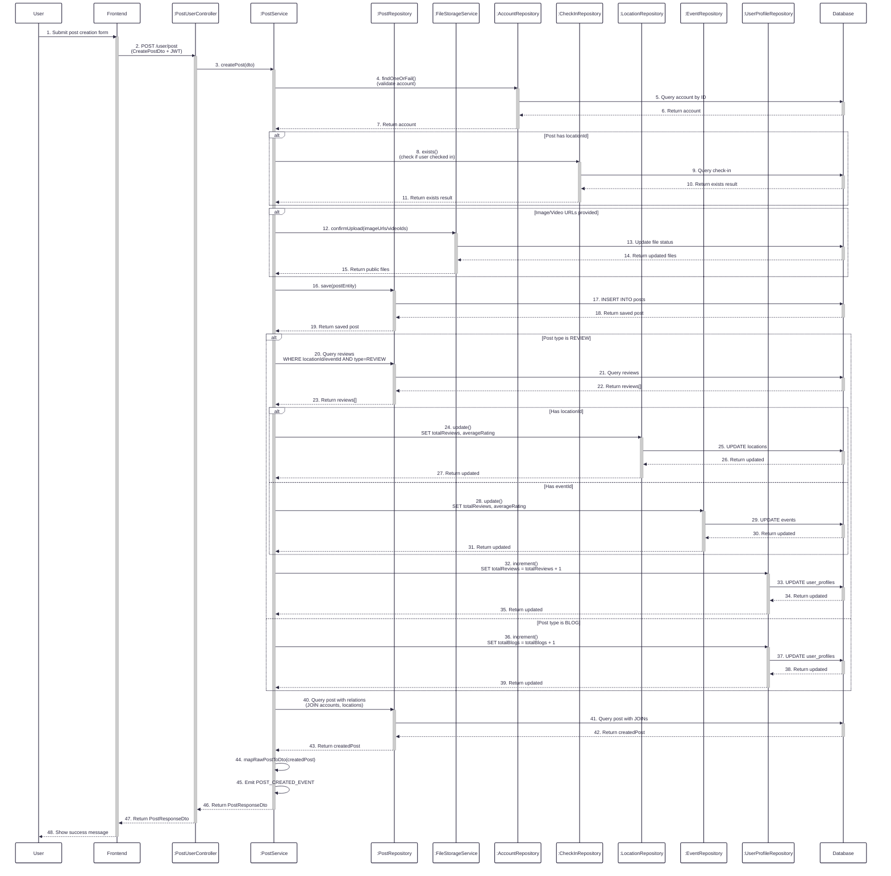
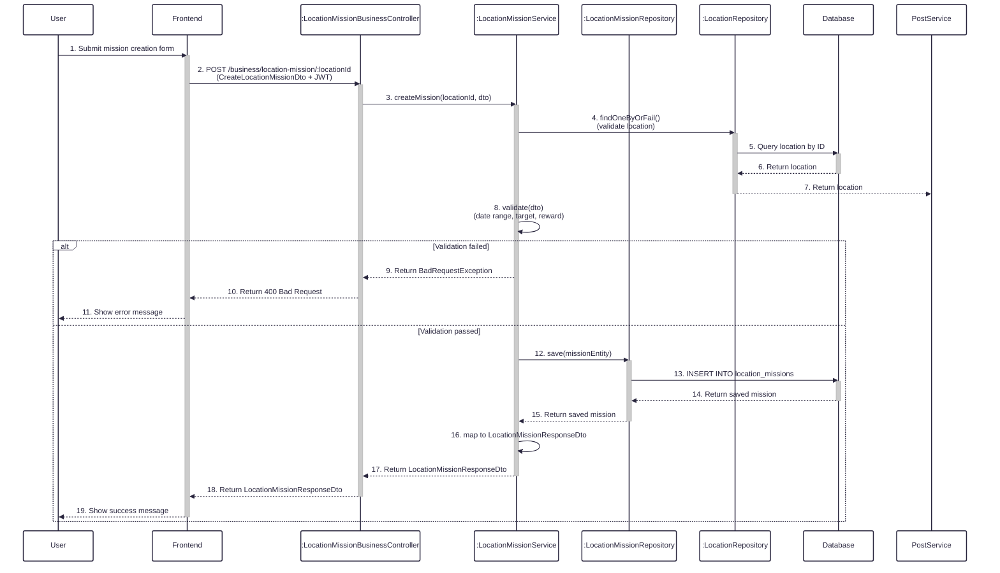
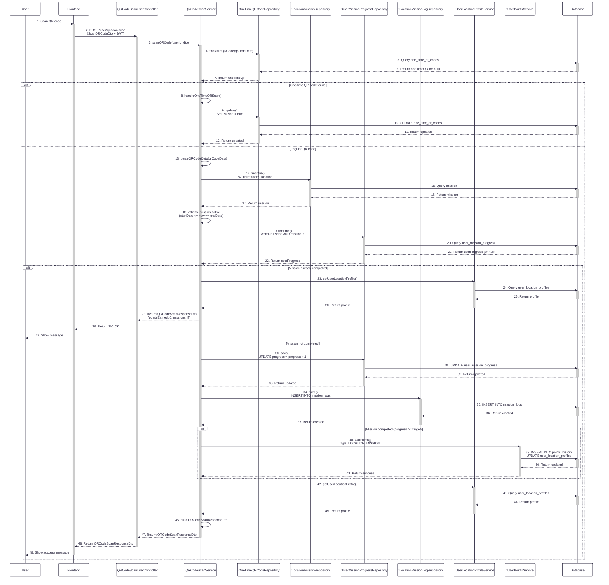
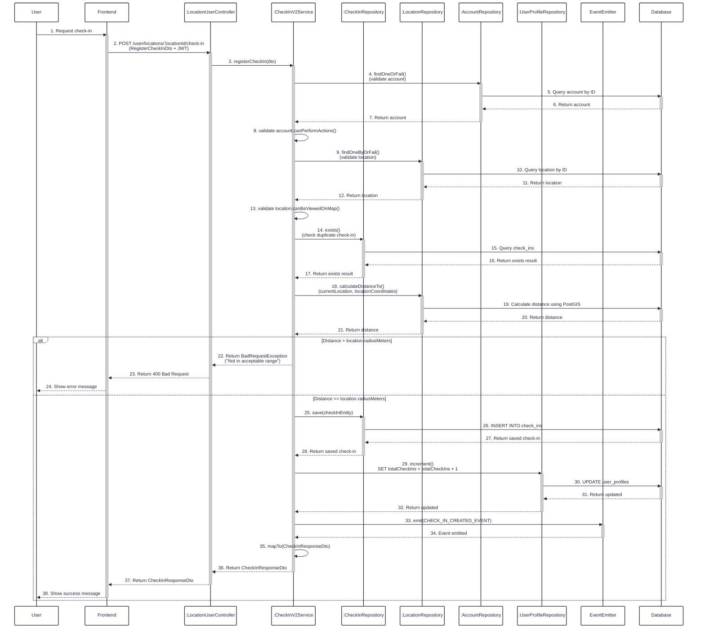
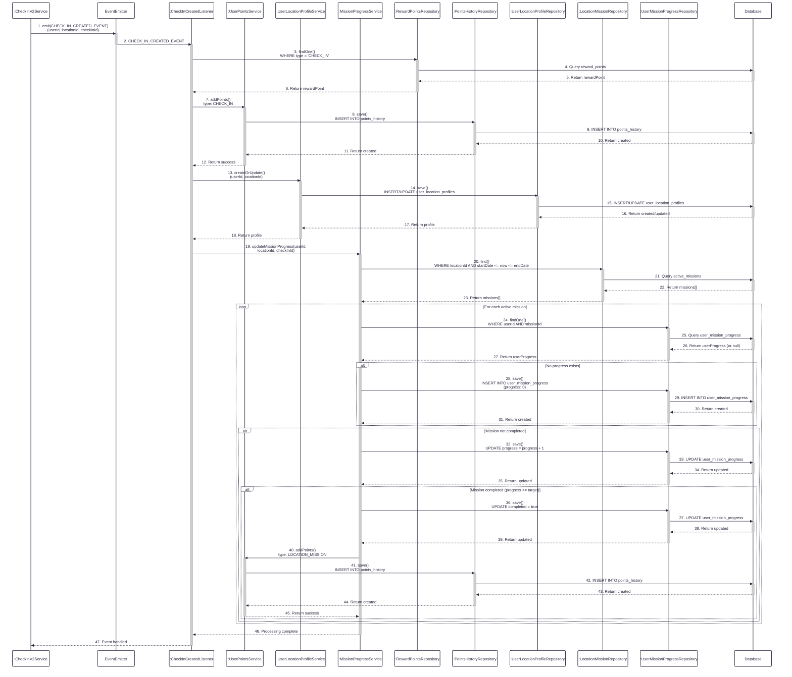
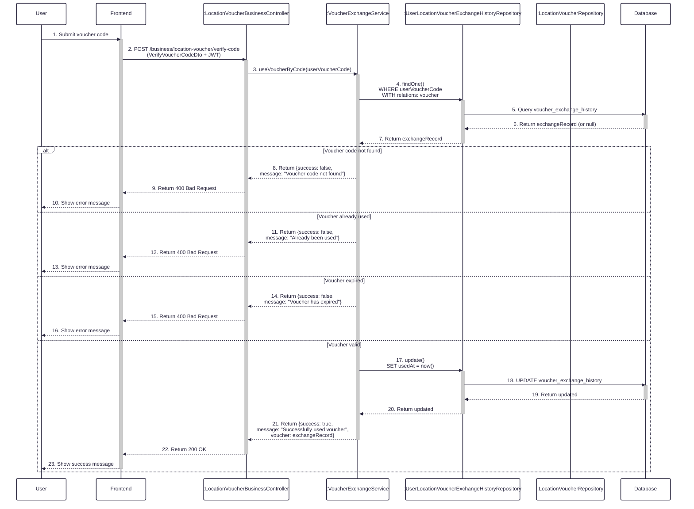
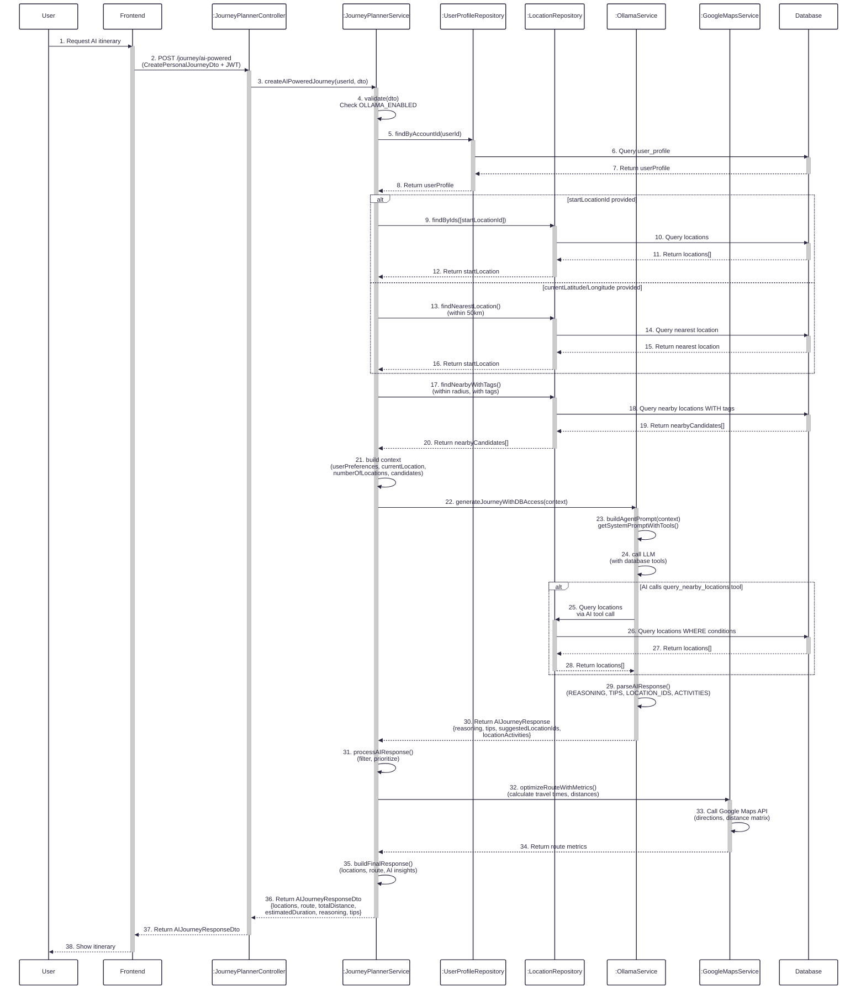

# Sequence Diagrams - User, Post, Itinerary, Mission, Voucher Features

## 1. Create Post Flow

**Figure 1:** Sequence diagram illustrating the flow of creating a new post, including database operations for validation, post creation, analytics updates, and user profile counters.

## 2. Create Mission Flow

**Figure 2:** Sequence diagram illustrating the flow of creating a location mission by a business owner, including location existence verification, date range validation, and mission creation.

## 3. Scan QR Code Flow

**Figure 3:** Sequence diagram illustrating the flow of scanning a QR code to process missions for users, including validation, mission progress tracking, points awarding, and response building.

## 4. Check-in to Location Flow

**Figure 4:** Sequence diagram illustrating the flow of user check-in to a location, including validation (account setup, location visibility, duplicate check-in), distance verification, check-in creation, and user profile counter updates.

## 5. Process Users' Mission Flow (After Check-in)

**Figure 5:** Sequence diagram illustrating the flow of processing users' missions automatically after check-in, including points awarding for check-in, user location profile creation, and mission progress tracking with completion rewards.

## 6. Business Process Voucher Flow

**Figure 6:** Sequence diagram illustrating the flow of business processing voucher codes, including voucher code validation (existence, usage status, expiration), and marking voucher as used.

## 7. AI Creates Personal Itinerary Flow

**Figure 7:** Sequence diagram illustrating the flow of AI creating personal itinerary, including user preference analysis, location data gathering, AI agent processing with database access, route optimization, and comprehensive journey response generation.
