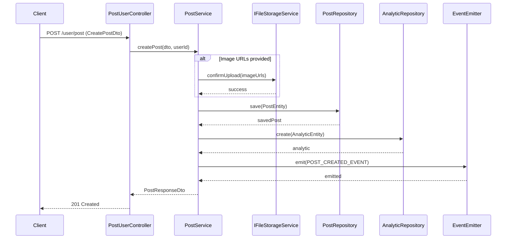
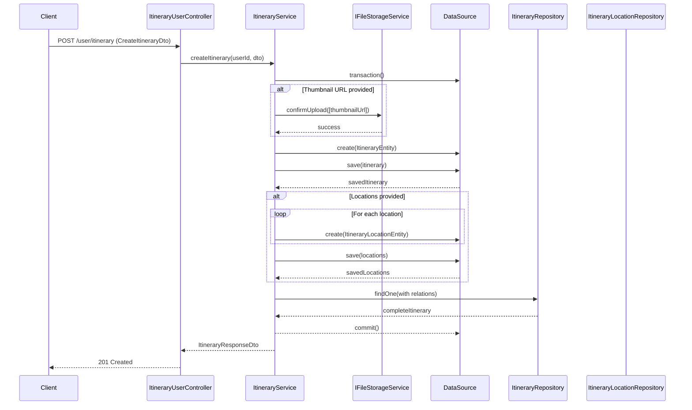
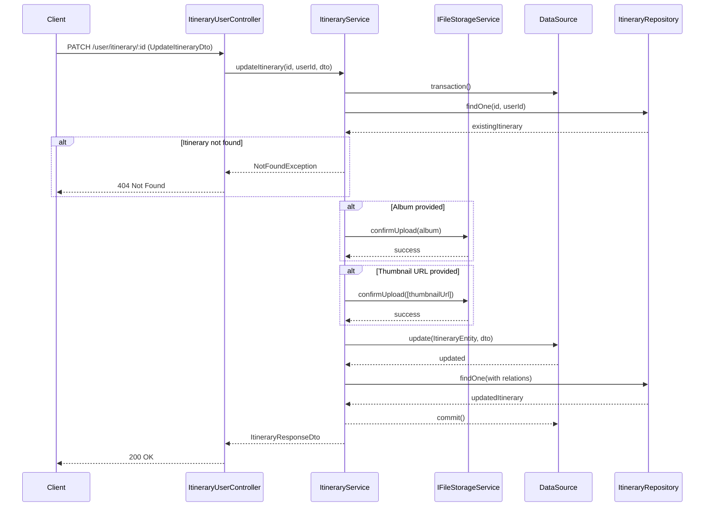
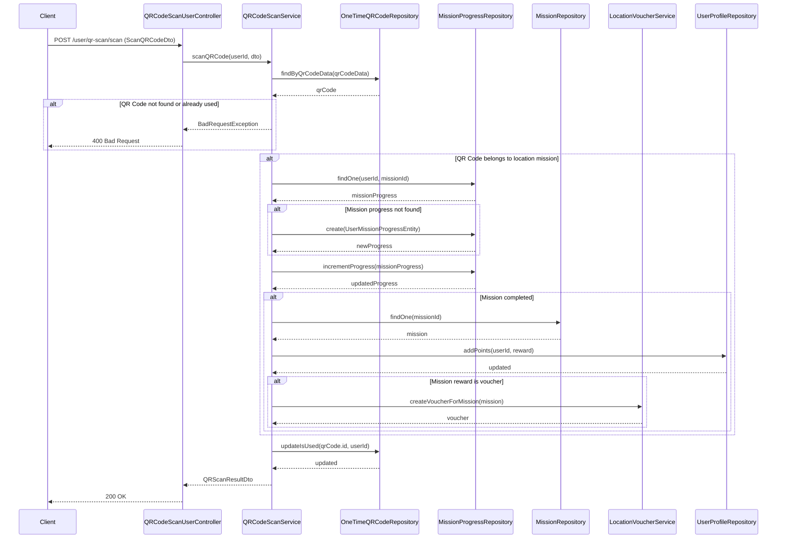
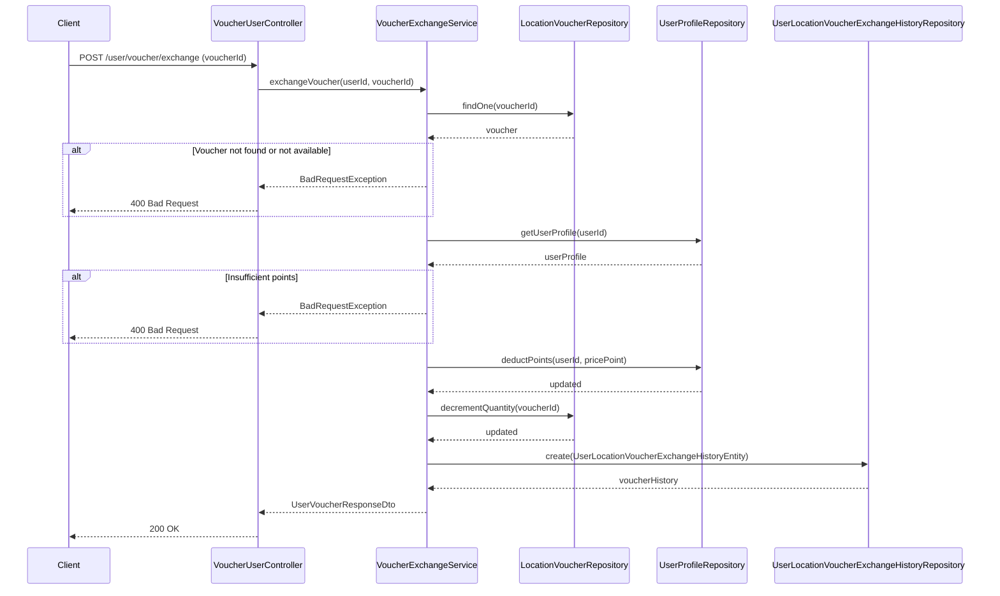
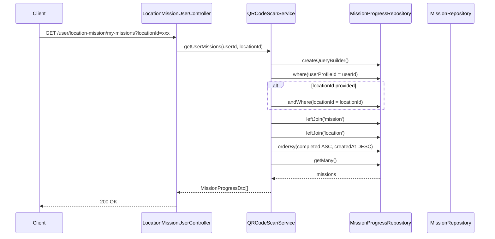
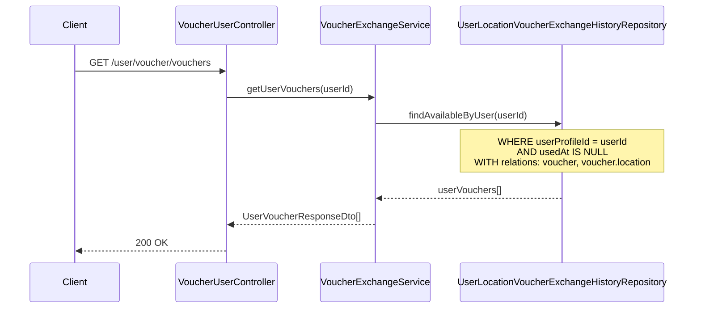
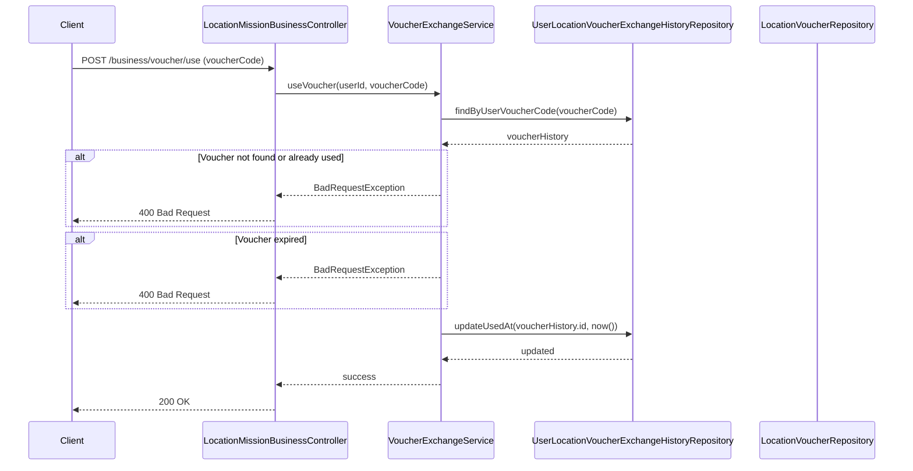
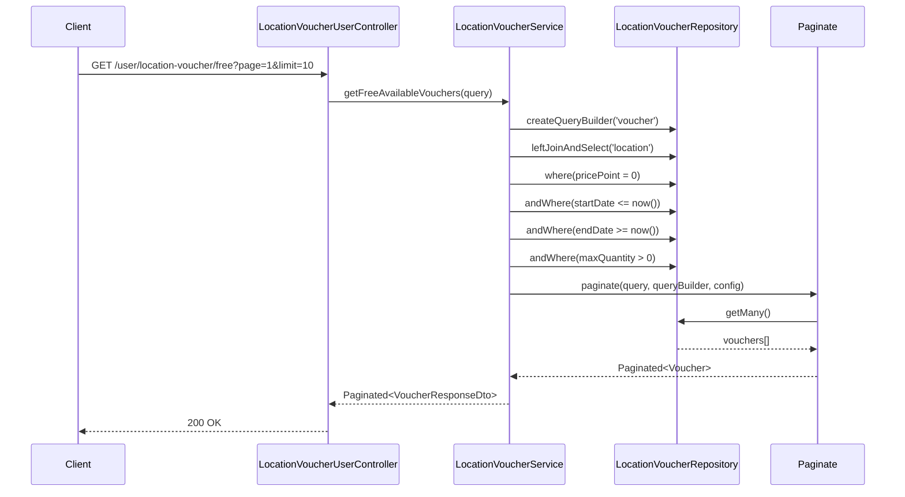
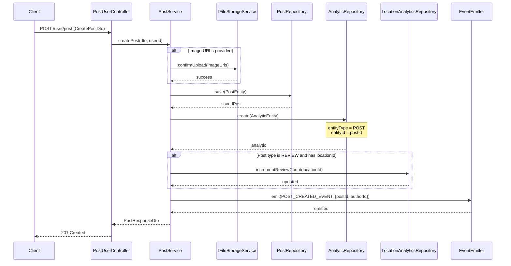

# Sequence Diagrams - User, Post, Itinerary, Mission, Voucher Features

## 1. Create Post Flow

## 2. Create Itinerary Flow

## 3. Update Itinerary Album Flow

## 4. Scan QR Code and Complete Mission Flow

## 5. Exchange Voucher Flow

## 6. Get User Missions Flow

## 7. Get User Available Vouchers Flow

## 8. Use Voucher Flow

## 9. Get Free Available Vouchers Flow

## 10. Create Post and Track Analytics Flow

