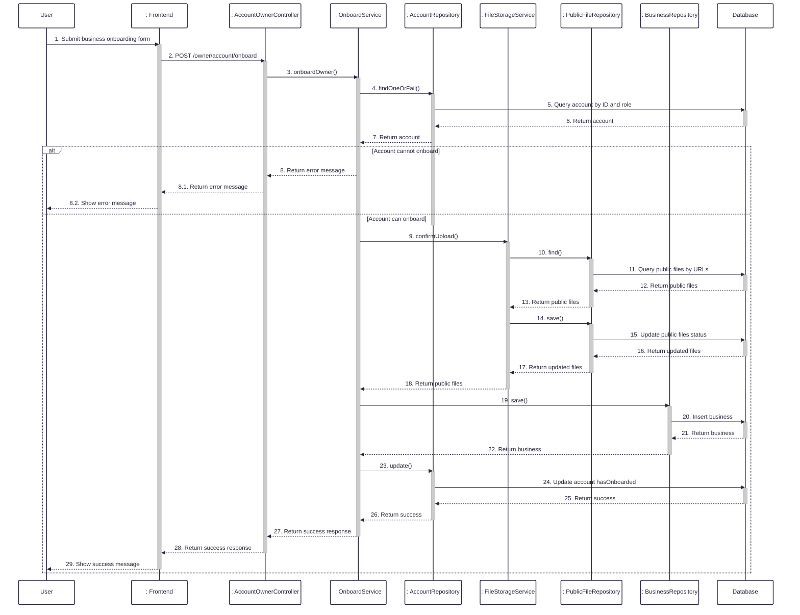

```mermaid
---
config:
  theme: redux
  look: classic
---
sequenceDiagram
    participant User
    participant Frontend as : Frontend
    participant Controller as : AccountOwnerController
    participant Service as : OnboardService
    participant AccRepo as : AccountRepository
    participant FileService as : FileStorageService
    participant FileRepo as : PublicFileRepository
    participant BizRepo as : BusinessRepository
    participant Database

    User->>Frontend: 1. Submit business onboarding form
    activate Frontend
    Frontend->>Controller: 2. POST /owner/account/onboard
    activate Controller
    Controller->>Service: 3. onboardOwner()
    activate Service
    Service->>AccRepo: 4. findOneOrFail()
    activate AccRepo
    AccRepo->>Database: 5. Query account by ID and role
    activate Database
    Database-->>AccRepo: 6. Return account
    deactivate Database
    AccRepo-->>Service: 7. Return account
    alt Account cannot onboard
        Service-->>Controller: 8. Return error message
        Controller-->>Frontend: 8.1. Return error message
        Frontend-->>User: 8.2. Show error message
    else Account can onboard
        deactivate AccRepo
        Service->>FileService: 9. confirmUpload()
        activate FileService
        FileService->>FileRepo: 10. find()
        activate FileRepo
        FileRepo->>Database: 11. Query public files by URLs
        activate Database
        Database-->>FileRepo: 12. Return public files
        deactivate Database
        FileRepo-->>FileService: 13. Return public files
        deactivate FileRepo
        FileService->>FileRepo: 14. save()
        activate FileRepo
        FileRepo->>Database: 15. Update public files status
        activate Database
        Database-->>FileRepo: 16. Return updated files
        deactivate Database
        FileRepo-->>FileService: 17. Return updated files
        deactivate FileRepo
        FileService-->>Service: 18. Return public files
        deactivate FileService
        Service->>BizRepo: 19. save()
        activate BizRepo
        BizRepo->>Database: 20. Insert business
        activate Database
        Database-->>BizRepo: 21. Return business
        deactivate Database
        BizRepo-->>Service: 22. Return business
        deactivate BizRepo
        Service->>AccRepo: 23. update()
        activate AccRepo
        AccRepo->>Database: 24. Update account hasOnboarded
        activate Database
        Database-->>AccRepo: 25. Return success
        deactivate Database
        AccRepo-->>Service: 26. Return success
        deactivate AccRepo
        Service-->>Controller: 27. Return success response
        deactivate Service
        Controller-->>Frontend: 28. Return success response
        deactivate Controller
        Frontend-->>User: 29. Show success message
        deactivate Frontend
    end
```
