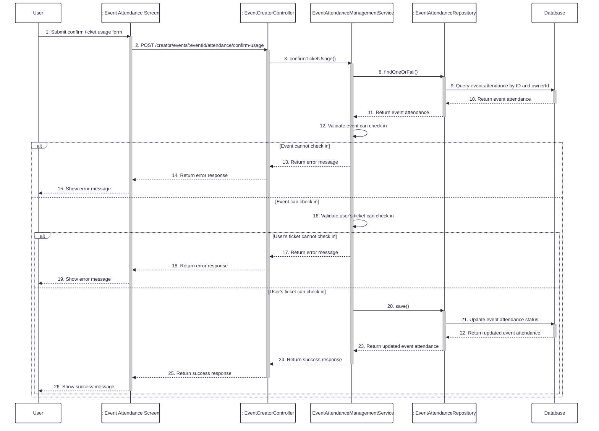

```mermaid
---
config:
  theme: redux
  look: classic
---
sequenceDiagram
    participant User
    participant EventAttendanceScreen as : Event Attendance Screen
    participant EventCreatorController as : EventCreatorController
    participant EventAttendanceManagementService as : EventAttendanceManagementService
    participant EventAttendanceRepository as : EventAttendanceRepository
    participant Database

    User->>EventAttendanceScreen: 1. Submit confirm ticket usage form
    activate EventAttendanceScreen
    EventAttendanceScreen->>EventCreatorController: 2. POST /creator/events/:eventId/attendance/confirm-usage
    activate EventCreatorController
    EventCreatorController->>EventAttendanceManagementService: 3. confirmTicketUsage()
    activate EventAttendanceManagementService
    EventAttendanceManagementService->>EventAttendanceRepository: 8. findOneOrFail()
    activate EventAttendanceRepository
    EventAttendanceRepository->>Database: 9. Query event attendance by ID and ownerId
    activate Database
    Database-->>EventAttendanceRepository: 10. Return event attendance
    deactivate Database
    EventAttendanceRepository-->>EventAttendanceManagementService: 11. Return event attendance
    deactivate EventAttendanceRepository
    EventAttendanceManagementService->>EventAttendanceManagementService: 12. Validate event can check in
    alt Event cannot check in
        EventAttendanceManagementService-->>EventCreatorController: 13. Return error message
        EventCreatorController-->>EventAttendanceScreen: 14. Return error response
        EventAttendanceScreen-->>User: 15. Show error message
    else Event can check in
        EventAttendanceManagementService->>EventAttendanceManagementService: 16. Validate user's ticket can check in
        alt User's ticket cannot check in
            EventAttendanceManagementService-->>EventCreatorController: 17. Return error message
            EventCreatorController-->>EventAttendanceScreen: 18. Return error response
            EventAttendanceScreen-->>User: 19. Show error message
        else User's ticket can check in
            EventAttendanceManagementService->>EventAttendanceRepository: 20. save()
            activate EventAttendanceRepository
            EventAttendanceRepository->>Database: 21. Update event attendance status
            activate Database
            Database-->>EventAttendanceRepository: 22. Return updated event attendance
            deactivate Database
            EventAttendanceRepository-->>EventAttendanceManagementService: 23. Return updated event attendance
            deactivate EventAttendanceRepository
            EventAttendanceManagementService-->>EventCreatorController: 24. Return success response
            deactivate EventAttendanceManagementService
            EventCreatorController-->>EventAttendanceScreen: 25. Return success response
            deactivate EventCreatorController
            EventAttendanceScreen-->>User: 26. Show success message
            deactivate EventAttendanceScreen
        end
    end
```
