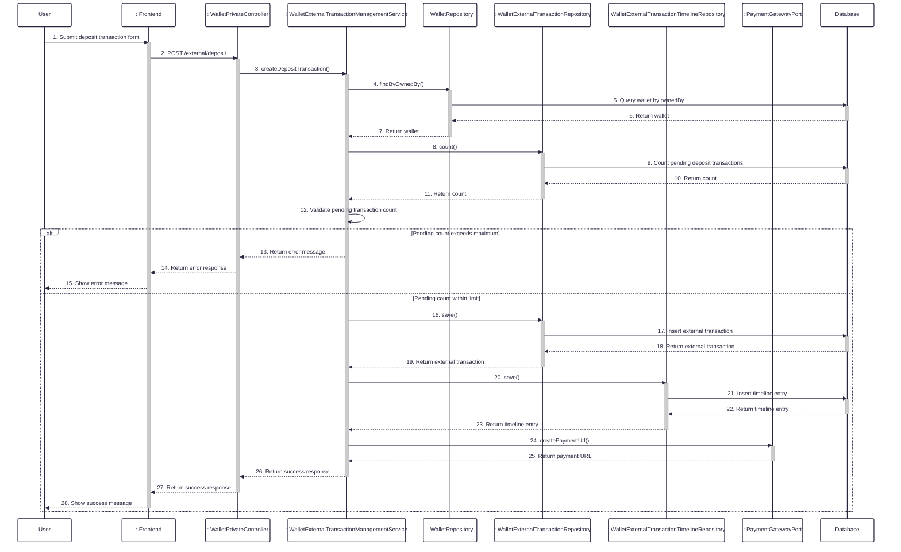

```mermaid
---
config:
  theme: redux
  look: classic
---
sequenceDiagram
    participant User
    participant Frontend as : Frontend
    participant WalletPrivateController as : WalletPrivateController
    participant WalletExternalTransactionManagementService as : WalletExternalTransactionManagementService
    participant WalletRepository as : WalletRepository
    participant WalletExternalTransactionRepository as : WalletExternalTransactionRepository
    participant WalletExternalTransactionTimelineRepository as : WalletExternalTransactionTimelineRepository
    participant PaymentGatewayPort as : PaymentGatewayPort
    participant Database

    User->>Frontend: 1. Submit deposit transaction form
    activate Frontend
    Frontend->>WalletPrivateController: 2. POST /external/deposit
    activate WalletPrivateController
    WalletPrivateController->>WalletExternalTransactionManagementService: 3. createDepositTransaction()
    activate WalletExternalTransactionManagementService
    WalletExternalTransactionManagementService->>WalletRepository: 4. findByOwnedBy()
    activate WalletRepository
    WalletRepository->>Database: 5. Query wallet by ownedBy
    activate Database
    Database-->>WalletRepository: 6. Return wallet
    deactivate Database
    WalletRepository-->>WalletExternalTransactionManagementService: 7. Return wallet
    deactivate WalletRepository
    WalletExternalTransactionManagementService->>WalletExternalTransactionRepository: 8. count()
    activate WalletExternalTransactionRepository
    WalletExternalTransactionRepository->>Database: 9. Count pending deposit transactions
    activate Database
    Database-->>WalletExternalTransactionRepository: 10. Return count
    deactivate Database
    WalletExternalTransactionRepository-->>WalletExternalTransactionManagementService: 11. Return count
    deactivate WalletExternalTransactionRepository
    WalletExternalTransactionManagementService->>WalletExternalTransactionManagementService: 12. Validate pending transaction count
    alt Pending count exceeds maximum
        WalletExternalTransactionManagementService-->>WalletPrivateController: 13. Return error message
        WalletPrivateController-->>Frontend: 14. Return error response
        Frontend-->>User: 15. Show error message
    else Pending count within limit
        WalletExternalTransactionManagementService->>WalletExternalTransactionRepository: 16. save()
        activate WalletExternalTransactionRepository
        WalletExternalTransactionRepository->>Database: 17. Insert external transaction
        activate Database
        Database-->>WalletExternalTransactionRepository: 18. Return external transaction
        deactivate Database
        WalletExternalTransactionRepository-->>WalletExternalTransactionManagementService: 19. Return external transaction
        deactivate WalletExternalTransactionRepository
        WalletExternalTransactionManagementService->>WalletExternalTransactionTimelineRepository: 20. save()
        activate WalletExternalTransactionTimelineRepository
        WalletExternalTransactionTimelineRepository->>Database: 21. Insert timeline entry
        activate Database
        Database-->>WalletExternalTransactionTimelineRepository: 22. Return timeline entry
        deactivate Database
        WalletExternalTransactionTimelineRepository-->>WalletExternalTransactionManagementService: 23. Return timeline entry
        deactivate WalletExternalTransactionTimelineRepository
        WalletExternalTransactionManagementService->>PaymentGatewayPort: 24. createPaymentUrl()
        activate PaymentGatewayPort
        PaymentGatewayPort-->>WalletExternalTransactionManagementService: 25. Return payment URL
        deactivate PaymentGatewayPort
        WalletExternalTransactionManagementService-->>WalletPrivateController: 26. Return success response
        deactivate WalletExternalTransactionManagementService
        WalletPrivateController-->>Frontend: 27. Return success response
        deactivate WalletPrivateController
        Frontend-->>User: 28. Show success message
        deactivate Frontend
    end
```

