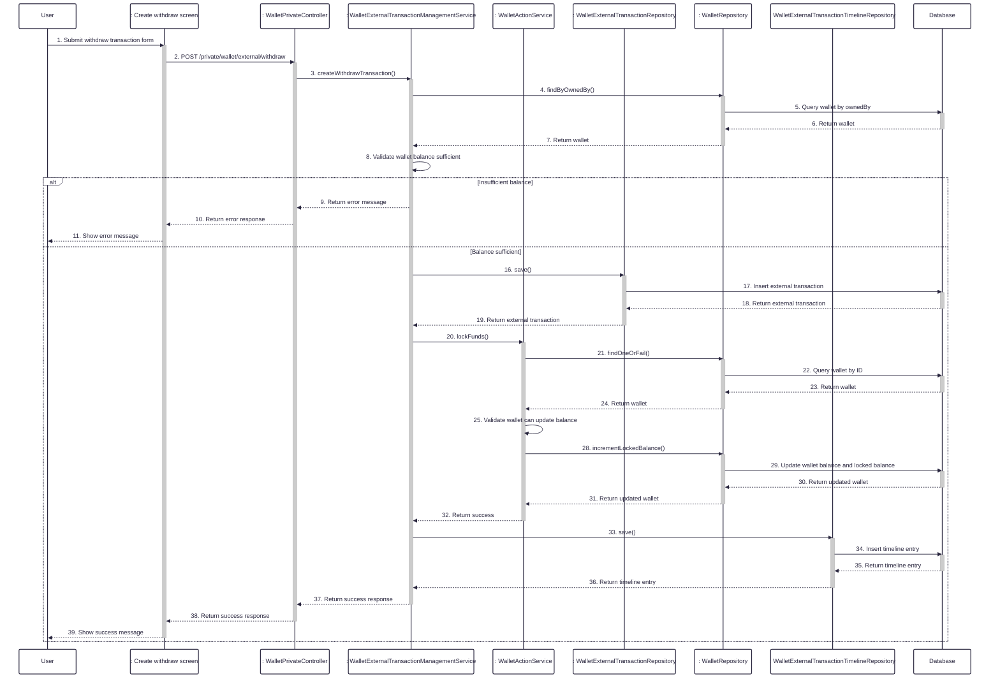

```mermaid
---
config:
  theme: redux
  look: classic
---
sequenceDiagram
    participant User
    participant Frontend as : Create withdraw screen
    participant WalletPrivateController as : WalletPrivateController
    participant WalletExternalTransactionManagementService as : WalletExternalTransactionManagementService
    participant WalletActionService as : WalletActionService
    participant WalletExternalTransactionRepository as : WalletExternalTransactionRepository
    participant WalletRepository as : WalletRepository
    participant WalletExternalTransactionTimelineRepository as : WalletExternalTransactionTimelineRepository
    participant Database

    User->>Frontend: 1. Submit withdraw transaction form
    activate Frontend
    Frontend->>WalletPrivateController: 2. POST /private/wallet/external/withdraw
    activate WalletPrivateController
    WalletPrivateController->>WalletExternalTransactionManagementService: 3. createWithdrawTransaction()
    activate WalletExternalTransactionManagementService
    WalletExternalTransactionManagementService->>WalletRepository: 4. findByOwnedBy()
    activate WalletRepository
    WalletRepository->>Database: 5. Query wallet by ownedBy
    activate Database
    Database-->>WalletRepository: 6. Return wallet
    deactivate Database
    WalletRepository-->>WalletExternalTransactionManagementService: 7. Return wallet
    deactivate WalletRepository
    WalletExternalTransactionManagementService->>WalletExternalTransactionManagementService: 8. Validate wallet balance sufficient
    alt Insufficient balance
        WalletExternalTransactionManagementService-->>WalletPrivateController: 9. Return error message
        WalletPrivateController-->>Frontend: 10. Return error response
        Frontend-->>User: 11. Show error message
    else Balance sufficient
        WalletExternalTransactionManagementService->>WalletExternalTransactionRepository: 16. save()
        activate WalletExternalTransactionRepository
        WalletExternalTransactionRepository->>Database: 17. Insert external transaction
        activate Database
        Database-->>WalletExternalTransactionRepository: 18. Return external transaction
        deactivate Database
        WalletExternalTransactionRepository-->>WalletExternalTransactionManagementService: 19. Return external transaction
        deactivate WalletExternalTransactionRepository
        WalletExternalTransactionManagementService->>WalletActionService: 20. lockFunds()
        activate WalletActionService
        WalletActionService->>WalletRepository: 21. findOneOrFail()
        activate WalletRepository
        WalletRepository->>Database: 22. Query wallet by ID
        activate Database
        Database-->>WalletRepository: 23. Return wallet
        deactivate Database
        WalletRepository-->>WalletActionService: 24. Return wallet
        deactivate WalletRepository
        WalletActionService->>WalletActionService: 25. Validate wallet can update balance
        WalletActionService->>WalletRepository: 28. incrementLockedBalance()
        activate WalletRepository
        WalletRepository->>Database: 29. Update wallet balance and locked balance
        activate Database
        Database-->>WalletRepository: 30. Return updated wallet
        deactivate Database
        WalletRepository-->>WalletActionService: 31. Return updated wallet
        deactivate WalletRepository
        WalletActionService-->>WalletExternalTransactionManagementService: 32. Return success
        deactivate WalletActionService
        WalletExternalTransactionManagementService->>WalletExternalTransactionTimelineRepository: 33. save()
        activate WalletExternalTransactionTimelineRepository
        WalletExternalTransactionTimelineRepository->>Database: 34. Insert timeline entry
        activate Database
        Database-->>WalletExternalTransactionTimelineRepository: 35. Return timeline entry
        deactivate Database
        WalletExternalTransactionTimelineRepository-->>WalletExternalTransactionManagementService: 36. Return timeline entry
        deactivate WalletExternalTransactionTimelineRepository
        WalletExternalTransactionManagementService-->>WalletPrivateController: 37. Return success response
        deactivate WalletExternalTransactionManagementService
        WalletPrivateController-->>Frontend: 38. Return success response
        deactivate WalletPrivateController
        Frontend-->>User: 39. Show success message
        deactivate Frontend
    end
```

