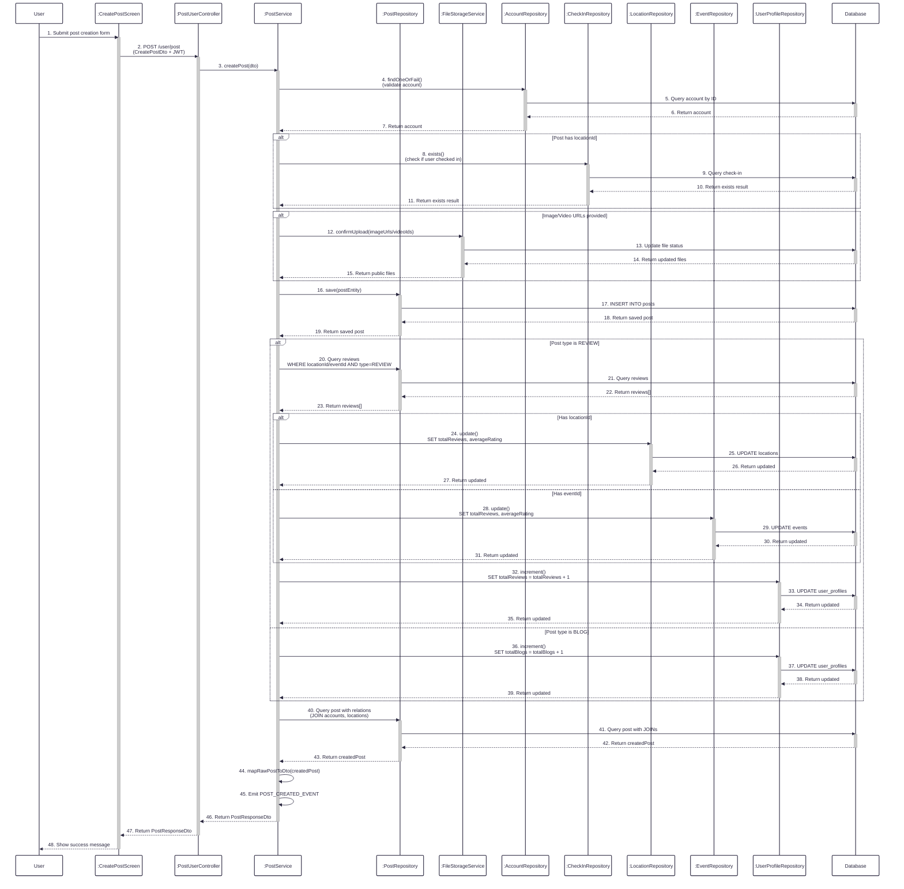

```mermaid
---
config:
  theme: redux
  look: classic
---
sequenceDiagram
    participant User
    participant CreatePostScreen as :CreatePostScreen
    participant PostController as :PostUserController
    participant PostService as :PostService
    participant PostRepo as :PostRepository
    participant FileService as :FileStorageService
    participant AccountRepo as :AccountRepository
    participant CheckInRepo as :CheckInRepository
    participant LocationRepo as :LocationRepository
    participant EventRepo as :EventRepository
    participant UserProfileRepo as :UserProfileRepository
    participant Database

    User->>CreatePostScreen: 1. Submit post creation form
    activate CreatePostScreen
    CreatePostScreen->>PostController: 2. POST /user/post<br/>(CreatePostDto + JWT)
    activate PostController
    PostController->>PostService: 3. createPost(dto)
    activate PostService

    PostService->>AccountRepo: 4. findOneOrFail()<br/>(validate account)
    activate AccountRepo
    AccountRepo->>Database: 5. Query account by ID
    activate Database
    Database-->>AccountRepo: 6. Return account
    deactivate Database
    AccountRepo-->>PostService: 7. Return account
    deactivate AccountRepo

    alt Post has locationId
        PostService->>CheckInRepo: 8. exists()<br/>(check if user checked in)
        activate CheckInRepo
        CheckInRepo->>Database: 9. Query check-in
        activate Database
        Database-->>CheckInRepo: 10. Return exists result
        deactivate Database
        CheckInRepo-->>PostService: 11. Return exists result
        deactivate CheckInRepo
    end

    alt Image/Video URLs provided
        PostService->>FileService: 12. confirmUpload(imageUrls/videoIds)
        activate FileService
        FileService->>Database: 13. Update file status
        activate Database
        Database-->>FileService: 14. Return updated files
        deactivate Database
        FileService-->>PostService: 15. Return public files
        deactivate FileService
    end

    PostService->>PostRepo: 16. save(postEntity)
    activate PostRepo
    PostRepo->>Database: 17. INSERT INTO posts
    activate Database
    Database-->>PostRepo: 18. Return saved post
    deactivate Database
    PostRepo-->>PostService: 19. Return saved post
    deactivate PostRepo

    alt Post type is REVIEW
        PostService->>PostRepo: 20. Query reviews<br/>WHERE locationId/eventId AND type=REVIEW
        activate PostRepo
        PostRepo->>Database: 21. Query reviews
        activate Database
        Database-->>PostRepo: 22. Return reviews[]
        deactivate Database
        PostRepo-->>PostService: 23. Return reviews[]
        deactivate PostRepo

        alt Has locationId
            PostService->>LocationRepo: 24. update()<br/>SET totalReviews, averageRating
            activate LocationRepo
            LocationRepo->>Database: 25. UPDATE locations
            activate Database
            Database-->>LocationRepo: 26. Return updated
            deactivate Database
            LocationRepo-->>PostService: 27. Return updated
            deactivate LocationRepo
        else Has eventId
            PostService->>EventRepo: 28. update()<br/>SET totalReviews, averageRating
            activate EventRepo
            EventRepo->>Database: 29. UPDATE events
            activate Database
            Database-->>EventRepo: 30. Return updated
            deactivate Database
            EventRepo-->>PostService: 31. Return updated
            deactivate EventRepo
        end

        PostService->>UserProfileRepo: 32. increment()<br/>SET totalReviews = totalReviews + 1
        activate UserProfileRepo
        UserProfileRepo->>Database: 33. UPDATE user_profiles
        activate Database
        Database-->>UserProfileRepo: 34. Return updated
        deactivate Database
        UserProfileRepo-->>PostService: 35. Return updated
        deactivate UserProfileRepo
    else Post type is BLOG
        PostService->>UserProfileRepo: 36. increment()<br/>SET totalBlogs = totalBlogs + 1
        activate UserProfileRepo
        UserProfileRepo->>Database: 37. UPDATE user_profiles
        activate Database
        Database-->>UserProfileRepo: 38. Return updated
        deactivate Database
        UserProfileRepo-->>PostService: 39. Return updated
        deactivate UserProfileRepo
    end

    PostService->>PostRepo: 40. Query post with relations<br/>(JOIN accounts, locations)
    activate PostRepo
    PostRepo->>Database: 41. Query post with JOINs
    activate Database
    Database-->>PostRepo: 42. Return createdPost
    deactivate Database
    PostRepo-->>PostService: 43. Return createdPost
    deactivate PostRepo

    PostService->>PostService: 44. mapRawPostToDto(createdPost)
    PostService->>PostService: 45. Emit POST_CREATED_EVENT
    PostService-->>PostController: 46. Return PostResponseDto
    deactivate PostService
    PostController-->>CreatePostScreen: 47. Return PostResponseDto
    deactivate PostController
    CreatePostScreen-->>User: 48. Show success message
    deactivate CreatePostScreen
```

**Figure 13:** Sequence diagram illustrating the flow of creating a new post, including database operations for validation, post creation, analytics updates, and user profile counters.
