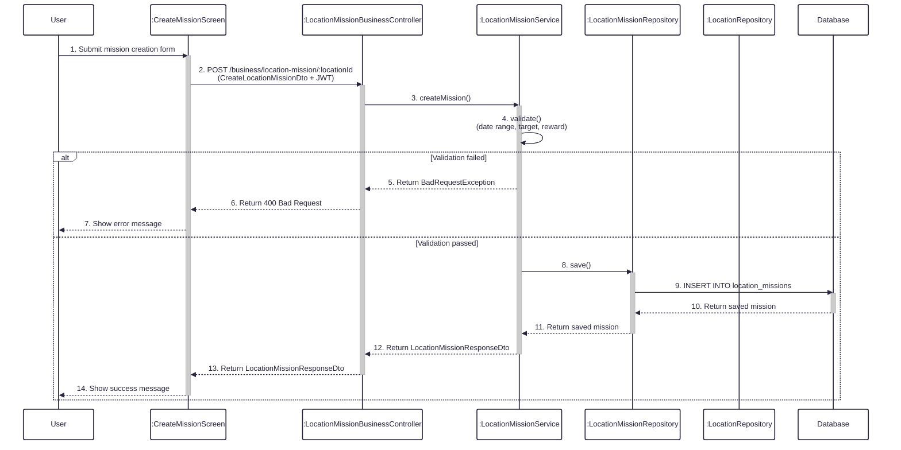

```mermaid
---
config:
  theme: redux
  look: classic
---
sequenceDiagram
    participant User
    participant CreateMissionScreen as :CreateMissionScreen
    participant MissionController as :LocationMissionBusinessController
    participant MissionService as :LocationMissionService
    participant MissionRepo as :LocationMissionRepository
    participant LocationRepo as :LocationRepository
    participant Database

    User->>CreateMissionScreen: 1. Submit mission creation form
    activate CreateMissionScreen
    CreateMissionScreen->>MissionController: 2. POST /business/location-mission/:locationId<br/>(CreateLocationMissionDto + JWT)
    activate MissionController
    MissionController->>MissionService: 3. createMission()
    activate MissionService

    MissionService->>MissionService: 4. validate()<br/>(date range, target, reward)

    alt Validation failed
        MissionService-->>MissionController: 5. Return BadRequestException
        MissionController-->>CreateMissionScreen: 6. Return 400 Bad Request
        CreateMissionScreen-->>User: 7. Show error message
    else Validation passed
        MissionService->>MissionRepo: 8. save()
        activate MissionRepo
        MissionRepo->>Database: 9. INSERT INTO location_missions
        activate Database
        Database-->>MissionRepo: 10. Return saved mission
        deactivate Database
        MissionRepo-->>MissionService: 11. Return saved mission
        deactivate MissionRepo

        MissionService-->>MissionController: 12. Return LocationMissionResponseDto
        deactivate MissionService
        MissionController-->>CreateMissionScreen: 13. Return LocationMissionResponseDto
        deactivate MissionController
        CreateMissionScreen-->>User: 14. Show success message
        deactivate CreateMissionScreen
    end
```

**Figure 14:** Sequence diagram illustrating the flow of creating a location mission by a business owner, including location existence verification, date range validation, and mission creation.
