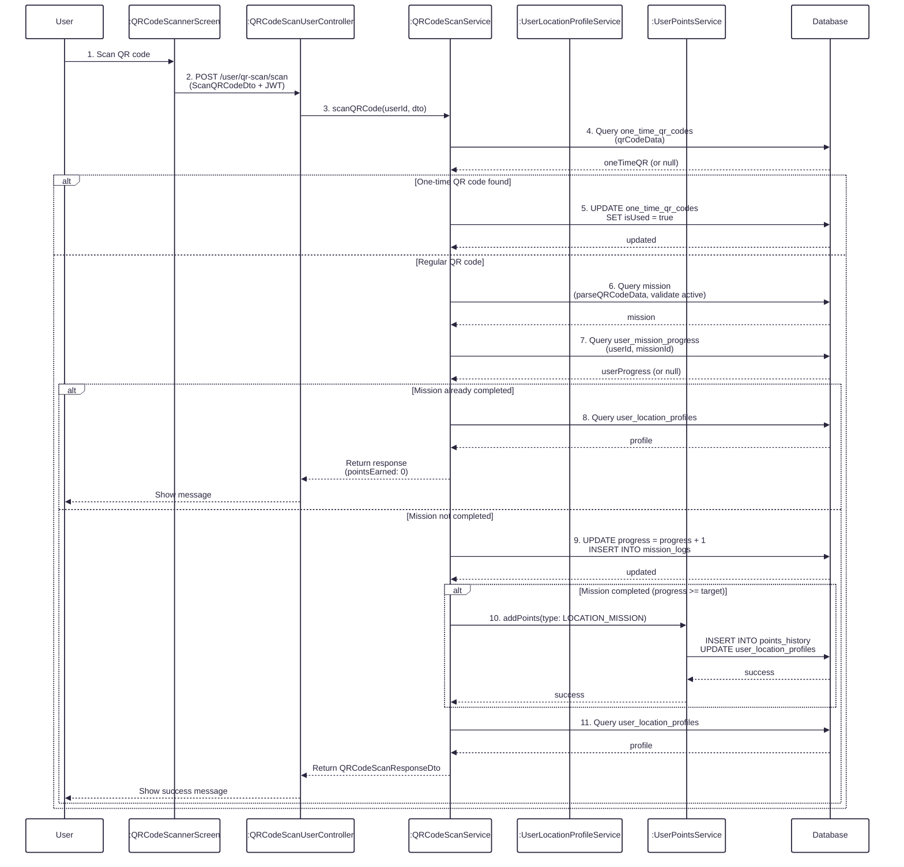

```mermaid
---
config:
  theme: redux
  look: classic
---
sequenceDiagram
    participant User
    participant QRCodeScannerScreen as :QRCodeScannerScreen
    participant QRController as :QRCodeScanUserController
    participant QRService as :QRCodeScanService
    participant UserLocationProfileService as :UserLocationProfileService
    participant PointsService as :UserPointsService
    participant Database

    User->>QRCodeScannerScreen: 1. Scan QR code
    QRCodeScannerScreen->>QRController: 2. POST /user/qr-scan/scan<br/>(ScanQRCodeDto + JWT)
    QRController->>QRService: 3. scanQRCode(userId, dto)

    QRService->>Database: 4. Query one_time_qr_codes<br/>(qrCodeData)
    Database-->>QRService: oneTimeQR (or null)

    alt One-time QR code found
        QRService->>Database: 5. UPDATE one_time_qr_codes<br/>SET isUsed = true
        Database-->>QRService: updated
    else Regular QR code
        QRService->>Database: 6. Query mission<br/>(parseQRCodeData, validate active)
        Database-->>QRService: mission

        QRService->>Database: 7. Query user_mission_progress<br/>(userId, missionId)
        Database-->>QRService: userProgress (or null)

        alt Mission already completed
            QRService->>Database: 8. Query user_location_profiles
            Database-->>QRService: profile
            QRService-->>QRController: Return response<br/>(pointsEarned: 0)
            QRController-->>User: Show message
        else Mission not completed
            QRService->>Database: 9. UPDATE progress = progress + 1<br/>INSERT INTO mission_logs
            Database-->>QRService: updated

            alt Mission completed (progress >= target)
                QRService->>PointsService: 10. addPoints(type: LOCATION_MISSION)
                PointsService->>Database: INSERT INTO points_history<br/>UPDATE user_location_profiles
                Database-->>PointsService: success
                PointsService-->>QRService: success
            end

            QRService->>Database: 11. Query user_location_profiles
            Database-->>QRService: profile
            QRService-->>QRController: Return QRCodeScanResponseDto
            QRController-->>User: Show success message
        end
    end
```

**Figure 15:** Sequence diagram illustrating the flow of scanning a QR code to process missions for users, including validation, mission progress tracking, points awarding, and response building.
