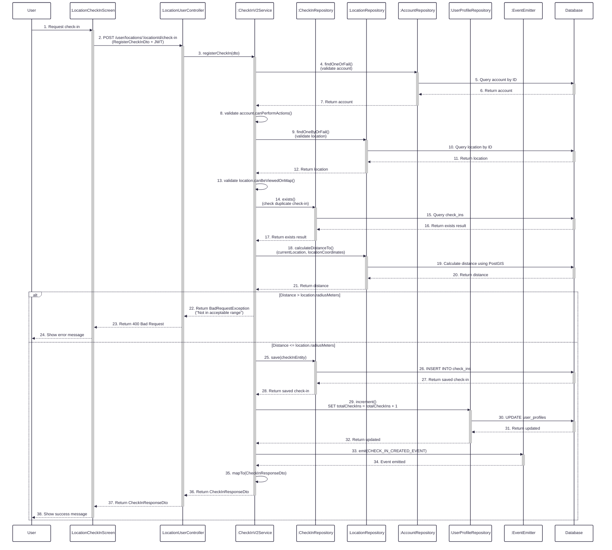

**Figure 16:** Sequence diagram illustrating the flow of user check-in to a location, including validation (account setup, location visibility, duplicate check-in), distance verification, check-in creation, and user profile counter updates.
