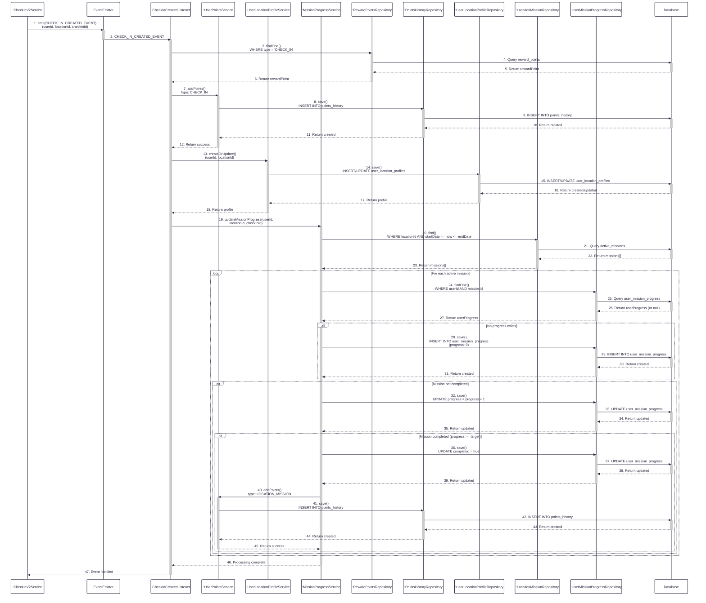

**Figure 17:** Sequence diagram illustrating the flow of processing users' missions automatically after check-in, including points awarding for check-in, user location profile creation, and mission progress tracking with completion rewards.
