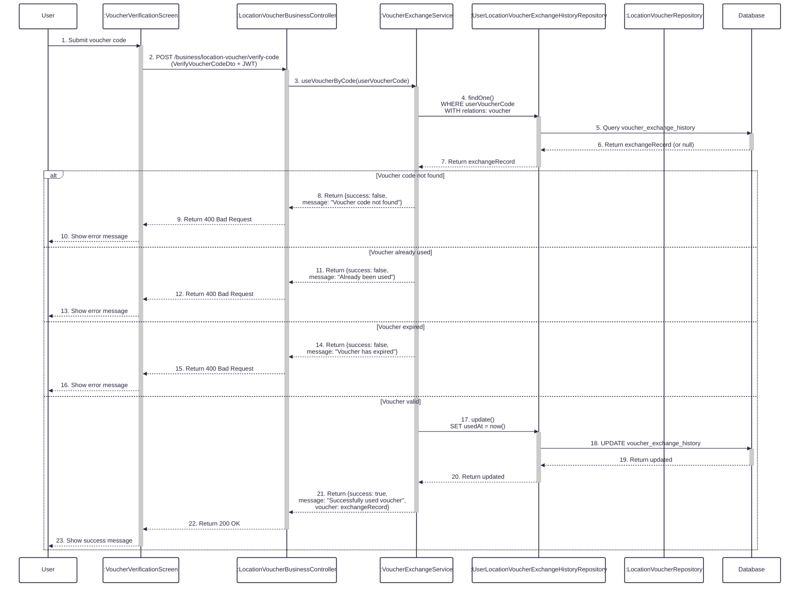

```mermaid
---
config:
  theme: redux
  look: classic
---
sequenceDiagram
    participant User
    participant VoucherVerificationScreen as :VoucherVerificationScreen
    participant VoucherController as :LocationVoucherBusinessController
    participant VoucherService as :VoucherExchangeService
    participant ExchangeHistoryRepo as :UserLocationVoucherExchangeHistoryRepository
    participant VoucherRepo as :LocationVoucherRepository
    participant Database

    User->>VoucherVerificationScreen: 1. Submit voucher code
    activate VoucherVerificationScreen
    VoucherVerificationScreen->>VoucherController: 2. POST /business/location-voucher/verify-code<br/>(VerifyVoucherCodeDto + JWT)
    activate VoucherController
    VoucherController->>VoucherService: 3. useVoucherByCode(userVoucherCode)
    activate VoucherService

    VoucherService->>ExchangeHistoryRepo: 4. findOne()<br/>WHERE userVoucherCode<br/>WITH relations: voucher
    activate ExchangeHistoryRepo
    ExchangeHistoryRepo->>Database: 5. Query voucher_exchange_history
    activate Database
    Database-->>ExchangeHistoryRepo: 6. Return exchangeRecord (or null)
    deactivate Database
    ExchangeHistoryRepo-->>VoucherService: 7. Return exchangeRecord
    deactivate ExchangeHistoryRepo

    alt Voucher code not found
        VoucherService-->>VoucherController: 8. Return {success: false,<br/>message: "Voucher code not found"}
        VoucherController-->>VoucherVerificationScreen: 9. Return 400 Bad Request
        VoucherVerificationScreen-->>User: 10. Show error message
    else Voucher already used
        VoucherService-->>VoucherController: 11. Return {success: false,<br/>message: "Already been used"}
        VoucherController-->>VoucherVerificationScreen: 12. Return 400 Bad Request
        VoucherVerificationScreen-->>User: 13. Show error message
    else Voucher expired
        VoucherService-->>VoucherController: 14. Return {success: false,<br/>message: "Voucher has expired"}
        VoucherController-->>VoucherVerificationScreen: 15. Return 400 Bad Request
        VoucherVerificationScreen-->>User: 16. Show error message
    else Voucher valid
        VoucherService->>ExchangeHistoryRepo: 17. update()<br/>SET usedAt = now()
        activate ExchangeHistoryRepo
        ExchangeHistoryRepo->>Database: 18. UPDATE voucher_exchange_history
        activate Database
        Database-->>ExchangeHistoryRepo: 19. Return updated
        deactivate Database
        ExchangeHistoryRepo-->>VoucherService: 20. Return updated
        deactivate ExchangeHistoryRepo

        VoucherService-->>VoucherController: 21. Return {success: true,<br/>message: "Successfully used voucher",<br/>voucher: exchangeRecord}
        deactivate VoucherService
        VoucherController-->>VoucherVerificationScreen: 22. Return 200 OK
        deactivate VoucherController
        VoucherVerificationScreen-->>User: 23. Show success message
        deactivate VoucherVerificationScreen
    end
```

**Figure 18:** Sequence diagram illustrating the flow of business processing voucher codes, including voucher code validation (existence, usage status, expiration), and marking voucher as used.
