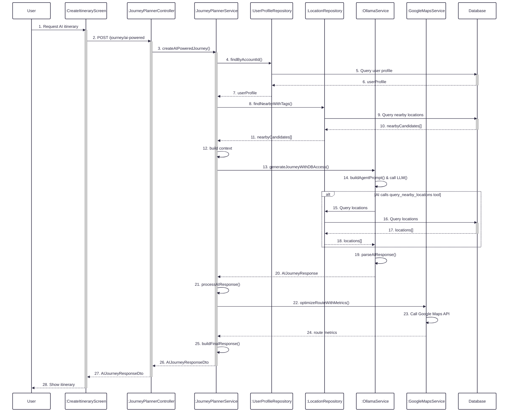
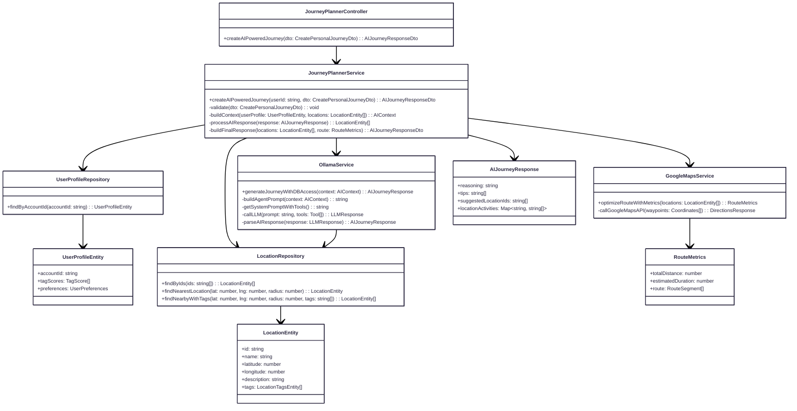

**Figure 19:** Sequence diagram illustrating the flow of AI creating personal itinerary, including user preference analysis, location data gathering, AI agent processing with database access, route optimization, and comprehensive journey response generation.

**Figure 19.1:** Class diagram showing the relationships between classes involved in the AI-powered itinerary creation flow, including controllers, services, repositories, AI services, and external APIs.
