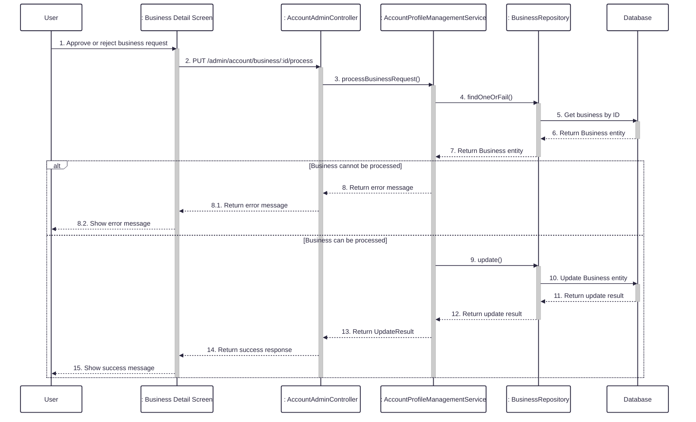

```mermaid
---
config:
  theme: redux
  look: classic
---
sequenceDiagram
    participant User
    participant Frontend as : Business Detail Screen
    participant AccountAdminController as : AccountAdminController
    participant AccountProfileManagementService as : AccountProfileManagementService
    participant BusinessRepository as : BusinessRepository
    participant Database

    User->>Frontend: 1. Approve or reject business request
    activate Frontend
    Frontend->>AccountAdminController: 2. PUT /admin/account/business/:id/process
    activate AccountAdminController
    AccountAdminController->>AccountProfileManagementService: 3. processBusinessRequest()
    activate AccountProfileManagementService
    AccountProfileManagementService->>BusinessRepository: 4. findOneOrFail()
    activate BusinessRepository
    BusinessRepository->>Database: 5. Get business by ID
    activate Database
    Database-->>BusinessRepository: 6. Return Business entity
    deactivate Database
    BusinessRepository-->>AccountProfileManagementService: 7. Return Business entity
    deactivate BusinessRepository
    alt Business cannot be processed
        AccountProfileManagementService-->>AccountAdminController: 8. Return error message
        AccountAdminController-->>Frontend: 8.1. Return error message
        Frontend-->>User: 8.2. Show error message
    else Business can be processed
        AccountProfileManagementService->>BusinessRepository: 9. update()
        activate BusinessRepository
        BusinessRepository->>Database: 10. Update Business entity
        activate Database
        Database-->>BusinessRepository: 11. Return update result
        deactivate Database
        BusinessRepository-->>AccountProfileManagementService: 12. Return update result
        deactivate BusinessRepository
        AccountProfileManagementService-->>AccountAdminController: 13. Return UpdateResult
        AccountAdminController-->>Frontend: 14. Return success response
        Frontend-->>User: 15. Show success message
    end
    deactivate AccountProfileManagementService
    deactivate AccountAdminController
    deactivate Frontend
```

