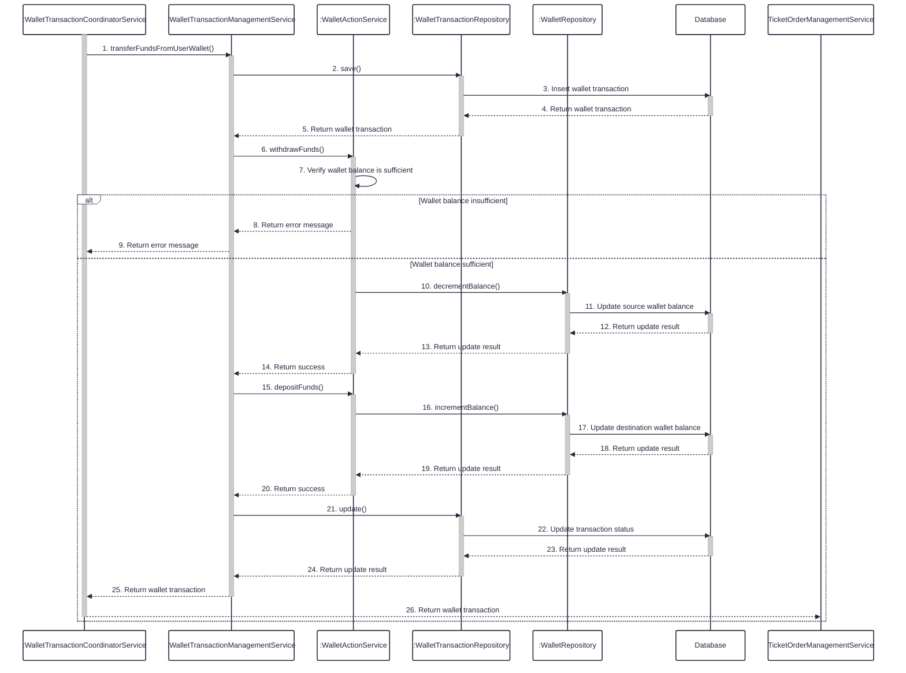

```mermaid
---
config:
  theme: redux
  look: classic
---
sequenceDiagram
  participant WalletTransactionCoordinatorService as :WalletTransactionCoordinatorService
  participant WalletTransactionManagementService as :WalletTransactionManagementService
  participant WalletActionService as :WalletActionService  
  participant WalletTransactionRepository as :WalletTransactionRepository
  participant WalletRepository as :WalletRepository

  activate WalletTransactionCoordinatorService
  WalletTransactionCoordinatorService->>WalletTransactionManagementService: 1. transferFundsFromUserWallet()
  activate WalletTransactionManagementService        
  WalletTransactionManagementService->>WalletTransactionRepository: 2. save()
  activate WalletTransactionRepository
  WalletTransactionRepository->>Database: 3. Insert wallet transaction
  activate Database
  Database-->>WalletTransactionRepository: 4. Return wallet transaction
  deactivate Database
  WalletTransactionRepository-->>WalletTransactionManagementService: 5. Return wallet transaction
  deactivate WalletTransactionRepository
  WalletTransactionManagementService->>WalletActionService: 6. withdrawFunds()
  activate WalletActionService
  WalletActionService->>WalletActionService: 7. Verify wallet balance is sufficient
  alt Wallet balance insufficient
      WalletActionService-->>WalletTransactionManagementService: 8. Return error message
      WalletTransactionManagementService-->>WalletTransactionCoordinatorService: 9. Return error message
  else Wallet balance sufficient
      WalletActionService->>WalletRepository: 10. decrementBalance()
      activate WalletRepository
      WalletRepository->>Database: 11. Update source wallet balance
      activate Database
      Database-->>WalletRepository: 12. Return update result
      deactivate Database
      WalletRepository-->>WalletActionService: 13. Return update result
      deactivate WalletRepository
      WalletActionService-->>WalletTransactionManagementService: 14. Return success
      deactivate WalletActionService
      WalletTransactionManagementService->>WalletActionService: 15. depositFunds()
      activate WalletActionService
      WalletActionService->>WalletRepository: 16. incrementBalance()
      activate WalletRepository
      WalletRepository->>Database: 17. Update destination wallet balance
      activate Database
      Database-->>WalletRepository: 18. Return update result
      deactivate Database
      WalletRepository-->>WalletActionService: 19. Return update result
      deactivate WalletRepository
      WalletActionService-->>WalletTransactionManagementService: 20. Return success
      deactivate WalletActionService
      WalletTransactionManagementService->>WalletTransactionRepository: 21. update()
      activate WalletTransactionRepository
      WalletTransactionRepository->>Database: 22. Update transaction status
      activate Database
      Database-->>WalletTransactionRepository: 23. Return update result
      deactivate Database
      WalletTransactionRepository-->>WalletTransactionManagementService: 24. Return update result
      deactivate WalletTransactionRepository
      WalletTransactionManagementService-->>WalletTransactionCoordinatorService: 25. Return wallet transaction
      deactivate WalletTransactionManagementService
      WalletTransactionCoordinatorService-->>TicketOrderManagementService: 26. Return wallet transaction
      deactivate WalletTransactionCoordinatorService
  end
```