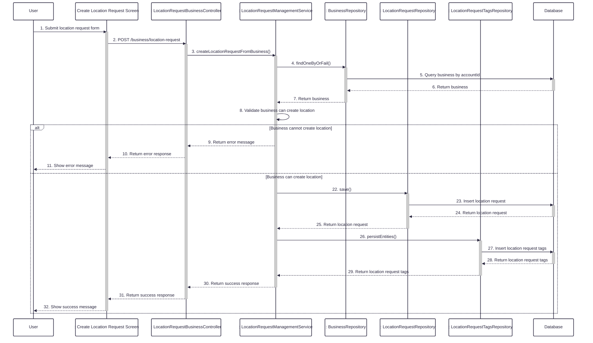

```mermaid
---
config:
  theme: redux
  look: classic
---
sequenceDiagram
    participant User
    participant Frontend as : Create Location Request Screen
    participant LocationRequestBusinessController as : LocationRequestBusinessController
    participant LocationRequestManagementService as : LocationRequestManagementService
    participant BusinessRepository as : BusinessRepository
    participant LocationRequestRepository as : LocationRequestRepository
    participant LocationRequestTagsRepository as : LocationRequestTagsRepository
    participant Database

    User->>Frontend: 1. Submit location request form
    activate Frontend
    Frontend->>LocationRequestBusinessController: 2. POST /business/location-request
    activate LocationRequestBusinessController
    LocationRequestBusinessController->>LocationRequestManagementService: 3. createLocationRequestFromBusiness()
    activate LocationRequestManagementService
    LocationRequestManagementService->>BusinessRepository: 4. findOneByOrFail()
    activate BusinessRepository
    BusinessRepository->>Database: 5. Query business by accountId
    activate Database
    Database-->>BusinessRepository: 6. Return business
    deactivate Database
    BusinessRepository-->>LocationRequestManagementService: 7. Return business
    deactivate BusinessRepository
    LocationRequestManagementService->>LocationRequestManagementService: 8. Validate business can create location
    alt Business cannot create location
        LocationRequestManagementService-->>LocationRequestBusinessController: 9. Return error message
        LocationRequestBusinessController-->>Frontend: 10. Return error response
        Frontend-->>User: 11. Show error message
    else Business can create location
        LocationRequestManagementService->>LocationRequestRepository: 22. save()
        activate LocationRequestRepository
        LocationRequestRepository->>Database: 23. Insert location request
        activate Database
        Database-->>LocationRequestRepository: 24. Return location request
        deactivate Database
        LocationRequestRepository-->>LocationRequestManagementService: 25. Return location request
        deactivate LocationRequestRepository
        LocationRequestManagementService->>LocationRequestTagsRepository: 26. persistEntities()
        activate LocationRequestTagsRepository
        LocationRequestTagsRepository->>Database: 27. Insert location request tags
        activate Database
        Database-->>LocationRequestTagsRepository: 28. Return location request tags
        deactivate Database
        LocationRequestTagsRepository-->>LocationRequestManagementService: 29. Return location request tags
        deactivate LocationRequestTagsRepository
        LocationRequestManagementService-->>LocationRequestBusinessController: 30. Return success response
        deactivate LocationRequestManagementService
        LocationRequestBusinessController-->>Frontend: 31. Return success response
        deactivate LocationRequestBusinessController
        Frontend-->>User: 32. Show success message
        deactivate Frontend
    end
```
