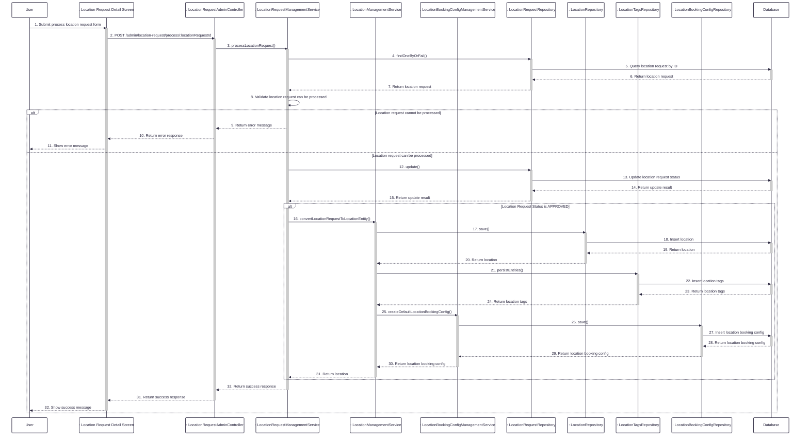

```mermaid
---
config:
  theme: redux
  look: classic
---
sequenceDiagram
    participant User
    participant Frontend as : Location Request Detail Screen
    participant LocationRequestAdminController as : LocationRequestAdminController
    participant LocationRequestManagementService as : LocationRequestManagementService
    participant LocationManagementService as : LocationManagementService
    participant LocationBookingConfigManagementService as : LocationBookingConfigManagementService
    participant LocationRequestRepository as : LocationRequestRepository
    participant LocationRepository as : LocationRepository
    participant LocationTagsRepository as : LocationTagsRepository
    participant LocationBookingConfigRepository as : LocationBookingConfigRepository
    participant Database

    User->>Frontend: 1. Submit process location request form
    activate Frontend
    Frontend->>LocationRequestAdminController: 2. POST /admin/location-request/process/:locationRequestId
    activate LocationRequestAdminController
    LocationRequestAdminController->>LocationRequestManagementService: 3. processLocationRequest()
    activate LocationRequestManagementService
    LocationRequestManagementService->>LocationRequestRepository: 4. findOneByOrFail()
    activate LocationRequestRepository
    LocationRequestRepository->>Database: 5. Query location request by ID
    activate Database
    Database-->>LocationRequestRepository: 6. Return location request
    deactivate Database
    LocationRequestRepository-->>LocationRequestManagementService: 7. Return location request
    deactivate LocationRequestRepository
    LocationRequestManagementService->>LocationRequestManagementService: 8. Validate location request can be processed
    alt Location request cannot be processed
        LocationRequestManagementService-->>LocationRequestAdminController: 9. Return error message
        LocationRequestAdminController-->>Frontend: 10. Return error response
        Frontend-->>User: 11. Show error message
    else Location request can be processed
        LocationRequestManagementService->>LocationRequestRepository: 12. update()
        activate LocationRequestRepository
        LocationRequestRepository->>Database: 13. Update location request status
        activate Database
        Database-->>LocationRequestRepository: 14. Return update result
        deactivate Database
        LocationRequestRepository-->>LocationRequestManagementService: 15. Return update result
        deactivate LocationRequestRepository
        alt Location Request Status is APPROVED
            LocationRequestManagementService->>LocationManagementService: 16. convertLocationRequestToLocationEntity()
            activate LocationManagementService
            LocationManagementService->>LocationRepository: 17. save()
            activate LocationRepository
            LocationRepository->>Database: 18. Insert location
            activate Database
            Database-->>LocationRepository: 19. Return location
            deactivate Database
            LocationRepository-->>LocationManagementService: 20. Return location
            deactivate LocationRepository
            LocationManagementService->>LocationTagsRepository: 21. persistEntities()
            activate LocationTagsRepository
            LocationTagsRepository->>Database: 22. Insert location tags
            activate Database
            Database-->>LocationTagsRepository: 23. Return location tags
            deactivate Database
            LocationTagsRepository-->>LocationManagementService: 24. Return location tags
            deactivate LocationTagsRepository
            LocationManagementService->>LocationBookingConfigManagementService: 25. createDefaultLocationBookingConfig()
            activate LocationBookingConfigManagementService
            LocationBookingConfigManagementService->>LocationBookingConfigRepository: 26. save()
            activate LocationBookingConfigRepository
            LocationBookingConfigRepository->>Database: 27. Insert location booking config
            activate Database
            Database-->>LocationBookingConfigRepository: 28. Return location booking config
            deactivate Database
            LocationBookingConfigRepository-->>LocationBookingConfigManagementService: 29. Return location booking config
            deactivate LocationBookingConfigRepository
            LocationBookingConfigManagementService-->>LocationManagementService: 30. Return location booking config
            deactivate LocationBookingConfigManagementService
            LocationManagementService-->>LocationRequestManagementService: 31. Return location
            deactivate LocationManagementService
        end
        LocationRequestManagementService-->>LocationRequestAdminController: 32. Return success response
        deactivate LocationRequestManagementService
        LocationRequestAdminController-->>Frontend: 31. Return success response
        deactivate LocationRequestAdminController
        Frontend-->>User: 32. Show success message
        deactivate Frontend
    end
```
