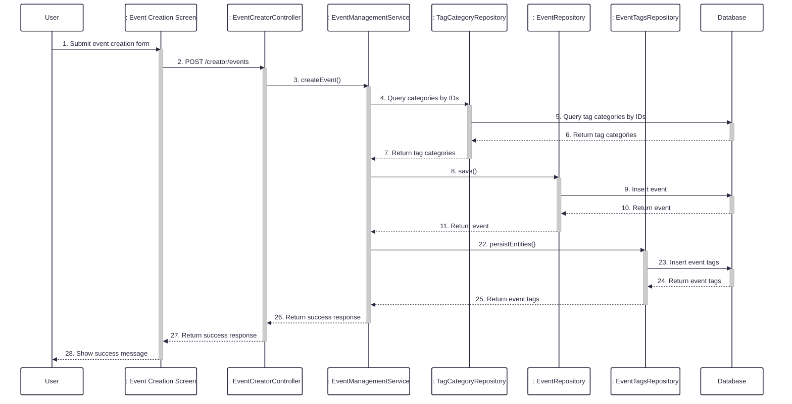

```mermaid
---
config:
  theme: redux
  look: classic
---
sequenceDiagram
    participant User
    participant Frontend as : Event Creation Screen
    participant EventCreatorController as : EventCreatorController
    participant EventManagementService as : EventManagementService
    participant TagCategoryRepository as : TagCategoryRepository
    participant EventRepository as : EventRepository
    participant EventTagsRepository as : EventTagsRepository
    participant Database

    User->>Frontend: 1. Submit event creation form
    activate Frontend
    Frontend->>EventCreatorController: 2. POST /creator/events
    activate EventCreatorController
    EventCreatorController->>EventManagementService: 3. createEvent()
    activate EventManagementService
    EventManagementService->>TagCategoryRepository: 4. Query categories by IDs
    activate TagCategoryRepository
    TagCategoryRepository->>Database: 5. Query tag categories by IDs
    activate Database
    Database-->>TagCategoryRepository: 6. Return tag categories
    deactivate Database
    TagCategoryRepository-->>EventManagementService: 7. Return tag categories
    deactivate TagCategoryRepository
    EventManagementService->>EventRepository: 8. save()
    activate EventRepository
    EventRepository->>Database: 9. Insert event
    activate Database
    Database-->>EventRepository: 10. Return event
    deactivate Database
    EventRepository-->>EventManagementService: 11. Return event
    deactivate EventRepository
    EventManagementService->>EventTagsRepository: 22. persistEntities()
    activate EventTagsRepository
    EventTagsRepository->>Database: 23. Insert event tags
    activate Database
    Database-->>EventTagsRepository: 24. Return event tags
    deactivate Database
    EventTagsRepository-->>EventManagementService: 25. Return event tags
    deactivate EventTagsRepository
    EventManagementService-->>EventCreatorController: 26. Return success response
    deactivate EventManagementService
    EventCreatorController-->>Frontend: 27. Return success response
    deactivate EventCreatorController
    Frontend-->>User: 28. Show success message
    deactivate Frontend
```

