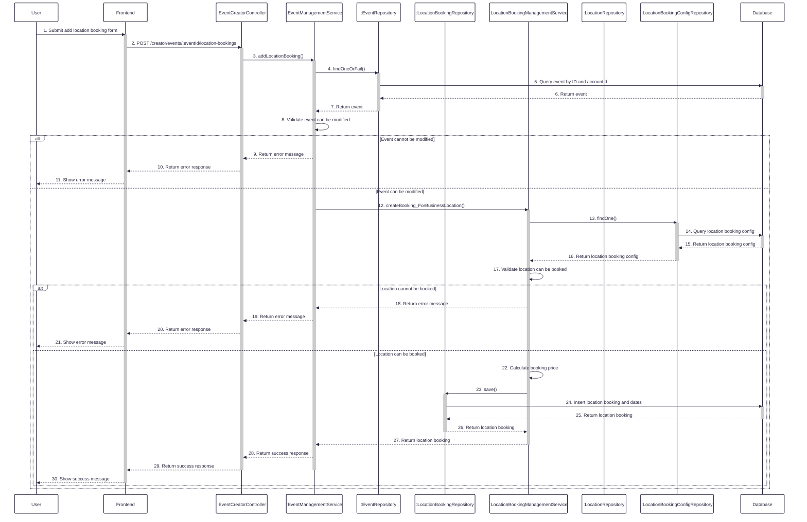

```mermaid
---
config:
  theme: redux
  look: classic
---
sequenceDiagram
    participant User
    participant Frontend
    participant EventCreatorController as :EventCreatorController
    participant EventManagementService as :EventManagementService
    participant EventRepository as :EventRepository
    participant LocationBookingRepository as :LocationBookingRepository
    participant LocationBookingManagementService as :LocationBookingManagementService
    participant LocationRepository as :LocationRepository
    participant LocationBookingConfigRepository as :LocationBookingConfigRepository
    participant Database

    User->>Frontend: 1. Submit add location booking form
    activate Frontend
    Frontend->>EventCreatorController: 2. POST /creator/events/:eventId/location-bookings
    activate EventCreatorController
    EventCreatorController->>EventManagementService: 3. addLocationBooking()
    activate EventManagementService
    EventManagementService->>EventRepository: 4. findOneOrFail()
    activate EventRepository
    EventRepository->>Database: 5. Query event by ID and accountId
    activate Database
    Database-->>EventRepository: 6. Return event
    deactivate Database
    EventRepository-->>EventManagementService: 7. Return event
    deactivate EventRepository
    EventManagementService->>EventManagementService: 8. Validate event can be modified
    alt Event cannot be modified
        EventManagementService-->>EventCreatorController: 9. Return error message
        EventCreatorController-->>Frontend: 10. Return error response
        Frontend-->>User: 11. Show error message
    else Event can be modified
        EventManagementService->>LocationBookingManagementService: 12. createBooking_ForBusinessLocation()
        activate LocationBookingManagementService
        LocationBookingManagementService->>LocationBookingConfigRepository: 13. findOne()
        activate LocationBookingConfigRepository
        LocationBookingConfigRepository->>Database: 14. Query location booking config
        activate Database
        Database-->>LocationBookingConfigRepository: 15. Return location booking config
        deactivate Database
        LocationBookingConfigRepository-->>LocationBookingManagementService: 16. Return location booking config
        deactivate LocationBookingConfigRepository
        LocationBookingManagementService->>LocationBookingManagementService: 17. Validate location can be booked
        alt Location cannot be booked
            LocationBookingManagementService-->>EventManagementService: 18. Return error message
            EventManagementService-->>EventCreatorController: 19. Return error message
            EventCreatorController-->>Frontend: 20. Return error response
            Frontend-->>User: 21. Show error message
        else Location can be booked
            LocationBookingManagementService->>LocationBookingManagementService: 22. Calculate booking price
            LocationBookingManagementService->>LocationBookingRepository: 23. save()
            activate LocationBookingRepository
            LocationBookingRepository->>Database: 24. Insert location booking and dates
            activate Database
            Database-->>LocationBookingRepository: 25. Return location booking
            deactivate Database
            LocationBookingRepository-->>LocationBookingManagementService: 26. Return location booking
            deactivate LocationBookingRepository
            LocationBookingManagementService-->>EventManagementService: 27. Return location booking
            deactivate LocationBookingManagementService
            EventManagementService-->>EventCreatorController: 28. Return success response
            EventCreatorController-->>Frontend: 29. Return success response
            deactivate EventManagementService
            deactivate EventCreatorController
            Frontend-->>User: 30. Show success message
            deactivate Frontend
        end
    end
```

