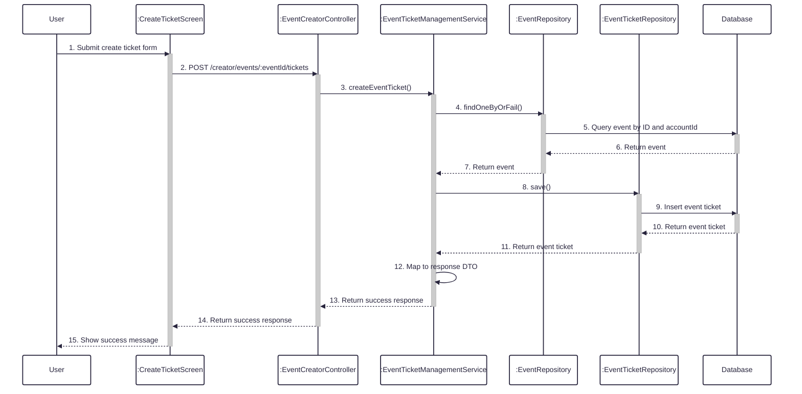

```mermaid
---
config:
  theme: redux
  look: classic
---
sequenceDiagram
    participant User
    participant CreateTicketScreen as :CreateTicketScreen
    participant EventCreatorController as :EventCreatorController
    participant EventTicketManagementService as :EventTicketManagementService
    participant EventRepository as :EventRepository
    participant EventTicketRepository as :EventTicketRepository
    participant Database

    User->>CreateTicketScreen: 1. Submit create ticket form
    activate CreateTicketScreen
    CreateTicketScreen->>EventCreatorController: 2. POST /creator/events/:eventId/tickets
    activate EventCreatorController
    EventCreatorController->>EventTicketManagementService: 3. createEventTicket()
    activate EventTicketManagementService
    EventTicketManagementService->>EventRepository: 4. findOneByOrFail()
    activate EventRepository
    EventRepository->>Database: 5. Query event by ID and accountId
    activate Database
    Database-->>EventRepository: 6. Return event
    deactivate Database
    EventRepository-->>EventTicketManagementService: 7. Return event
    deactivate EventRepository
    EventTicketManagementService->>EventTicketRepository: 8. save()
    activate EventTicketRepository
    EventTicketRepository->>Database: 9. Insert event ticket
    activate Database
    Database-->>EventTicketRepository: 10. Return event ticket
    deactivate Database
    EventTicketRepository-->>EventTicketManagementService: 11. Return event ticket
    deactivate EventTicketRepository
    EventTicketManagementService->>EventTicketManagementService: 12. Map to response DTO
    EventTicketManagementService-->>EventCreatorController: 13. Return success response
    deactivate EventTicketManagementService
    EventCreatorController-->>CreateTicketScreen: 14. Return success response
    deactivate EventCreatorController
    CreateTicketScreen-->>User: 15. Show success message
    deactivate CreateTicketScreen
```
