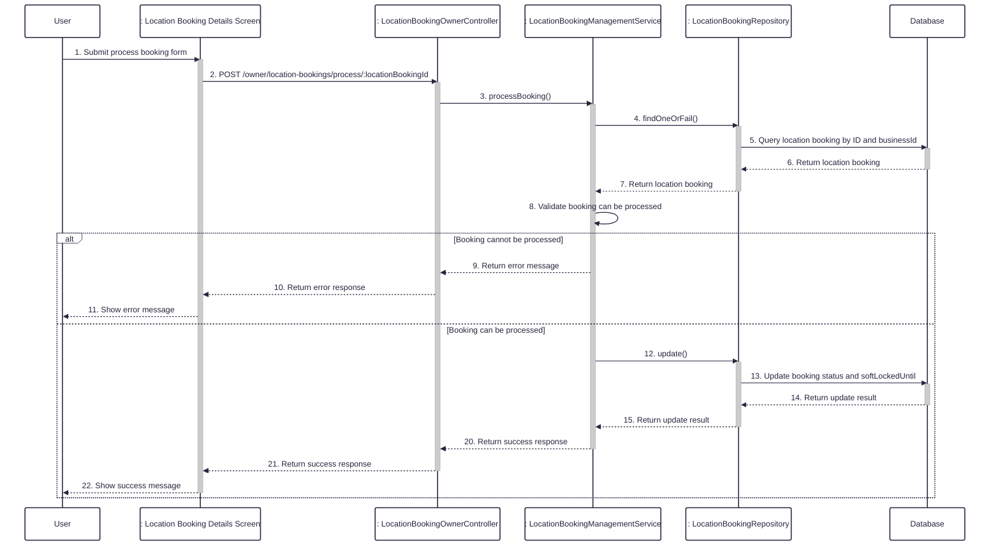

```mermaid
---
config:
  theme: redux
  look: classic
---
sequenceDiagram
    participant User
    participant Frontend as : Location Booking Details Screen
    participant LocationBookingOwnerController as : LocationBookingOwnerController
    participant LocationBookingManagementService as : LocationBookingManagementService
    participant LocationBookingRepository as : LocationBookingRepository
    participant Database

    User->>Frontend: 1. Submit process booking form
    activate Frontend
    Frontend->>LocationBookingOwnerController: 2. POST /owner/location-bookings/process/:locationBookingId
    activate LocationBookingOwnerController
    LocationBookingOwnerController->>LocationBookingManagementService: 3. processBooking()
    activate LocationBookingManagementService
    LocationBookingManagementService->>LocationBookingRepository: 4. findOneOrFail()
    activate LocationBookingRepository
    LocationBookingRepository->>Database: 5. Query location booking by ID and businessId
    activate Database
    Database-->>LocationBookingRepository: 6. Return location booking
    deactivate Database
    LocationBookingRepository-->>LocationBookingManagementService: 7. Return location booking
    deactivate LocationBookingRepository
    LocationBookingManagementService->>LocationBookingManagementService: 8. Validate booking can be processed
    alt Booking cannot be processed
        LocationBookingManagementService-->>LocationBookingOwnerController: 9. Return error message
        LocationBookingOwnerController-->>Frontend: 10. Return error response
        Frontend-->>User: 11. Show error message
    else Booking can be processed
        LocationBookingManagementService->>LocationBookingRepository: 12. update()
        activate LocationBookingRepository
        LocationBookingRepository->>Database: 13. Update booking status and softLockedUntil
        activate Database
        Database-->>LocationBookingRepository: 14. Return update result
        deactivate Database
        LocationBookingRepository-->>LocationBookingManagementService: 15. Return update result
        deactivate LocationBookingRepository
        LocationBookingManagementService-->>LocationBookingOwnerController: 20. Return success response
        deactivate LocationBookingManagementService
        LocationBookingOwnerController-->>Frontend: 21. Return success response
        deactivate LocationBookingOwnerController
        Frontend-->>User: 22. Show success message
        deactivate Frontend
    end
```

