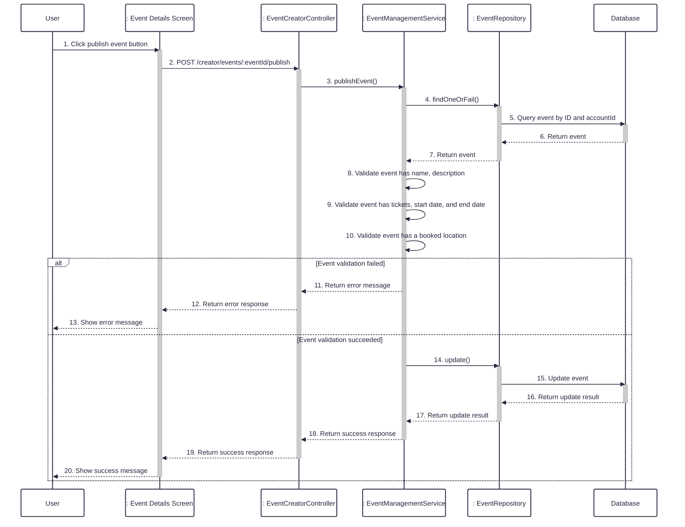

```mermaid
---
config:
  theme: redux
  look: classic
---
sequenceDiagram
    participant User
    participant Frontend as : Event Details Screen
    participant EventCreatorController as : EventCreatorController
    participant EventManagementService as : EventManagementService
    participant EventRepository as : EventRepository
    participant Database

    User->>Frontend: 1. Click publish event button
    activate Frontend
    Frontend->>EventCreatorController: 2. POST /creator/events/:eventId/publish
    activate EventCreatorController
    EventCreatorController->>EventManagementService: 3. publishEvent()
    activate EventManagementService
    EventManagementService->>EventRepository: 4. findOneOrFail()
    activate EventRepository
    EventRepository->>Database: 5. Query event by ID and accountId
    activate Database
    Database-->>EventRepository: 6. Return event
    deactivate Database
    EventRepository-->>EventManagementService: 7. Return event
    deactivate EventRepository
    EventManagementService->>EventManagementService: 8. Validate event has name, description
    EventManagementService->>EventManagementService: 9. Validate event has tickets, start date, and end date
    EventManagementService->>EventManagementService: 10. Validate event has a booked location
    alt Event validation failed
      EventManagementService-->>EventCreatorController: 11. Return error message
      EventCreatorController-->>Frontend: 12. Return error response
      Frontend-->>User: 13. Show error message
    else Event validation succeeded
      EventManagementService->>EventRepository: 14. update()
      activate EventRepository
      EventRepository->>Database: 15. Update event 
      activate Database
      Database-->>EventRepository: 16. Return update result
      deactivate Database
      EventRepository-->>EventManagementService: 17. Return update result
      deactivate EventRepository
      EventManagementService-->>EventCreatorController: 18. Return success response
      deactivate EventManagementService
      EventCreatorController-->>Frontend: 19. Return success response
      deactivate EventCreatorController
      Frontend-->>User: 20. Show success message
      deactivate Frontend
    end
```