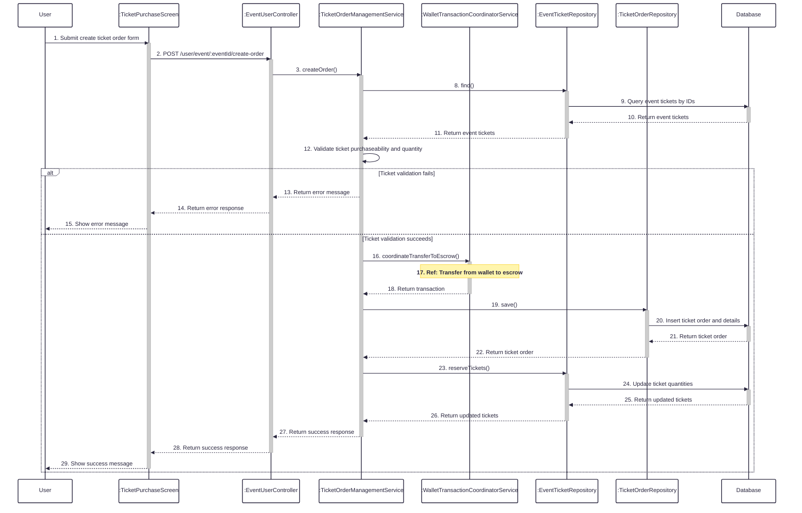

```mermaid
---
config:
  theme: redux
  look: classic
---
sequenceDiagram
    participant User
    participant TicketPurchaseScreen as :TicketPurchaseScreen
    participant EventUserController as :EventUserController
    participant TicketOrderManagementService as :TicketOrderManagementService
    participant WalletTransactionCoordinatorService as :WalletTransactionCoordinatorService
    participant EventTicketRepository as :EventTicketRepository
    participant TicketOrderRepository as :TicketOrderRepository
    participant Database

    User->>TicketPurchaseScreen: 1. Submit create ticket order form
    activate TicketPurchaseScreen
    TicketPurchaseScreen->>EventUserController: 2. POST /user/event/:eventId/create-order
    activate EventUserController
    EventUserController->>TicketOrderManagementService: 3. createOrder()
    activate TicketOrderManagementService
    TicketOrderManagementService->>EventTicketRepository: 8. find()
    activate EventTicketRepository
    EventTicketRepository->>Database: 9. Query event tickets by IDs
    activate Database
    Database-->>EventTicketRepository: 10. Return event tickets
    deactivate Database
    EventTicketRepository-->>TicketOrderManagementService: 11. Return event tickets
    deactivate EventTicketRepository
    TicketOrderManagementService->>TicketOrderManagementService: 12. Validate ticket purchaseability and quantity
    alt Ticket validation fails
        TicketOrderManagementService-->>EventUserController: 13. Return error message
        EventUserController-->>TicketPurchaseScreen: 14. Return error response
        TicketPurchaseScreen-->>User: 15. Show error message
    else Ticket validation succeeds
        TicketOrderManagementService->>WalletTransactionCoordinatorService: 16. coordinateTransferToEscrow()
        activate WalletTransactionCoordinatorService
        note over WalletTransactionCoordinatorService: 17. Ref: Transfer from wallet to escrow
        WalletTransactionCoordinatorService-->>TicketOrderManagementService: 18. Return transaction
        deactivate WalletTransactionCoordinatorService
        TicketOrderManagementService->>TicketOrderRepository: 19. save()
        activate TicketOrderRepository
        TicketOrderRepository->>Database: 20. Insert ticket order and details
        activate Database
        Database-->>TicketOrderRepository: 21. Return ticket order
        deactivate Database
        TicketOrderRepository-->>TicketOrderManagementService: 22. Return ticket order
        deactivate TicketOrderRepository
        TicketOrderManagementService->>EventTicketRepository: 23. reserveTickets()
        activate EventTicketRepository
        EventTicketRepository->>Database: 24. Update ticket quantities
        activate Database
        Database-->>EventTicketRepository: 25. Return updated tickets
        deactivate Database
        EventTicketRepository-->>TicketOrderManagementService: 26. Return updated tickets
        deactivate EventTicketRepository
        TicketOrderManagementService-->>EventUserController: 27. Return success response
        deactivate TicketOrderManagementService
        EventUserController-->>TicketPurchaseScreen: 28. Return success response
        deactivate EventUserController
        TicketPurchaseScreen-->>User: 29. Show success message
        deactivate TicketPurchaseScreen
    end
```
